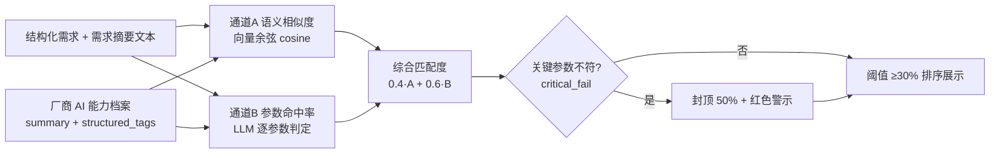

## 阶段1：需求回溯与基线锁定 
以下是在前几轮对话中你已经确认的所有关键决策，作为PRD的**唯一事实来源**，后续每个功能点都会标注对应的基线编号。

| 基线ID | 决策内容 |
| --- | --- |
| B1 | Demo核心场景：供需匹配闭环（厂商注册上传 → 买家需求描述 → 匹配结果），不含后续智能服务 |
| B2 | 买家需求输入：混合模式，以对话为主，系统主动引导+用户主动描述，可弹出选项辅助，高效提取需求；支持需求修正，Agent无缝更新并重新匹配 |
| B3 | 厂商资料录入：混合模式，自由文本 + 模板化表单 + 产品文档直接上传 |
| B4 | 匹配结果展示：精简列表（工厂名/所在地/一句话摘要/匹配度%），点击展开详情，**必须展示匹配理由**（哪些参数匹配/哪些不匹配） |
| B5 | 原型保真度：PoC级别，导入真实厂家资料，可邀请真实用户体验，接入最强大大模型 |
| B6 | 管理员后台：需要，简单版，至少能查看用户需求、厂商产品、匹配数据 |
| B7 | 演示数据：真实共创会员资料（设定100家） |
| B9 | 锁定垂直行业：消费电子代工（机顶盒、智能音箱、IoT设备等） |
| B10 | 用户可自助注册（厂商端+买家端） |


---

## 阶段2：功能模块化分解 
系统拆分为四个一级模块，每个模块下拆出二级功能点，并标注对应的基线来源。

### 模块1：厂商端（供给端） 
| 二级功能 | 描述 | 基线来源 |
| --- | --- | --- |
| 1.1 自助注册 | 手机号/邮箱注册，选择“我是厂商”，填写企业基本信息（名称、所在地、主营行业、统一社会信用代码）+上传营业执照（jpg/png/pdf） | B1, B10 |
| 1.2 能力录入-模板化表单 | 下拉多选/填空：行业、工艺类型、认证资质、设备清单、擅长场景 | B3 |
| 1.3 能力录入-自由文本 | 富文本框，自然语言描述隐性能力（如“做过XX客户定制项目”） | B3 |
| 1.4 能力录入-文档上传 | 支持PDF/PPT/Word，如设备清单、案例介绍、认证证书 | B3 |
| 1.5 能力档案生成（AI自动·只读） | 提交原始材料后系统自动生成只读能力档案（无预览、不可人工编辑）；材料变更自动重新生成 | B3, B5 |
| 1.6 审核状态查看 | 显示“审核中/已通过”；预置厂商已通过，现场新注册厂商由管理员一键审核 | B1 |


### 模块2：买家端（需求端） 
| 二级功能 | 描述 | 基线来源 |
| --- | --- | --- |
| 2.1 自助注册/登录 | 选择“我是采购方”，简化注册流程 | B1, B10 |
| 2.2 需求对话Agent-开场引导 | Agent自我介绍，询问“您需要找什么类型的代工厂？” | B2 |
| 2.3 需求对话Agent-动态选项 | 根据用户回答，弹出选项按钮组（如“需要哪些操作系统？”→[Linux/Android/RTOS]） | B2 |
| 2.4 需求对话Agent-自由输入 | 用户可随时输入大段自然语言补充需求 | B2 |
| 2.5 需求萃取完成与需求档案管理 | 萃取完成双通道（Agent判断+用户主动）；生成确认的需求档案；萃取中改口仅更新槽位；已确认档案修改生成新版本并提示是否重新匹配 | B2, B1 |
| 2.6 匹配结果页-精简列表 | 顶部显示“为您找到N家匹配的工厂”，列表项含工厂名称、所在地、一句话摘要、匹配度% | B4 |
| 2.7 匹配结果页-详情展开 | 点击列表项展开，显示子分数副行，并按判定分三组：✅匹配项（绿色）、⚠️需协商/未声明（黄色）、❌不匹配项（红色）；关键参数不符出红色警示条；含AI评语 | B4 |
| 2.8 会话与需求匹配历史管理 | 多会话（新建/续聊/恢复），每次“确认需求并触发匹配”生成需求匹配快照，历史可回看；会话记录完整过程，需求匹配必属某会话 | B2 |


### 模块3：匹配引擎（后台AI核心） 
| 二级功能 | 描述 | 基线来源 |
| --- | --- | --- |
| 3.1 厂商资料解析 | 解析自由文本/文档：①提取结构化标签存入PostgreSQL；②生成厂商级代表向量 + 原文切块向量（含出处metadata）存入向量库 | B3, B5 |
| 3.2 买家需求理解 | 大模型理解对话中的复杂需求，生成结构化需求向量 | B2, B5 |
| 3.3 语义匹配计算 | 双通道打分（语义相似度0.4 + 参数命中率0.6），计算供需匹配度（算法定义详见阶段7） | B5 |
| 3.4 匹配理由生成 | 大模型生成可解释性文本：逐参数verdict判定、差异描述、综合评语（输出格式见阶段7.6） | B4, B5 |


### 模块4：管理员后台（简单版） 
| 二级功能 | 描述 | 基线来源 |
| --- | --- | --- |
| 4.1 数据概览 | 显示用户总数、需求总数、厂商总数、匹配次数 | B6 |
| 4.2 需求与匹配查看 | 列表展示所有买家需求档案，可查看完整对话历史、结构化需求及其匹配结果（匹配度/三组判定/AI评语）；支持按匹配状态/匹配度区间筛选与导出CSV | B6 |
| 4.3 厂商产品查看 | 列表展示所有厂商及其AI能力档案，可查看原始上传资料和解析结果 | B6 |


### 模块0：基础支撑（非功能性） 
| 二级功能 | 描述 | 基线来源 |
| --- | --- | --- |
| 0.1 真实数据预置 | 系统初始化时导入100家真实共创会员的公开资料（含表单、文本、文档，如实公开不做脱敏） | B7 |
| 0.2 大模型API集成 | 接入DeepSeek，支持多模态文档理解 | B5 |
| 0.3 数据存储 | PostgreSQL（结构化）+ 向量数据库（Pinecone/Milvus） | B5 |


## 阶段3：用户故事与验收标准 
### 模块1：厂商端（供给端） 
---

#### 1.1 自助注册 
**用户故事**：作为代工企业的管理员，我想要通过手机号和邮箱自助注册一个厂商账号，以便于我能登录系统并发布我司的制造能力。

**验收标准**：

+ **AC1**：Given 用户访问注册页，When 填写未被注册的手机号/邮箱并设置密码，选择“我是厂商”身份，点击注册，Then 系统发送验证码，验证通过后创建账号并自动登录，跳转到“企业基本信息”填写页。
+ **AC2**：Given 用户已登录厂商账号，When 进入控制台，Then 页面右上角显示企业名称和“未完善资料”提示。
+ **AC3**：Given 用户填写企业基本信息（名称、所在地、主营行业、统一社会信用代码）并上传营业执照（jpg/png/pdf，≤10MB），When 点击保存，Then 信息存入数据库，状态变为“已完善基础信息，待录入能力”；信用代码全局唯一，重复则提示“该企业已注册”。

---

#### 1.2 能力录入-模板化表单 
**用户故事**：作为厂商用户，我想要通过勾选和填空的方式填写工艺类型、认证资质、设备清单等标准化字段，以便于系统能快速结构化地理解我的核心制造能力。

**验收标准**：

+ **AC1**：Given 厂商进入“录入能力”页，When 页面加载，Then 显示分组表单，包含：工艺类型（下拉多选）、认证资质（多选标签如ISO9001/CE/FCC）、设备清单（可动态添加的表格：设备名/数量/年份）、擅长场景（多选：机顶盒/智能音箱/IoT/…）。
+ **AC2**：Given 用户勾选“工艺类型”中的“SMT贴片”和“整机组装”，When 点击“下一步”，Then 系统保存已填字段，并切换到自由文本输入区（1.3）。

---

#### 1.3 能力录入-自由文本 
**用户故事**：作为厂商用户，我想要在一个富文本框中用自然语言描述我的隐性能力（如特定客户案例、定制经验），以便于那些无法被标准化表单覆盖的竞争优势也能被AI理解和展示。

**验收标准**：

+ **AC1**：Given 用户进入自由文本区，When 页面加载，Then 显示一个富文本框，placeholder提示“请描述您的隐性能力，例如：我们曾为某头部机顶盒品牌提供Linux底层适配的ODM服务，支持最小起订量500台…”。
+ **AC2**：Given 用户在富文本框中输入超过10个字符的描述，When 点击“插入常用模板”，Then 系统弹出一个侧边栏，列出3-5个行业相关的描述模板（如“多系统支持经验”“小批量柔性生产能力”），点击后可插入到光标位置。
+ **AC3**：Given 用户完成输入，When 点击“下一步”，Then 内容被暂存，切换到文档上传区（1.4）。

---

#### 1.4 能力录入-文档上传 
**用户故事**：作为厂商用户，我想要上传产品文档（PDF/PPT/Word），以便于系统能从中提取更多结构化的能力信息，减少手动录入的工作量。

**验收标准**：

+ **AC1**：Given 用户进入文档上传区，When 页面加载，Then 显示拖拽上传区域，支持 .pdf/.ppt/.pptx/.doc/.docx 格式，单个文件≤20MB。
+ **AC2**：Given 用户拖入一个PDF文件（如“公司介绍及设备清单.pdf”），When 文件上传完成，Then 显示文件名、文件大小和“解析中…”状态，解析完成后变为“✓ 已解析，提取到12条设备记录”。
+ **AC3**：Given 用户上传了不支持的格式（如.xlsx），When 系统检测到，Then 拒绝上传并提示“暂不支持该格式，请上传PDF/PPT/Word文件”。

---

#### 1.5 能力档案生成（AI自动·只读） 
**用户故事**：作为厂商用户，我提交原始材料（表单/文本/文档）后，系统自动生成我的能力档案；档案由AI解析产出、**只读、无预览**，我可随时查看，以便于我了解系统如何理解我的制造能力。

**验收标准**：

+ **AC1**：Given 用户完成表单、文本、文档三步，When 点击“提交材料”，Then 系统自动调用大模型解析，生成**正式能力档案**（无预览、无编辑），状态进入“审核中”，并跳转至能力档案查看页。
+ **AC2**：Given 能力档案生成完成，When 厂商查看，Then 页面三栏展示：左栏“原始输入”（表单摘要+文本片段+文档名），中栏“AI提取的结构化标签”（只读，带来源标记，如：工艺:SMT贴片/整机组装；认证:ISO9001；OS支持:Linux/Android），右栏“一句话能力摘要”（如“珠三角10年机顶盒ODM经验，支持Linux/Android双系统，最小起订量500台”）。
+ **AC3**：Given 厂商修改了原始材料（表单/文本/文档），When 重新提交，Then 系统自动重新生成能力档案并覆盖旧结果（仅保留最新档案，不保留生成历史）。
+ **AC4**：Given 能力档案由AI解析产出，Then 厂商**不可直接编辑**；若发现解析错误（如OS支持误识别为“RTOS”），通过修改原始材料触发重新生成（Demo不做“修改申请+人工审核”，属后续方向）。

---

#### 1.6 审核状态查看 
**用户故事**：作为厂商用户，我希望能查看能力档案的审核状态（审核中/已通过），以便于我知道我的能力何时进入匹配池；作为管理员，我希望能对新注册厂商执行一键审核。 

**验收标准**：

+ **AC1**：Given 厂商提交能力资料（表单/文本/文档），When 能力档案自动生成完成，Then 状态变为“审核中”，厂商控制台显示黄色“审核中”状态徽标。
+ **AC2**：Given 系统初始化，When 100家预置厂商导入完成，Then 其审核状态为“已通过”（绿色），能力直接进入匹配池。
+ **AC3**：Given 管理员在厂商列表中看到“审核中”的厂商，When 点击“审核通过”（可先在厂商详情核对营业执照等原始资料），Then 状态变为“已通过”，该厂商能力进入匹配池，厂商端状态同步更新，操作写入`admin_logs`。
+ **AC4**：Given 管理员点击“驳回”，When 填写驳回原因，Then 状态变为“已驳回”，厂商端可见原因并可修改后重新提交审核。

---

### 模块2：买家端（需求端） 
---

#### 2.1 自助注册/登录 
**用户故事**：作为采购方（品牌企业/硬件创业者），我想要通过手机号和邮箱注册一个买家账号，以便于我能使用AI Agent描述我的代工需求并获取匹配结果。

**验收标准**：

+ **AC1**：Given 用户访问注册页，When 选择“我是采购方”，填写信息并通过验证码校验，Then 账号创建成功，自动登录并跳转到“需求对话Agent”页面。
+ **AC2**：Given 用户已注册，When 在登录页输入正确的手机号和密码，Then 登录成功，直接进入最近一次对话页面（若有）或新的对话页面。

---

#### 2.2 需求对话Agent-开场引导 
**用户故事**：作为买家，当我开始新的需求对话时，我希望Agent先自我介绍并询问我需要什么类型的代工厂，以便于我能快速进入状态并开始描述。

**验收标准**：

+ **AC1**：Given 买家进入新的对话页面，When 页面加载完成，Then 聊天窗口自动显示Agent的第一条消息：“您好！我是需脉AI选型助手。请告诉我您需要找什么类型的代工厂？例如：机顶盒、智能音箱、IoT设备…”，并在输入框上方显示快捷选项按钮：[机顶盒] [智能音箱] [IoT设备] [其他，手动输入]。
+ **AC2**：Given Agent显示了开场消息，When 买家点击快捷选项“机顶盒”，Then 该选项变为选中状态，Agent的下一条消息自动发送：“好的，机顶盒代工。请问您需要哪些操作系统支持？”并弹出选项：[Linux] [Android] [RTOS] [其他]。

---

#### 2.3 需求对话Agent-动态选项 
**用户故事**：作为买家，在对话过程中，我希望Agent根据我的回答动态弹出相关的选项按钮，以便于我能高效地点选而不必每次都用键盘输入。

**验收标准**：

+ **AC1**：Given 买家在前一步选择了“机顶盒”和“Linux”，When Agent继续询问，Then 弹出与Linux机顶盒代工相关的选项，如“需要哪些扩展接口？”→ [多网口] [USB] [HDMI] [GPIO]，每个选项可多选。
+ **AC2**：Given 买家点击了某个选项，When 选项被选中（高亮），Then 输入框自动填充该选项的文字（如“需要多网口和USB”），买家仍可继续在输入框中追加额外描述。
+ **AC3**：Given 买家在5秒内未点击任何选项，When 超时，Then 选项按钮仍保留，但Agent在聊天窗口中追加一条提示：“您也可以直接在下方输入您的详细要求。”

---

#### 2.4 需求对话Agent-自由输入 
**用户故事**：作为买家，我希望在Agent引导的过程中随时可以用自然语言输入大段需求描述，以便于我能完整表达那些选项按钮无法覆盖的复杂要求。

**验收标准**：

+ **AC1**：Given 对话进行中，When 买家在输入框中输入超过50个字符的长文本并发送，Then 系统将该文本作为用户消息显示在聊天窗口，并立即调用大模型解析，Agent回复一条确认消息，如“我已记录您的需求：需要支持二次开发，适用于酒店场景…”。
+ **AC2**：Given 买家发送了自由文本，When 文本中包含参数信息（如“最小起订量1000台”），Then Agent在后续对话中不再重复询问该参数，并在右侧悬浮面板（或底部）实时更新“当前需求摘要”。

---

#### 2.5 需求萃取完成与需求档案管理 
**用户故事**：作为买家，我希望需求萃取完成后能形成一份确认的需求档案；萃取中可自由改口（仅更新槽位），确认后也可修改（生成新版本档案）；无论萃取中还是确认后，我都能保证档案与我真实意图一致，并可随时提交匹配。

**验收标准**：

+ **AC1**（完成判定·Agent判断）：Given 对话进行中，When 品类锚点（产品类型）已确认且关键维度已有覆盖，Then Agent主动提示“需求已基本清晰：确认完成？还是继续补充？”，用户可选择确认或继续补充（不强制打断）。
+ **AC2**（完成判定·用户主动）：Given 对话任意阶段，When 用户点击“完成需求描述”或输入结束指令（如“/done”），Then 结束萃取，生成“需求档案”卡片（当前版本 vN），列出已提取参数（产品类型、OS、接口、认证、起订量、应用场景等），未指定的参数标注“未指定（可忽略）”，明确排除的参数标注“排除”。
+ **AC3**（提交匹配）：Given 需求档案已确认，When 用户点击“提交匹配”，Then 系统将结构化需求发送至匹配引擎，显示加载动画（“正在为您匹配最合适的工厂…”），3-5秒后跳转到匹配结果页（2.6）。
+ **AC4**（萃取中改口=自由输入）：Given 萃取中尚未确认，When 用户改口（如“不对，是Android”），Then 仅更新当前需求槽位与摘要，不生成新档案、不触发重新匹配（属2.4自由输入的自然行为）。
+ **AC5**（确认后修改=新版本）：Given 已确认的需求档案（版本 vN），When 用户修改任一槽位（如起订量500→1000），Then 生成新版本档案（vN+1），并提示“需求已更新，是否基于新需求重新匹配？”出现按钮[立即重新匹配][继续完善]。
+ **AC6**（重新匹配）：Given 用户点击[立即重新匹配]，When 系统处理，Then 清空旧匹配缓存，用新版本档案重新调用匹配引擎（对应2.8快照version递增）；点击[继续完善]则保持新档案状态、等待后续提交。

---

#### 2.6 匹配结果页-精简列表 
**用户故事**：作为买家，提交需求后，我希望看到一个精简的匹配工厂列表，包含工厂名称、所在地、一句话摘要和匹配度百分比，以便于我能快速浏览并决定深入了解哪家。

**验收标准**：

+ **AC1**：Given 匹配引擎返回结果，When 结果页加载，Then 顶部显示“为您找到 N 家匹配的工厂”（N≥1），下方按匹配度降序排列列表项。
+ **AC2**：Given 列表加载，When 每个列表项渲染，Then 显示：工厂名称（如“东莞某某电子”）、所在地（如“广东东莞”）、一句话能力摘要（来自1.5的右栏）、匹配度百分比（如“92%”），右侧有一个“查看详情”的展开箭头。
+ **AC3**：Given 没有找到任何匹配的工厂，When 结果显示，Then 页面显示“暂无精确匹配的工厂，您可以尝试调整需求或联系我们的人工顾问”，并提供“修改需求”按钮（返回02A对话页并保留上下文，与2.7一致）。

---

#### 2.7 匹配结果页-详情展开 
**用户故事**：作为买家，当我点击某个工厂的列表项时，我希望能看到具体的匹配理由——哪些参数匹配、哪些不匹配，以及AI的综合评语，以便于我能做出明智的选择。

**验收标准**：

+ **AC1**：Given 结果页显示，When 买家点击某个列表项的“查看详情”箭头，Then 该项向下展开，顶部显示子分数副行“语义相似度 82% · 参数命中 5/6”，下方按判定分三组展示：✅ 匹配项（绿色标签，如“支持Linux ✓”“有ISO认证 ✓”）、⚠️ 需协商/未声明（黄色标签，如“需求：交期30天 → 工厂：标准交期45天（需协商）”“ISO13485（厂商未声明）”）、❌ 不匹配项（红色标签，如“不支持Android”）。
+ **AC2**：Given 详情展开且存在关键参数（产品类型/OS/认证）明确不匹配，When 页面渲染完成，Then 面板顶部显示红色警示条“关键参数不满足，谨慎合作”（对应`critical_fail`，匹配度已封顶50%，见阶段7.5）。
+ **AC3**：Given 详情展开，When 页面渲染完成，Then 在三组标签下方显示“AI评语”段落，内容为1-2句话的总结（如“该厂在技术方案上高度契合，但交期需协商，建议进一步沟通”）。
+ **AC4**：Given 详情展开，When 买家再次点击箭头，Then 详情折叠，回到精简列表状态。
+ **AC5**（引用原文）：Given 详情展开，When 标签或AI评语带有出处引用source（doc_id/page/chunk_text），Then 对应位置显示“查看原文”链接，点击后打开原始文档预览并定位/高亮到引用段落（基于原文块向量metadata，提升可信度）。

---

#### 2.8 会话与需求匹配历史管理 
**用户故事**：作为买家，我希望能管理多个需求会话（新建/续聊/恢复），并能随时回看某次确认的需求及当时的匹配结果，以便于跟踪我的采购需求全过程。 

**验收标准**：

+ **AC1**（新建会话）：Given 买家已登录，When 点击“新建会话”，Then 进入新的空白对话页，Agent重新开场引导。
+ **AC2**（自动保存与恢复）：Given 买家在对话中已输入内容，When 刷新页面/网络中断/退出后重新登录，Then 自动进入该会话并恢复完整对话与当前需求摘要（草稿不丢失）。
+ **AC3**（会话列表）：Given 买家有多个会话，When 进入“我的会话”，Then 显示会话列表（标题/摘要/更新时间/状态），可切换或续聊任一会话。
+ **AC4**（需求匹配快照）：Given 买家在2.5确认需求档案并提交匹配（含修改后重新匹配），When 系统处理，Then 生成一条需求匹配快照（确认时的`structured_demand` + 本次`match_results`），存入`buyer_requests`，关联当前`conversation_id`，`version`在同会话内递增。
+ **AC5**（历史回看）：Given 某会话存在多条需求匹配快照，When 买家查看“历史匹配”，Then 可按时间查看每次确认的需求与当时的匹配结果（快照长期保留，无过期）。
+ **AC6**（删除会话）：Given 买家删除某会话，When 确认删除，Then 该会话及其下所有需求匹配快照与匹配结果一并删除（不可恢复）。


### 模块3：匹配引擎（后台AI核心） 
---

#### 3.1 厂商资料解析 
**用户故事**：作为系统，当厂商提交能力资料（模板化表单+自由文本+上传文档）时，我希望自动调用大模型提取结构化能力标签并生成向量嵌入，以便于将这些隐性能力转化为可计算的供需语义知识。

**验收标准**：

+ **AC1**：Given 厂商完成能力录入三步（表单/文本/文档）并点击“提交材料”，When 系统接收到请求，Then 后端自动将表单字段、自由文本、文档解析出的文本拼接为一个结构化Prompt，调用大模型API（DeepSeek），生成能力档案（无独立按钮、无预览页）。
+ **AC2**（双轨入库）：Given 大模型返回解析结果，When 结果包含JSON格式的结构化标签（如工艺、认证、OS支持等），Then 系统将标签存入PostgreSQL的`vendor_capabilities`表；同时生成两类向量存入向量库（如Pinecone）：①**厂商级代表向量**（由`structured_tags`拼装文本+`summary_text`生成，1档案=1向量，用于通道A匹配）；②**原文块向量**（原始文本按段落/页切块后逐一向量化，每块携带`vendor_id`/`doc_id`/`doc_name`/`page`/`chunk_text`等metadata，用于引用溯源）。
+ **AC3**：Given 文档上传后，When 系统调用文档解析服务（Unstructured/LayoutParser），Then 成功提取文本内容，若解析失败则记录错误日志并跳过该文档，但表单和自由文本仍继续解析。
+ **AC4**：Given 大模型API超时（>30秒）或返回异常，When 系统捕获异常，Then 重试一次，若仍失败则返回错误信息给前端，提示“AI解析暂时不可用，请稍后重试”。

---

#### 3.2 买家需求理解 
**用户故事**：作为系统，当买家在对话Agent中完成需求描述并提交时，我希望大模型能准确理解其复杂需求，生成结构化需求向量，以便于进行语义匹配。

**验收标准**：

+ **AC1**：Given 买家在2.5点击“提交匹配”，When 系统接收到对话历史及最终确认的需求摘要，Then 后端将对话上下文和摘要拼接为Prompt，调用大模型API，提取出结构化需求字段（产品类型、OS、接口、认证、起订量、应用场景等）。
+ **AC2**：Given 大模型返回结构化需求JSON，When 系统验证品类锚点（产品类型）存在，Then 将需求存入`buyer_requests`表，并生成需求文本的向量嵌入存入向量数据库，关联`request_id`。
+ **AC3**：Given 买家在对话中进行了需求修正（如将Linux改为Android），When 系统接收到修正指令，Then 更新内存中的需求槽位，并在最终提交时使用更新后的字段生成向量，旧版本不覆盖（保留历史用于学习）。
+ **AC4**：Given 大模型返回的需求JSON中部分字段为空，When 系统检测，Then 除品类锚点（`product_type`）外的未指定字段按“通配”处理——不参与匹配限制、不标记“不完整”；`product_type`为唯一必填（提交匹配前置校验拦截，见2.5），若异常进入匹配且锚点缺失，则结果页标注“未指定产品类型，匹配仅供参考”。

---

#### 3.3 语义匹配计算 
**用户故事**：作为系统，当买家的需求向量就绪后，我希望将其与所有已发布的厂商能力向量进行相似度计算，并返回按匹配度排序的工厂列表，以便于买家看到最相关的结果。

**验收标准**：

+ **AC1**（通道A·语义相似度）：Given 买家的需求向量已生成，When 系统触发匹配任务，Then 在向量库中对**厂商级代表向量**执行近似最近邻搜索（ANN），计算余弦相似度，返回Top-K（K默认20）个最相似的厂商及其`semantic_score`。
+ **AC2**（通道B·参数命中率）：Given 获取到Top-K厂商，When 系统调用大模型对需求参数逐项比对厂商能力，Then 得到每项参数的verdict（matched/partial/missing/unmatched），按权重汇总为`param_hit_rate`（判定与计分规则见阶段7.4）。
+ **AC3**（综合匹配度）：Given 两个通道分数就绪，When 系统按公式 `match_score = ⌊100×(0.4·semantic_score + 0.6·param_hit_rate)⌋` 计算，Then 生成综合匹配度并按降序排列，过滤掉 `match_score < 30` 的厂商；若关键参数`unmatched`则封顶50%（见阶段7.5）。
+ **AC4**：Given 有多个厂商，When 匹配计算完成，Then 将结果（厂商ID、`semantic_score`、`param_hit_rate`、`match_score`、按verdict分组的参数字段）写入`match_results`表，关联`request_id`；确认后需求匹配快照下的结果长期保留（无过期时间，除非会话被删除）。
+ **AC5**：Given 买家点击“立即重新匹配”（需求修正后），When 系统处理，Then 清除该`request_id`的旧匹配结果，重新执行3.2和3.3，生成新结果。

---

#### 3.4 匹配理由生成 
**用户故事**：作为系统，对于每个匹配结果，我希望大模型能生成可解释的文本，说明哪些需求参数与厂商能力匹配、哪些不匹配，并给出综合评语，以便于买家理解为什么这家工厂被推荐。

**验收标准**：

+ **AC1**：Given 匹配计算完成，When 系统调用大模型API，传入买家需求JSON和厂商能力JSON，Then Prompt要求模型输出：逐参数的verdict判定（matched/partial/missing/unmatched）、差异描述note、每条声明的出处引用source（doc_id/page/chunk_text，由原文块向量检索获得）、一句话AI评语（输出格式见阶段7.6）。
+ **AC2**：Given 大模型返回匹配理由，When 结果包含结构化JSON（params: [{param, demand_value, supply_value, verdict, note, source}], ai_comment），Then 系统校验verdict枚举合法后，按verdict分组存入`match_results`表的`matched_params`/`partial_params`/`unmatched_params`（含`source`引用），并与前端2.7的展示结构对齐。
+ **AC3**：Given 某个参数判定为partial（如交期30天 vs 45天），When 大模型生成note描述，Then 应注明“需协商”或“可满足但需延长交期”，而非简单标记为“不满足”；partial计分按阶段7.4的0.5折减。
+ **AC4**：Given 大模型生成理由耗时较长，When 系统处理，Then 采用异步生成：先返回匹配列表（含匹配度），详情展开时再加载匹配理由（若未生成则显示“理由生成中…”），避免阻塞主结果页。

---

### 模块4：管理员后台（简单版） 
---

#### 4.1 数据概览 
**用户故事**：作为平台管理员，我希望登录后台后能看到平台的核心数据指标（用户总数、需求总数、厂商总数、匹配次数），以便于我快速了解平台的规模、活跃度和使用情况。

**验收标准**：

+ **AC1**：Given 管理员使用账号密码登录后台，When 进入首页（/admin/dashboard），Then 页面顶部显示四个统计卡片：用户总数（从`users`表COUNT，含买家/厂商/管理员）、需求总数（从`buyer_requests`表COUNT）、厂商总数（从`vendors`表COUNT）、匹配次数（从`match_results`表COUNT）。
+ **AC2**：Given 数据概览加载，When 页面渲染，Then 每个卡片显示当前数值，并附带“较昨日”的变化百分比（若有数据），数据每5分钟自动刷新一次。
+ **AC3**：Given 管理员未登录，When 直接访问后台URL，Then 重定向到登录页，登录失败超过5次锁定10分钟。

---

#### 4.2 需求与匹配查看 
**用户故事**：作为平台管理员，我希望能以列表形式查看所有买家需求档案及其匹配结果，以便于我审核需求真实性、排查问题或复核匹配质量。 

**验收标准**：

+ **AC1**：Given 管理员进入“需求与匹配”页面（/admin/requests），When 页面加载，Then 显示分页表格，列包括：会话ID、需求ID（快照版本）、买家名称、产品类型、提交时间、匹配状态（未匹配/已匹配），按提交时间倒序排列。
+ **AC2**：Given 表格显示，When 管理员点击某一行的“查看”按钮，Then 右侧滑出抽屉或跳转新页面，展示：所属会话的完整对话历史（聊天记录）、该条需求匹配快照的结构化需求JSON（可折叠）、**该需求档案的匹配结果列表**（每条含匹配厂商、匹配度%、按verdict三组展示的匹配项（绿-匹配/黄-需协商·未声明/红-不匹配）、AI评语、查看原文source，口径与阶段7.9一致）；该查看操作写入`admin_logs`审计日志。
+ **AC3**：Given 管理员在列表上方输入关键词搜索，When 输入“机顶盒”，Then 表格实时筛选，只显示产品类型包含“机顶盒”的需求记录。
+ **AC4**：Given 管理员在列表上方选择匹配状态/匹配度区间或时间范围，When 点击“筛选”，Then 表格只显示符合条件的记录，支持导出CSV（含需求与匹配字段），导出操作写入`admin_logs`审计日志。

---

#### 4.3 厂商产品查看 
**用户故事**：作为平台管理员，我希望能查看所有厂商的基本信息、AI能力档案以及他们上传的原始资料，以便于我审核厂商资质或确认AI解析的准确性。

**验收标准**：

+ **AC1**：Given 管理员进入“厂商产品”页面（/admin/vendors），When 页面加载，Then 显示分页表格，列包括：厂商ID、企业名称、所在地、主营行业、审核状态、提交时间。
+ **AC2**：Given 表格显示，When 管理员点击某一行的“查看”按钮，Then 进入详情页，分为三个标签页：①基本信息（注册时填写）、②AI能力档案（解析后的结构化标签+一句话摘要）、③原始资料（上传的文档列表，可点击下载或预览）。
+ **AC3**：Given 管理员在详情页的“AI能力档案”标签，When 查看解析结果，Then 可看到每个标签的来源标记（如“来自表单”“来自自由文本”“来自文档”），便于追溯。
+ **AC4**：Given 表格中存在“审核中”的厂商，When 管理员点击操作列“审核”，Then 弹出通过/驳回确认框（驳回需填原因），通过后该厂商能力进入匹配池，状态与厂商端同步，操作写入`admin_logs`（对应1.6）。

---


## 阶段4（更新版）：优先级与范围界定（MoSCoW法则） 
### 🔴 Must（必须有，否则Demo无法演示核心价值或无法满足开放体验需求） 
| 模块 | 功能点 | 说明 |
| --- | --- | --- |
| **模块0：基础支撑** | 0.1 真实数据预置 | 初始化导入100家真实共创会员公开资料 |
| | 0.2 大模型API集成 | 接入GPT-4o或Claude 3.5 Sonnet |
| | 0.3 数据存储 | PostgreSQL + 向量数据库 |
| **模块1：厂商端** | 1.1 自助注册 | **↑ 从Should提升**，开放给厂家真实注册 |
| | 1.2 能力录入-模板化表单 | 核心录入方式之一 |
| | 1.3 能力录入-自由文本 | 核心录入方式之一 |
| | 1.4 能力录入-文档上传 | **↑ 从Should提升**，开放给厂家真实上传PDF/PPT/Word |
| | 1.5 能力档案生成 | 提交材料后AI自动生成，只读、无预览，材料变更自动重新生成 |
| | 1.6 审核状态查看 | **↑ 从Should提升**，展示“审核中→已通过”与管理员一键审核 |
| **模块2：买家端** | 2.1 自助注册/登录 | 开放给买家真实试用 |
| | 2.2 需求对话Agent-开场引导 | 系统主动引导 |
| | 2.3 需求对话Agent-动态选项 | 弹出选项按钮辅助高效提取需求 |
| | 2.4 需求对话Agent-自由输入 | 用户随时输入大段自然语言 |
| | 2.5 需求萃取完成与需求档案管理 | 萃取完成双通道；确认档案；萃取中改口/确认后修改生成新版本；提交匹配 |
| | 2.6 匹配结果页-精简列表 | 工厂名/所在地/一句话摘要/匹配度% |
| | 2.7 匹配结果页-详情展开 | ✅匹配项 / ⚠️需协商·未声明 / ❌不匹配项 / AI评语（含双通道子分数） |
| | 2.8 会话与需求匹配历史管理 | 会话持久化+需求匹配快照，支撑“关键数据沉淀” |
| **模块3：匹配引擎** | 3.1 厂商资料解析 | 大模型提取结构化标签 |
| | 3.2 买家需求理解 | 大模型生成需求向量 |
| | 3.3 语义匹配计算 | 向量相似度+Prompt工程 |
| | 3.4 匹配理由生成 | 可解释性文本 |
| **模块4：管理员后台** | 4.1 数据概览 | **↑ 从Should提升**，演示时展示 |
| | 4.2 需求与匹配查看 | **↑ 从Should提升**，查看需求及其匹配结果、筛选与导出 |
| | 4.3 厂商产品查看 | **↑ 从Should提升**，查看能力档案 |


### 🟡 Should（应该有，缺了也能演示但不够完美） 
当前无：原Should中的1.1、1.4、4.1-4.3及1.6已全部提升为Must（其中1.6因“管理员审核厂商”流程纳入Demo而提升）。

### 🟢 Could（锦上添花） 
+ 多行业切换（锁定消费电子即可）
+ 复杂权限管理
+ 匹配结果导出

### ⚪ Won't（明确不做） 
+ 交易闭环、支付、物流
+ 付费会员体系、供需智能服务（需求洞察等）
+ 能力档案修改申请与人工审核（后续方向：纠正AI解析错误并驱动AI改进）
+ 动态需求Schema生成（未知品类由Agent现场生成维度，后续方向）
+ 多语言支持
+ 移动端适配（先做Web）


## 阶段5：数据实体与演示数据规划 
基于100家真实共创会员资料，定义核心数据实体及其关键字段，并规划演示数据的预置与生成策略。

### 5.1 核心数据实体 
| 实体 | 关键字段 | 存储方式 | 说明 |
| --- | --- | --- | --- |
| **用户账号** (`users`) | user_id, phone, email, password_hash, role (vendor/buyer/admin), created_at, status | PostgreSQL | 支持三种角色，厂商和买家分开注册 |
| **厂商基本信息** (`vendors`) | vendor_id, user_id, company_name, location, main_industry, credit_code (统一社会信用代码), license_url, created_at, audit_status (pending/passed/rejected) | PostgreSQL | 信用代码用于厂商唯一标识与真实性核验，营业执照作为审核材料；预置厂商为已通过；现场新注册厂商进入审核中，由管理员一键审核 |
| **厂商能力档案** (`vendor_capabilities`) | capability_id, vendor_id, structured_tags (JSONB: 工艺/认证/OS/设备等), summary_text, source_type (form/text/doc), raw_text, doc_urls (array), created_at | PostgreSQL + 向量数据库 | 结构化标签用于参数匹配（通道B）；厂商级代表向量用于语义匹配（通道A）；原文块向量（含出处metadata）用于引用溯源；能力档案无预览、只读，随原始材料变更自动重新生成 |
| **会话** (`conversations`) | conversation_id, user_id, status (进行中/已确认/已关闭), conversation_history (JSONB: 完整对话过程), created_at, updated_at | PostgreSQL | 记录需求端完整会话过程；需求匹配快照必属于某会话 |
| **需求匹配快照** (`buyer_requests`) | request_id, conversation_id, user_id, version (会话内序号), structured_demand (JSONB: 确认时快照), demand_vector_id, status, created_at | PostgreSQL + 向量数据库 | 每次“确认需求并触发匹配”生成一条快照，必属某会话；同会话下按version递增，构成需求演化轨迹 |
| **匹配结果** (`match_results`) | match_id, request_id, vendor_id, semantic_score (0-1), param_hit_rate (0-1), match_score (0-100), critical_fail (bool), match_source (llm/rule/hybrid), matched_params (JSONB), partial_params (JSONB), unmatched_params (JSONB), ai_comment, created_at | PostgreSQL | 每次匹配独立记录，长期保留（除非所属会话被删除）；字段语义见阶段7 |
| **管理员操作日志** (`admin_logs`) | log_id, admin_id, action, target_type, target_id, created_at | PostgreSQL | 记录管理员查看、导出等操作，用于审计 |


### 5.2 演示数据预置策略 
| 数据类型 | 预置方式 | 数量 | 说明 |
| --- | --- | --- | --- |
| **厂商账号与基本信息** | 系统初始化时批量导入 | 100家 | 来自真实共创会员的公开资料，分布在珠三角消费电子代工领域 |
| **厂商能力档案** | 预先调用大模型解析并生成向量 | 100家 | 确保Demo中匹配引擎能立即返回结果，无需等待解析 |
| **买家账号** | 预置2-3个测试账号 + 支持现场自助注册 | 2-3个 | 测试账号已有关联的需求历史，方便演示管理员后台 |
| **历史需求与匹配记录** | 预置约50条历史需求与匹配记录（按正式注册与真实需求流程导入，基于真实厂商资料，非伪造数据） | ~50条 | 用于管理员后台的数据概览和日志查看 |
| **管理员账号** | 预置1个超级管理员账号 | 1个 | 用于演示时登录后台查看数据 |


### 5.3 现场演示数据流 
| 演示环节 | 数据来源 | 说明 |
| --- | --- | --- |
| 厂商端注册与录入 | 现场真实操作或预置账号 | 若时间允许，可邀请投资人现场体验注册新厂商并上传资料，展示AI解析效果 |
| 买家端需求描述 | 现场实时输入 | 投资人可亲自描述需求，或与创始人互动输入，展示对话Agent的引导与修正 |
| 匹配结果 | 实时调用匹配引擎 | 基于预置的100家厂商向量数据，实时计算并返回结果 |
| 管理员后台 | 实时读取数据库 | 展示刚刚发生的需求、厂商和匹配记录，证明数据真实 |


## 阶段6：异常流程与边界处理 
列出Demo中必须优雅处理的异常场景，确保演示不翻车，同时向投资人展示系统的鲁棒性。

### 6.1 大模型相关异常 
| 场景 | 处理方式 | 用户看到的效果 |
| --- | --- | --- |
| **大模型API超时（>30秒）** | 前端显示“AI正在努力思考中…”的友好动画，后端重试一次；若仍失败，按阶段7.8规则兜底（真实计算）或提示“当前请求较多，请稍后重试” | 不会出现白屏或报错，也不返回伪造结果 |
| **大模型返回格式错误** | 后端校验JSON结构，若不符合预期，则fallback到规则匹配兜底通道（见阶段7.8，`match_source='rule'`），并记录日志 | 匹配结果仍可用，只是可能不是最优 |
| **向量检索/embedding不可用** | 跳过通道A，仅用通道B参数命中率计算综合匹配度（`match_source='hybrid'`），结果页标注“语义通道暂不可用” | 匹配不中断，仅缺失语义维度 |
| **文档解析失败** | 前端提示“该文档暂不支持解析，建议您手动填写表单或输入文本”，但允许跳过该步骤继续 | 不阻塞整个录入流程 |


### 6.2 输入与匹配异常 
| 场景 | 处理方式 | 用户看到的效果 |
| --- | --- | --- |
| **买家输入极度模糊的需求**（如“找一个好工厂”） | Agent引导追问：“请问您指的是哪个行业？需要什么工艺？”若用户仍不提供，则提示“需求信息不足，暂无法匹配，请补充更多细节” | 避免返回垃圾结果，体现AI的严谨 |
| **无匹配结果**（匹配度全部低于30%） | 结果页显示“暂无精确匹配的工厂，您可以：①修改需求 ②查看相似工厂（匹配度20-30%的）③联系人工顾问” | 提供替代方案，不冷场 |
| **需求修正后无变化** | 若修正后的需求与之前完全相同，Agent提示“您的需求未发生变化，无需重新匹配” | 避免无效计算 |
| **厂商上传空文档** | 前端校验文件大小>0，若为空则拒绝上传并提示“文件内容为空，请重新选择” | 防止垃圾数据 |


### 6.3 系统与演示环境异常 
| 场景 | 处理方式 | 用户看到的效果 |
| --- | --- | --- |
| **网络中断** | 前端检测网络状态，显示“网络连接已断开，请检查网络后重试”的Toast，并自动保存当前输入 | 恢复后不丢失数据 |
| **演示环境崩溃/卡死** | 对外使用前完成真实链路自测（注册→录入→匹配→详情全流程跑通），降低故障概率；现场异常时按真实系统预案快速恢复并如实说明 | 靠真实自测与系统预案保障，不依赖录像等演示性兜底 |
| **并发过高导致响应慢** | 限制同时在线演示人数（如仅演示者操作），或提前预热模型连接池 | 避免现场卡顿 |


### 6.4 数据与安全（真实运行要求） 
| 场景 | 处理方式 | 说明 |
| --- | --- | --- |
| **厂商数据如实公开** | 厂商业务信息与联系方式一律如实展示，不做脱敏、不做可见性控制；是否披露客户品牌等细节由厂商自行决定（愿写则展示，不写则平台不代写） | 真实透明，与“纯净/透明”定位一致 |
| **现场用户注册信息** | 明确告知用户当前为试点（PoC）环境，说明数据存储与使用范围，按真实用户协议处理 | 真实系统如实告知，不隐瞒也不伪造 |
| **管理员后台访问控制** | 采用真实账号体系与权限控制：角色分离、登录限流、操作写入`admin_logs`审计日志 | 真实系统真实安全，不做演示性放宽或临时重置 |


## 阶段7：匹配度算法定义（双通道打分·Demo版） 
本阶段为模块3（匹配引擎）的算法权威定义，统一`3.3 语义匹配计算`、`3.4 匹配理由生成`、`2.7 匹配结果详情`与数据实体`match_results`的口径。Demo阶段不训练专属模型，但算法与数据结构必须可复现、可解释、可兜底。

### 7.1 算法总览 
匹配度由两个互补通道合成：**语义相似度**（回答“相关吗”）+ **参数命中率**（回答“对得上吗”）。综合权重可配置，Demo默认 `0.4/0.6`。



### 7.2 需求Schema体系与参数权重（常量，前端/后台可调） 
需求Schema采用**分层结构**，保证任意需求可结构化、可比对：
+ **固定部分**：所有代工需求共通的维度（下表），参与通道B精确计分；
+ **品类扩展（预置可选加载）**：按垂直品类加载特有维度（如机顶盒：OS/接口/内存；智能音箱：语音方案/喇叭），纳入同一计分体系；
+ **开放扩展**：用户提出的未预定义维度（如“宽温-40~85℃”）记为附加约束，不参与通道B精确计分，并入语义通道（通道A）与原文引用。

每个字段具备**三态**：
| 状态 | 含义 | 对匹配的影响 |
| --- | --- | --- |
| 已指定 | 用户明确给出取值 | 参与通道B计分 |
| 未指定（通配） | 不关注 | 不计分、不限制，天然全匹配 |
| 明确排除 | 如“不要Android” | 负向过滤（按unmatched处理） |

固定参数表（权重可调）：
| 参数 key | 名称 | 类型 | 是否关键 | 权重 w_p |
| --- | --- | --- | --- | --- |
| `product_type` | 产品类型 | 单选 | ✅ 关键（品类锚点） | 2.0 |
| `os_support` | 操作系统 | 多选 | ✅ 关键 | 1.5 |
| `certifications` | 认证资质 | 多选 | ✅ 关键 | 1.5 |
| `application_scene` | 应用场景 | 文本/多选 | — | 1.0 |
| `interfaces` | 扩展接口 | 多选 | — | 1.0 |
| `min_order_qty` | 起订量 | 数值 | — | 1.0 |
| `process` | 工艺要求 | 多选 | — | 0.5 |
| `lead_time_days` | 交期（天） | 数值 | — | 0.5 |
| `customization` | 二次开发/SDK | 布尔 | — | 0.5 |

说明：`product_type`为品类锚点，是**唯一必填**（提交匹配前置校验，见2.5）；除锚点外所有字段可选，未指定即通配（不限制）；关键参数（product_type/os_support/certifications）任一判定为`unmatched`时，该厂商标记`critical_fail=true`，触发7.5的封顶与警示逻辑。

### 7.3 通道A：语义相似度 
+ **输入文本**：需求侧 = 最终确认的`structured_demand`拼装文本 + 一句话需求摘要；供给侧 = **厂商级代表向量**，由`structured_tags`拼装文本 + `summary_text`生成。
+ **向量化**：调用embedding API（如`text-embedding-3-small`），需求向量存`demand_vector_id`，厂商代表向量预计算存入向量库（1档案=1向量，用于厂商级Top-K检索）。
+ **公式**：$s_{sem} = clip(\cos(\vec{q}, \vec{v}),\ 0,\ 1)$
+ **引用溯源（双轨）**：厂商原始文档另按段落/页切块生成**原文块向量**（携带`doc_id`/`page`/`chunk_text`等metadata），不参与厂商排序，仅用于匹配理由的段级引用（见7.6、3.4）。
+ **特点**：语义相关但参数说不上的厂商，此通道得分高、通道B低，两通道互补。

### 7.4 通道B：参数命中率 
LLM对需求中每个已提取参数，对照厂商能力给出四态判定：

| 判定 verdict | 含义 | 单参数得分 score_p |
| --- | --- | --- |
| `matched` | 完全满足 | 1.0 |
| `partial` | 需协商（如交期30 vs 45，可协调） | 0.5 |
| `missing` | 厂商未声明该能力（≠不满足） | 0.3 |
| `unmatched` | 明确不满足 | 0.0 |

**命中率公式**：

$$s_{param} = \frac{\sum w_p \cdot score_p}{\sum w_p}$$

**计分范围**：仅对“已指定”参数计分，分母 = 已指定参数的权重和（未指定通配不计入，避免稀释）；“明确排除”的参数若与厂商能力冲突，按`unmatched`处理（可触发7.5关键参数封顶）。

+ `missing`计0.3体现“未声明≠不满足”；`partial`计0.5并在展示层归入“⚠️需协商”。

### 7.5 综合匹配度（含阈值与关键参数规则） 
$$match\_score = \big\lfloor 100 \times (0.4 \cdot s_{sem} + 0.6 \cdot s_{param}) \big\rfloor$$

| 规则 | 说明 |
| --- | --- |
| **关键参数封顶** | 若任一关键参数`unmatched`（`critical_fail=true`），`match_score = min(match_score, 50)`，列表项/详情顶部显示红色警示 |
| **过滤阈值** | `match_score < 30` 的厂商不进结果列表 |
| **排序** | 按`match_score`降序 |

### 7.6 LLM 结构化输出格式（对齐并扩展3.4） 
```json
{
  "params": [
    {"param": "product_type", "demand_value": "机顶盒", "supply_value": "机顶盒/智能音箱", "verdict": "matched", "note": "", "source": null},
    {"param": "os_support", "demand_value": "Linux", "supply_value": "Linux/Android", "verdict": "matched", "note": "来自《公司介绍.pdf》P3", "source": {"doc_id": "DOC-007", "doc_name": "公司介绍及设备清单.pdf", "page": 3, "chunk_text": "支持Linux/Android双系统，提供SDK二次开发"}},
    {"param": "lead_time_days", "demand_value": 30, "supply_value": 45, "verdict": "partial", "note": "可协商，需延长交期", "source": null},
    {"param": "certifications", "demand_value": "ISO13485", "supply_value": null, "verdict": "missing", "note": "厂商未声明，需向厂商确认", "source": null}
  ],
  "ai_comment": "该厂在技术方案与操作系统上高度契合，但交期需协商，且未声明ISO13485认证，建议进一步沟通确认。"
}
```

校验规则：后端校验`verdict`枚举（matched/partial/missing/unmatched）合法，非法则整条记录按7.8兜底；`note`用于生成2.7黄色/红色标签的差异描述；`source`用于“查看原文”引用定位（doc_id/page/chunk_text），缺失或非法时前端不显示引用链接。

### 7.7 数据落地（`match_results`扩展） 
| 字段 | 类型 | 说明 |
| --- | --- | --- |
| `semantic_score` | REAL | 通道A分数（0-1） |
| `param_hit_rate` | REAL | 通道B命中率（0-1） |
| `match_score` | INT | 综合匹配度（0-100，落库值） |
| `matched_params` / `partial_params` / `unmatched_params` | JSONB | 按verdict分组存储（含demand_value/supply_value/note） |
| `critical_fail` | BOOLEAN | 关键参数是否不符 |
| `match_source` | ENUM('llm','rule','hybrid') | 是否走了兜底通道 |
| `ai_comment` | TEXT | 综合评语 |

保留策略：确认后需求匹配快照下的匹配结果长期保留，无过期时间；仅当所属会话被用户删除时一并删除。

### 7.8 兜底规则（确定性通道） 
当LLM或embedding不可用（超时/格式错误/异常）时启用，保证演示不翻车：
+ 基于`structured_tags`做“精确命中 + 包含关系”判定，生成同构`verdict`；
+ `s_sem`置默认0.5，`s_param`用规则命中率计算，`match_source='rule'`；
+ 结果页标注“基于规则匹配（AI暂不可用）”，软降级、不白屏。

### 7.9 可解释性呈现（与2.7对齐） 
+ 匹配度%下方增加副行：“语义相似度 82% · 参数命中 5/6”，展示分数构成；
+ 标签分组：`matched`→绿色✅；`partial`→黄色“需协商”；`missing`→黄色“未声明”；`unmatched`→红色❌；
+ `critical_fail`时详情顶部显示红色警示条“关键参数不满足，谨慎合作”。

### 7.10 真实数据质量保障 
本产品基于真实数据与真实匹配效果运行，不做脚本化的“黄金路径”，演示结果即真实计算结果。为保障真实效果稳定呈现，对预置数据做如下质量保障：
+ **数据质量校验**：100家厂商能力档案的`structured_tags`完整率、`summary_text`覆盖率、向量生成率等指标达标后开放匹配；
+ **口径预检**：用若干真实买家需求对已导入数据跑通全链路，核对`verdict`判定是否符合预期、`match_score`分布是否有梯度与区分度，发现口径问题及时修复后再对外使用；
+ **真实口径原则**：不预置“参考答案”或“干扰项”；若真实数据效果不足，通过**补全真实资料**而非编造结果来提升匹配效果。


## 阶段8：非功能需求（NFR） 
本阶段汇总PoC必须满足的非功能要求，作为开发与验收的横切约束，与阶段6（异常流程）、阶段7（算法定义）相互引用。

### 8.1 性能 
| 指标 | 目标 | 关联 |
| --- | --- | --- |
| AI能力档案解析 | ≤10秒（骨架屏3-5秒内先出占位） | 1.5 AC1 |
| 需求理解+匹配计算 | ≤5秒（含匹配度与结果列表） | 2.5 AC3 |
| 对话Agent首响应 | ≤2秒 | 2.2-2.4 |
| 匹配理由（异步） | ≤15秒，详情展开时可见“理由生成中…” | 3.4 AC4 |

### 8.2 容量与并发 
+ PoC容量约束：同时在线会话≤5（对外使用与开放体验均适用）；
+ 大模型连接池预热，避免首个请求慢；
+ 超出容量时排队或明确提示，不静默失败。

### 8.3 可靠性 
+ LLM超时（>30s）重试1次，仍失败按阶段7.8规则兜底或提示重试（阶段6.1）；
+ 文档解析失败可跳过，不阻塞录入（1.4）；
+ embedding/向量检索不可用时降级`hybrid`，仅用参数命中率（阶段6.1）；
+ 软降级原则：任何单点失败不白屏、不返回伪造结果。

### 8.4 安全与隐私 
+ 真实账号体系与角色分离（vendor/buyer/admin），登录限流（连续5次失败锁定10分钟，4.1 AC3）；
+ 管理员操作写入`admin_logs`审计日志（4.2-4.3）；
+ 100家厂商业务信息与联系方式如实公开，不做脱敏或可见性控制；是否披露客户品牌由厂商自行决定（阶段6.4）；
+ 现场注册按真实用户协议告知PoC环境与数据范围（阶段6.4）；
+ 敏感配置（API Key等）走环境变量，不落库、不下发前端。

### 8.5 可观测性 
+ 每次匹配记录`match_source`（llm/rule/hybrid），后台可追溯匹配计算来源（阶段7.7）；
+ 核心错误（LLM超时/解析失败/兜底触发）记录日志；
+ 需求与匹配页支持按匹配状态/匹配度区间筛选与CSV导出（4.2）。


## 附录：术语对照（BP ↔ 产品文档） 
| BP 术语 | 产品文档术语 | 说明 |
| --- | --- | --- |
| 专属 Agent | 需求对话 Agent | 买家端的需求描述智能助手（2.2-2.5） |
| 能力档案 / SKU 产品描述与功能参数 | AI 能力档案（`vendor_capabilities`） | 厂商端结构化能力表达（1.2-1.5） |
| 需求打磨 | Agent 引导澄清 + 需求档案确认 | 对话引导、动态选项、萃取完成与档案管理（2.2-2.5） |
| 源头厂商限定发布 | 厂商端发布（`vendors` + `audit_status`） | 仅代工企业/源头厂商可发布能力，含审核机制（1.1-1.6） |
| 纯净语义匹配（无权重/无竞价） | 双通道打分匹配引擎 | 无竞价、无投流权重，按真实参数与语义匹配（阶段7） |
| 行业避坑指南 / 行业最佳实践 | 不在本次PoC范围，作为后续方向 | 见阶段4 Won't 清单 |
| MCP / Agent 生态接口 | 不在本次PoC范围，作为后续方向 | 见阶段4 Won't 清单 |


