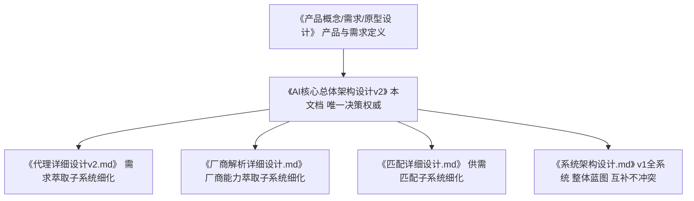
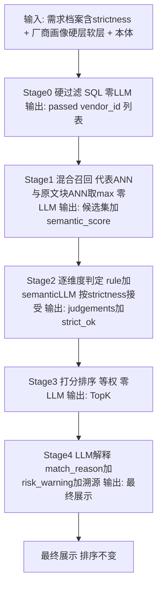
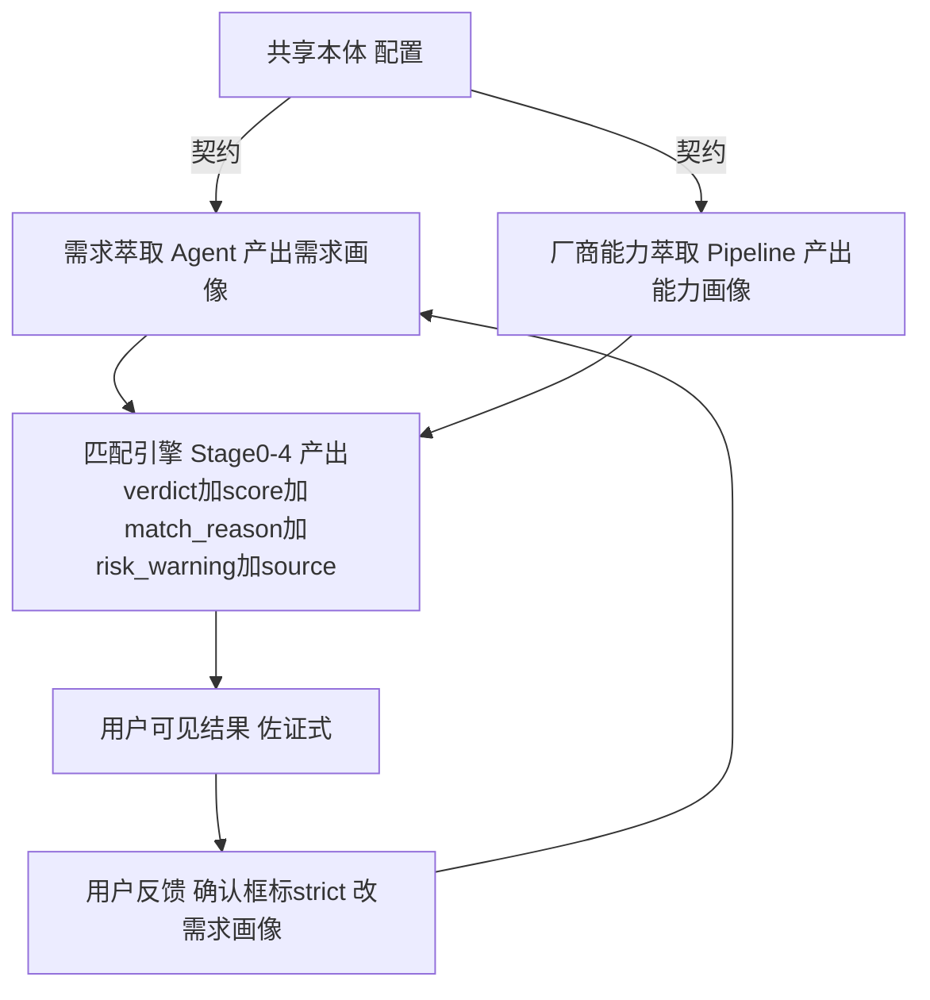

# 需脉枢纽 · AI 核心总体架构设计 v2（纲要性设计指导文档）

> 版本：v2.0 ｜ 状态：**设计指导（待各子系统细化）** ｜ 更新：2026-08-15
>
> 本文档是 AI 核心——**需求萃取 / 厂商能力萃取 / 供需匹配**三大子系统的**顶层架构纲要**，定位为修订
> 《代理详细设计v2》《匹配详细设计》《厂商解析详细设计》等子文档的**指导性输入**（决策的单一权威源）。
> 子文档细化时若与本文档第一性概念冲突，**以本文档为准**。

---

## 0. 文档定位与使用方式

- **纲要不替代子文档**：本文档只定"第一性概念 + 顶层决策 + 接口契约"，不写逐字段 LLD。各子系统的实现细节在其各自详细设计文档中细化。
- **修订流程（如何用本文档）**：
  1) 以本文档第 3~9 章为"决策基线"；
  2) 逐块细化（第 11 章演进路线），每细化一块，**回写并修订**对应子文档（代理/匹配/厂商解析）；
  3) 子文档与本文档冲突处，回写本文档的修订记录（避免双源漂移）。

### 文档体系关系



---

## 1. 背景与动因

### 1.1 为什么要重构顶层架构
- 现有 AI 核心是**逐步打补丁**形成的：`PARAM_MAP` 带 os→os_support 映射层、`ALL_FIELDS` 固定厂商维度、匹配"先 ANN 后规则"、单向量召回、无用户级严格度、解释无 match_reason/risk_warning。
- 结果是**阻抗失配**（结构化需求 vs 非结构化供给）、**召回有损**（单向量压缩漏软能力）、**扩展靠改代码**——架构有腐烂风险。
- 本次重构：**把散点收敛为第一性概念**，从源头解决扩展性、准确性、效率。

### 1.2 已确认的关键决策（2026-08-15 评审定案）
| # | 决策 | 说明 |
| --- | --- | --- |
| D1 | **统一 Schema（能力维度本体，同 key）** | 需求/厂商/匹配共用同一维度字典，消除 PARAM_MAP 映射层 |
| D2 | **匹配顺序改为"硬筛先行 → 混合召回"** | Stage0 硬过滤（strict，零 LLM）→ Stage1 多向量混合召回（代表 ∪ 原文块） |
| D3 | **厂商软层（自由标签）纳入萃取** | 本体外的任意能力走 soft 层（标签+摘要+原文块多向量），不丢失 |
| D4 | **LLM 解释升级为 match_reason + risk_warning** | 佐证式 → 顾问级可解释 |
| D5 | **前端"当前需求"改为 Schema 感知** | 前端展示/处理统一为 schema 实例（label/options 由本体下发），替代"前端不感知 schema"的自由需求点集；Agent 私有工作态（`_pending`/`_recommend` 等）不属于 schema |
| D6 | **移除 excluded（排除项）** | 能力是可加的、多余能力不 disqualify；"不要X"由 Agent 语义处理（不加入需求集/作为产品规格需求点）；厂商身份/合规类排除另设独立属性维度；需求档案收敛为正向 set 点 `{value, strictness}`（wildcard=未指定不入档，降为 Agent 私有标记） |
| D7 | **strictness 两档（必须/尽力），去掉 partial** | strictness 由 Agent 从语言自动推断（"必须/一定要/只要"→必须；"最好/优先/希望"→尽力；默认=尽力）；确认框只读展示可微调；必须项才进 Stage0 SQL 硬筛（枚举/数值含容差）；text/扩展的"必须"走 Stage2 语义 strict；**verdict 的 partial（厂商部分满足）保留** |
| D8 | **extended 结构化：自由需求点 `{label, value, strictness}`（方案 D）** | 扩展约束不再是无结构字符串列表；每条含 `value`（语义短语）+ `strictness`（两档）+ 必填 `label`（自由展示标签：非受控 key、不参与匹配、不进本体）；**promote 机制**：同类约束高频出现 → 固化进本体维度配置，此后进 `dimensions`（D1 数据驱动） |
| D9 | **厂商代表向量 = embed(能力自然语言描述 summary)** | `summary` 从"≤50 字一句话摘要"升级为**自然语言串联全部萃取字段**的能力描述（含 soft.tags），上限 ≤400 字；**REP = `embed(summary)`**，废除 `rep_text` 的 structured_tags 机器拼接（方案 X）；需求侧 `q` 同步为**自然语言需求描述**（程序模板，与 summary 同构）保证向量空间对称；summary 一物两用：档案展示 + REP 向量 |
| D10 | **取消权重，需求点等权平均评分** | 删除 `weight` 字段与 0.4/0.6 混合、critical_fail 封顶；需求点匹配度统一四档（matched=100 / partial=50 / missing=30 / unmatched=0；语义维度取 LLM verdict 档位同量纲）；`match_score = round(Σ需求点匹配度档位 / 需求点数)`（0-100）；Stage1 semantic_score 只做召回、不进最终分；**重要性由 strictness 表达**（重要→strict 门槛，次要→best-effort 等权加分） |
| D11 | **移除 demand_level，采集策略交由 LLM** | 匹配端本无"必填"（需求点已指定参与/未指定不参与，D10 分母=已指定点数）；`demand_level`（hard/soft/optional）从本体移除；采集端只保留**品类锚定**（product_type 必锚定：完成判定/提交前置 + SC-31）；追问顺序由 Agent 的 LLM 按"当前上下文 + 待确认需求点 + 重要性"自然引导（不再程序预分级）；配合两步化提交（确认框），用户主动确认即可提交 |
| D12 | **提交门槛 = 品类锚定 + ≥1 需求点 + 用户确认** | `KEY_DIMS`（完成判定"关键维度"）与 `pending_slots`/动态 Validator 机制**整体移除**——不存在"提交了哪几个需求点才可提交"；**不允许 0 需求点提交**（仅品类不满足：dimensions 或 extended 至少 1 个需求点，后台校验 `len(dimensions)+len(extended)≥1` 拦截），规避 match_score 分母=0 的边界；需求点未指定 → missing/不参与计分（D10 语义不变） |

---

## 2. 设计目标与顶层原则

### 2.1 设计目标
| 目标 | 含义 |
| --- | --- |
| 需求萃取**准确 & 高效** | 槽位化准确（LLM 判语义、程序执行）、strictness 两档（Agent 推断）、单次推理 |
| 厂商萃取**准确 & 高效** | 离线批量、同本体、溯源+置信度+完备度、soft 层兜底 |
| 供需匹配**准确 & 高效** | 硬筛保底线、混合召回提召回、逐维度判定保精度、LLM 解释提可信；LLM 后置化省钱 |
| 三系统**有效串联** | 单一契约（本体）+ 两张画像 + 反馈闭环 |

### 2.2 顶层原则
1) **单一契约**：三个子系统只通过"能力维度本体 + 两张画像"通信。
2) **分层职责**：Agent=前台接诊（建档）；萃取管线=后台建档案库；匹配引擎=专家诊疗。互不越界。
3) **数据驱动扩展**：新增品类/维度=加本体配置 + soft 层兜底，**不改代码**。
4) **匹配方法与来源解耦**：判定方式由"值形态"决定，与"预定义/扩展"来源正交。
5) **大模型=大脑，程序=执行**：语义判定全部在推理节点/LLM；程序只做确定性执行与不变式（延续红线：不做字符串匹配判定语义；不截断模型输出）。

---

## 3. 第一性概念（本文档的基石）

### 3.1 能力维度本体（共享契约 / 统一 Schema）
需求、厂商、匹配三者**唯一共享**的维度字典。一个维度=一条配置（详见第 4 章）。
**作用**：消除阻抗失配的根源——两侧不再各说各话，匹配层不需要映射桥接。

### 3.2 两张画像
- **需求画像**（需求萃取产物）：`{维度key: {value, strictness(strict/best-effort)}, extended: [{label, value, strictness}]}`（仅正向指定点；wildcard=未指定不入档，excluded 已移除 D6，strictness 两档 D7；extended=自由需求点，label 必填、仅展示、不参与匹配，D8）
- **能力画像**（厂商萃取产物）：`{structured: {维度key: {value, confidence, source}}, soft: {自由标签[], summary, doc_chunks[]}}`（summary=自然语言串联全字段的能力描述 ≤400 字，兼展示与 REP 向量，D9）
- **共同点**：都是"本体结构化的硬层 + 自由语义的软层"，天然对齐（详见第 9 章）。

### 3.3 匹配漏斗（Stage 0–4）
`硬筛(0) → 混合召回(1) → 逐维度判定(2) → 打分排序(3) → LLM 解释/重排(4)`
- 前两阶段**零 LLM**（快、省）；LLM 只在 Stage2 的语义参数与 Stage4 出现。

### 3.4 反馈闭环
Agent 从语言自动推断 strictness（必须/尽力，D7）→ 确认框只读展示 → 需求画像更新 → 重匹配。**用户显式要求 = 精度闭环**（越用越准，且可审计）。

---

## 4. 能力维度本体（详细）

### 4.1 维度模型
```text
维度 = {
  key,            // 两侧同 key（消除 os vs os_support 映射）
  label,          // 中文名（展示用）
  value_type,     // 值形态：enum多选 / scalar单值 / number数值 / text自由文本
  provenance,     // 来源：general通用预定义 / category品类预定义 / extended扩展
  direction,      // number 专用：≥（需求下限，如 MOQ/产能）/ ≤（需求上限，如交期）
}
```

### 4.2 值形态 → 判定方式（自动派生，不手配）
| value_type | 判定方式（Stage2） | 举例 |
| --- | --- | --- |
| enum（多选） | rule 集合判定（覆盖全部/子集/无交集） | os、接口、认证 |
| scalar（单值） | rule 等值 / semantic 近义 | 品类、主控平台 |
| number（数值） | rule 区间 + direction（达标/容差） | MOQ、交期、月产能 |
| text（自由文本） | semantic（LLM 判 verdict） | 应用场景、定制、扩展 |

> **关键原则**：判定方式由 `value_type` 派生；`provenance` 只决定"怎么萃取"，两者正交——扩展字段也可精确匹配（前提厂商侧同维度萃取）、预定义字段也可语义匹配。

### 4.3 来源 → 萃取方式
| provenance | 需求侧 | 厂商侧 |
| --- | --- | --- |
| general（通用预定义） | Agent 固定槽位 | 提取器固定维度 |
| category（品类预定义） | 品类锚点后激活的槽位 | 品类相关维度（配置化） |
| extended（扩展） | 自由需求点 `{label, value, strictness}`（label 必填、仅展示，非受控 key；高频约束 promote 进本体，D8） | **soft 软层**（自由标签，不预设 key） |

### 4.4 配置化与扩展
- 本体存于 JSON 配置（如 `schema_categories.json` 演进为"本体配置"），**新增品类/维度只改配置**。
- **soft 软层是本体外的安全网**：任何未被本体覆盖的厂商能力都进软层（标签+摘要+原文块），保证"能力不丢失、可被多向量召回"。

### 4.5 与现有实现的迁移关系
- 现有 `PARAM_MAP`（带映射层）→ 演化为本体（同 key），映射消除。
- 现有 `FIXED_FIELDS` / `CATEGORY_EXTENSIONS` → 本体 general/category 来源。
- 现有 `ALL_FIELDS`（厂商固定 10 维度）→ 本体子集 + 新增 soft 软层。

---

## 5. 三子系统

### 5.1 需求萃取（Agent）
- **输入**：用户对话。
- **输出**：需求画像（本体维度 + strictness + 扩展约束 `[{label, value, strictness}]`）。
- **关键机制**：
  - 推理节点（LLM 判语义：填槽/答疑/引导/提交/品类切换）；程序执行不变式（merge/reconcile/strictness 写入）。
  - **扩展约束（D8）**：本体外的自由需求点入 `extended`，每条 `{label, value, strictness}`——value=语义短语、strictness 两档（同 dimensions）、label **必填**、由 LLM 生成简洁类别短语（外观/物流/包装…），仅供展示/确认框分组（非受控 key、不参与结构化匹配）；同类约束高频出现（按 label 聚类）触发 **promote**（固化进本体配置，下次进 dimensions）。
  - **逼硬性条件**：把模糊要求（"小厂"）逼成确定性值（MOQ≤500）；strictness 两档（必须/尽力）由 Agent 从语言自动推断（"必须/一定要"→必须；"最好/优先"→尽力；默认=尽力，D7）。
  - **一会话一产品**（SC-31 品类切换护栏）；**提交两步化**（确认框只读展示 Agent 判定的 strictness，品类锁定必须，可微调后提交）。
  - **采集策略（D11/D12）**：无 hard/soft/optional 分级（demand_level 已移除）；**提交门槛 = 品类锚定（product_type 必锚定）+ 至少 1 个需求点（dimensions 或 extended 非空，后台校验，D12）+ 用户确认（两步化确认框）**——`KEY_DIMS`/pending_slots 完成判定机制已移除（D12）；**追问顺序交由 LLM** 按"当前上下文 + 待确认需求点 + 重要性"自然引导（不再程序预分级）。
  - **前端"当前需求" = schema 实例（D5）**：前端不再感知"自由需求点集"，直接消费 schema 实例（label/options/type 由本体下发），"当前需求"面板与提交确认框都按 schema 设计，消除中间转换；Agent 私有工作态（`_pending`/`_recommend` 等）不进 schema。
- **准确**：槽位化 + strictness 显式声明；**效率**：单次推理、工具调用、缓存、不重复 LLM。

### 5.2 厂商能力萃取（离线 Pipeline）
- **输入**：厂商 PDF/PPT/画册。
- **输出**：能力画像（结构化硬层 + soft 软层）。
- **关键机制**：
  - 离线批量 LLM 萃取到**同一本体**（同 key）。
  - 每维度带 **source 溯源**（doc/page/chunk）+ **confidence** + **completeness**（可审计、可解释）。
  - **soft 软层**：自由标签 + 摘要 + 原文块多向量——兜住本体外的任意能力（D3）。
- **准确**：结构化 + 溯源 + 完备度；**效率**：离线一次摊薄，供多次匹配复用。

### 5.3 供需匹配（引擎漏斗）· Stage 详述

> 本节是匹配引擎的权威描述（输入 / 处理 / 输出），后续实现以本节为准，**待逐步确认细化**。
> 整体输入契约：**需求档案**（含 strictness）+ **厂商画像**（硬层 + soft 软层）+ **本体**（维度配置）。

#### 5.3.0 总览（流程图）



**成本分布**：Stage0/1/3 零 LLM（毫秒级）；Stage2 仅语义参数用 LLM；Stage4 仅对 TopK 用 LLM。

> **贯穿示例设定（Stage0-4 各子节示例共用）**：买方做"智能音箱"的需求档案 + 4 家厂商（V1 华声 / V2 锐联 / V3 微芯 / V4 极光）。参数沿用各 Stage 的**当前待确认值**（min_semantic=0.35、阈值 60），待 5.3.6 拍板后同步。
>
> **需求档案**（D5/D6/D7/D8 格式）：
>
> ```json
> {
>   "dimensions": {
>     "product_type":         {"value": "智能音箱",            "strictness": "strict"},
>     "certifications":       {"value": ["CCC", "SRRC"],       "strictness": "strict"},
>     "os":                   {"value": ["Linux", "Android"],  "strictness": "best-effort"},
>     "moq":                  {"value": 500,                   "strictness": "best-effort"},
>     "lead_time_days":       {"value": 30,                    "strictness": "strict"},
>     "application_scenario": {"value": "家庭客厅",             "strictness": "best-effort"}
>   },
>   "extended": [
>     {"label": "外观", "value": "外壳黑色", "strictness": "strict"},
>     {"label": "物流", "value": "送货上门", "strictness": "best-effort"}
>   ],
>   "version": 1
> }
> ```
>
> - strict 维度：product_type、certifications、lead_time_days（进 Stage0 SQL）、外观（text→Stage2 语义 strict）；best-effort：os、moq、application_scenario、物流（全接受只计分）。
>
> **厂商画像（4 家，硬层 structured + soft）**：
>
> | 厂商 | 品类 | 认证 | OS | MOQ | 交期 | soft 关键 |
> | --- | --- | --- | --- | --- | --- | --- |
> | V1 华声电子 | 智能音箱 | CCC, SRRC | Linux, Android | 300 | 20天 | 主攻户外/运动场景；无黑色外壳记录 |
> | V2 锐联科技 | 智能音箱、机顶盒 | CCC, CE | Linux, Android | 800 | 45天 | 语音助手；欧美市场经验 |
> | V3 微芯制造 | 机顶盒 | CCC | Linux | 1000 | 60天 | 仅机顶盒代工 |
> | V4 极光声学 | 智能音箱 | CCC, SRRC, FCC | Android, RTOS | 100 | 15天 | 声学调校；可定制黑色外壳；送货上门 |

#### 5.3.1 Stage0 · 硬过滤

- **输入**：需求档案中**可精确匹配的 strict 维度**（strictness=strict 且 value_type ∈ {受控 enum / scalar 品类 / number}；**text 与 extended 的 strict 不进本 Stage**）；全体厂商硬层（`structured`）。
  - **示例输入**（贯穿设定）：
    - 需求档案 strict 维度：`product_type=智能音箱(strict)`、`certifications=[CCC,SRRC](strict)`、`lead_time_days≤30(strict)`；`外观=外壳黑色` 为 text-strict → 不走 SQL，留到 Stage2 语义判定。
    - 全体厂商硬层（相关列）：
      | 厂商 | product_types | certifications | lead_time_days |
      | --- | --- | --- | --- |
      | V1 | ["智能音箱"] | ["CCC","SRRC"] | 20 |
      | V2 | ["智能音箱","机顶盒"] | ["CCC","CE"] | 45 |
      | V3 | ["机顶盒"] | ["CCC"] | 60 |
      | V4 | ["智能音箱"] | ["CCC","SRRC","FCC"] | 15 |
- **处理**（物理 = 一次 SQL 集合过滤，非逐厂商循环）：
  1) 收集硬筛条件：仅 strict 且**可精确匹配**的维度——品类（scalar）、受控枚举（认证等）、数值（MOQ/交期/产能）；**text/扩展的 strict（如"外观=外壳黑色"）不进 SQL**，走 Stage2 语义 strict（D7）。
  2) 一条 SQL 完成：JSONB 包含（品类/认证 ⊆ 厂商值）、数值方向（MOQ/交期/产能）。
  3) 示例（由上面 strict 维度拼出的 SQL）：
     ```sql
     WHERE structured->'product_types' @> '["智能音箱"]'
       AND structured->'certifications' @> '["CCC","SRRC"]'
       AND (structured->>'lead_time_days')::int <= 30
     ```
     → V1 ✓（全过）、V4 ✓（全过）；V2 ✗（认证缺 SRRC）、V3 ✗（品类不符）
- **下推边界（定案）**：① 可下推 = strict 且受控 enum/scalar/number（text/extended 不进，走 Stage2 语义）；② 数值只做**严格满足**（upper `s≤d` / lower `s≥d`），**不含容差**（容差=partial 语义归 Stage2）；③ **品类为闭集**：厂商只萃取确定品类，不接受"其他/开放"声明；买方要非已知品类 → 品类不设 strict（best-effort），走 Stage1 语义召回 + Stage2 判定兜底；④ 前提：枚举须为**归一后受控值**（D1 synonyms），否则精确比较误杀。
- **输出**：`passed: [vendor_id...]`（筛选出的厂商 id 列表，作为 Stage1 检索范围）。可选：`dropped_count`（按规则聚合计数，供 UX"筛除了 N 家"）。
  - 示例：`passed=[V1, V4]`、`dropped_count=2`。
- **零 LLM**。规模：100 万厂商 → 数千（GIN 索引，<100ms）。

#### 5.3.2 Stage1 · 混合召回

- **输入**：需求档案；**Stage0 输出（passed vendor_id 列表，作为检索范围）**；REP（代表向量 = embed(summary)，1条/厂商，D9）与 CHUNK（原文块，N条/厂商）向量库；本体硬字段。
  - **示例输入**（贯穿设定）：检索范围 `passed={V1, V4}`；需求向量 q = embed(自然语言需求描述，含 extended)；REP/CHUNK 为 V1/V4 已入库向量（REP=embed(summary)）。
- **处理**：
  0) **检索范围 = Stage0 passed 集**：两路召回（路径A/B）均在硬筛通过集内执行（ANN 结果以 `vendor_id IN (passed)` 过滤或后置交集）。
  1) `demand_embedding_text` 用**自然语言模板**把需求拼成描述文本（含 extended，与厂商 summary 同构）→ embed 成需求向量 q（D9 对称）。
  2) **路径A 代表ANN**：q 对 REP 做 cosine 最近邻 → 每厂商 `rep_score`，top-k。
  3) **路径B 原文块ANN**：q 对 CHUNK 做 ANN → 每条块一个分 → **按 vendor_id 取 max** → 每厂商 `chunk_score`（细节能力命中，D3）。
  4) **合并**：两路取**并集**、按厂商去重；`semantic_score = max(rep_score, chunk_score)`；低于 `min_semantic`（如 0.35）剔除。
  - **示例计算**（V1 / V4）：
    | 厂商 | 路径A rep | 路径B chunk | semantic_score=max |
    | --- | --- | --- | --- |
    | V1 | 0.72 | 0.68 | 0.72（rep） |
    | V4 | 0.81 | 0.85（文档命中"声学调校/黑色外壳/送货上门"） | 0.85（chunk） |
- **输出**：`candidates: [{vendor_id, semantic_score, recall_source(rep|chunk)}]`。
  - 示例：min_semantic=0.35 → 均保留；`candidates=[V4(0.85, chunk), V1(0.72, rep)]`。
- **零 LLM**。

#### 5.3.3 Stage2 · 逐维度判定

- **输入**：候选厂商硬层 + soft；需求档案全维度；本体（value_type → 判定方式）；strictness。
  - **示例输入**（贯穿设定）：候选 = Stage1 的 V1/V4；需求档案全维度（8 个需求点）见 5.3.0；V1/V4 硬层 + soft 见 5.3.0 厂商画像表。
- **处理**：
  0) **主循环**（每个候选厂商各跑一套 judgements）：
     ```text
     for 每个需求点 (key, {value, strictness}):
         if 该维度未指定: continue          # 未指定不进判定、不进分母（D6）
         verdict = judge(key, value, 厂商硬层 + soft)   # 按 value_type 派发
         judgements.append({param, demand_value, supply_value, verdict,
                            strictness, note, source})
         if strictness == strict and verdict != matched:
             strict_ok = False              # 有必须项未满足 → 标记（不硬杀）
     ```
  1) 判定方式按 `value_type` 派生（D1：判定与来源解耦；enum/scalar/number 需基于**归一后的受控值**）：
     | value_type | 判定 | matched | partial | unmatched | missing |
     | --- | --- | --- | --- | --- | --- |
     | enum | 集合：需求⊆厂商 | 需求全被覆盖 | 有交集但非全 | 无交集 | 厂商未声明 |
     | number | 数值+direction+容差1.5 | upper `s≤d` / lower `s≥d` | upper `d<s≤1.5d` / lower `d/1.5≤s<d` | 超容差 | 厂商未声明 |
     | scalar | 等值（品类近义走 LLM） | 等值 | —（无 partial 语义） | 不等值 | 厂商未声明 |
     | text | LLM 语义判定（批量 + 缓存） | 语义满足 | 部分满足 | 不满足 | 判不出/未声明 |
     - **数值例子**：需求交期 d=30 天（upper）→ 厂商 15=matched、40=partial（30<40≤45）、60=unmatched。
     - **missing**：厂商文档未声明该维度 = missing（D10 计 30、需协商，介于 partial 与 unmatched 之间）；text 判定失败也降级 missing。
  2) **strictness 接受**：strict(必须)→仅 `matched`（否则 `strict_ok=false`）；best-effort(尽力)→全接受只计分（matched100 / partial50 / missing30 / unmatched0）。
  - **示例计算**（V4 / V1）：
    | 需求点 | 判定方式 | V4（strict_ok=✓） | V1（strict_ok=✗） |
    | --- | --- | --- | --- |
    | product_type | scalar 等值 | 智能音箱=智能音箱 → matched | matched |
    | certifications | enum 集合 | {CCC,SRRC}⊆{CCC,SRRC,FCC} → matched | matched |
    | os | enum 集合 | 交集 {Android} → partial | {Linux,Android}⊆厂商 → matched |
    | moq | number upper | 100≤500 → matched | 300≤500 → matched |
    | lead_time_days | number upper | 15≤30 → matched | 20≤30 → matched |
    | application_scenario | text LLM | 客厅场景 → matched | 主攻户外 → partial |
    | 外观 | text LLM | 可定制黑色外壳 → matched | 无黑色外壳证据 → unmatched |
    | 物流 | text LLM | 送货上门 → matched | 未声明 → missing |
    - 需求点**等权**计分（D10）；best-effort 的 partial 接受只计分。
- **输出**：每候选 `judgements[]`（param/demand/supply/verdict/kind/note）+ `strict_ok`。
  - 示例：V4 strict_ok=✓；V1 外观（strict）unmatched → strict_ok=✗（不硬杀，Stage4 转 risk_warning）。
- **LLM**：仅语义参数（text/scalar 近义）批量判定；失败降级 missing。

#### 5.3.4 Stage3 · 打分排序

- **输入**：`judgements`（来自 Stage2，各需求点 verdict）。
  - **示例输入**（贯穿设定）：judgements 见 5.3.3 示例（8 个需求点，V4 全 matched/partial、V1 含外观 unmatched + 物流 missing）。
- **处理**：
  1) 需求点匹配度四档：matched=100 / partial=50 / missing=30 / unmatched=0（missing=厂商未声明，介于 partial 与 unmatched 之间）。
  2) `match_score = round(Σ需求点匹配度档位 / 需求点数)`（0-100，即需求点命中率；等权，D10；语义维度取 LLM verdict 四档，量纲一致）。
  3) 阈值 60 剔除 → 按 match_score 降序 → **取 TopK**（K 默认 10，可配）。
  - **示例计算**（8 个需求点）：
    - V4：7 matched + 1 partial（os）→ (7×100+50)/8 = 93.75 → `match_score≈94`
    - V1：5 matched + 1 partial（场景）+ 1 missing（物流）+ 1 unmatched（外观）→ (5×100+50+30+0)/8 = 72.5 → `match_score≈73`
    - 阈值 60 → 均保留。
- **输出**：`ranked(TopK): [{vendor_id, match_score, judgements}]`（K 默认 10，可配）。
  - 示例：`ranked=[V4(94), V1(73)]`。
- **零 LLM**。
> 备注：Stage1 `semantic_score` **仅用于召回**（min_semantic 过滤候选），**不进 Stage3 最终分**（D10）；语义相关性已通过 Stage2 text 维度的 LLM verdict 体现。

#### 5.3.5 Stage4 · LLM 解释

- **输入**：**Stage3 输出的 TopK 厂商**的 `judgements` + 需求档案 + 该厂商 `doc_chunks`。
  - **示例输入**（贯穿设定，TopK）：V4/V1 的 judgements（5.3.3）；V4 的 doc_chunks 含"黑色外壳/送货上门"原文块（供溯源引用）。
- **处理**：
  1) 需求向量对 CHUNK 检索 top-k → 可引用原文块（溯源）。
  2) LLM 生成：**verdict 四组**（覆盖：matched/partial/missing/unmatched，missing=厂商未声明**独立成组**）+ `match_reason` + `risk_warning` + `ai_comment`；每项 verdict 带 `source`（doc/page/chunk_text）。
  3) 失败/非法 → **保留 Stage2/3 判定**（不覆盖、不翻车）。
- **输出**：每厂商最终展示 `{四组params(带source): matched/partial/missing/unmatched, match_reason, risk_warning, ai_comment}`；**排序不变**（未来可启用重排才调整顺序）。
  - **示例输出**（V4 / V1，与输出定义一致：四组 params(带 source) + match_reason + risk_warning + ai_comment）：
    **V4**（match_score 94，排序第 1）：
    - **matched**（带 source）：product_type（doc1 p2）、certifications（doc2 p1）、moq（doc1 p3）、lead_time_days（doc1 p3）、application_scenario（doc3 p1）、外观（doc4 p5）、物流（doc4 p5）
    - **partial**：os（doc1 p2：支持 Android/RTOS，未提 Linux）
    - **unmatched**：（无）
    - **match_reason**：品类/认证/MOQ/交期均达标，OS 部分覆盖，需求满足率 94/100。
    - **risk_warning**：OS 含 Linux 厂商未明确支持，建议商务确认。
    - **ai_comment**：整体匹配度高，建议优先联系；重点确认 OS 兼容与打样排期。
    **V1**（match_score 73，排序第 2）：
    - **matched**：product_type、certifications、os、moq、lead_time_days
    - **partial**：application_scenario（主攻户外）
    - **missing**：物流（未声明送货上门）
    - **unmatched**：外观（strict·外壳黑色，无证据）
    - **match_reason**：品类/认证/交期达标，场景部分匹配，物流未声明，需求满足率 73/100。
    - **risk_warning**：外观（外壳黑色·strict）未确认满足，需与厂商确认定制能力。
    - **ai_comment**：基本可合作；外观定制、物流与场景匹配需进一步确认。
  - 每项 verdict 带 `source`（doc/page/chunk_text）溯源；LLM 失败回退 Stage2/3 判定；排序保持 `[V4, V1]`。
  > 注：**missing 组** = 厂商文档未声明该维度（如 V1 未提送货上门），与 partial（明确部分满足）**分开展示**。
- **LLM**：仅对 Stage3 输出的 **TopK** 异步生成（解释范围 = TopK，④ 定案）。

#### 5.3.6 细化点（确认状态）

1) ~~SQL 下推边界~~ → **已定案**：可下推 = strict 且受控 enum/scalar/number（text/extended 走 Stage2 语义）；数值只做严格满足、**不含容差**（容差归 Stage2 partial）；**品类闭集**（不接受"其他/开放"声明，买方非已知品类设 best-effort 走语义）；枚举须为归一后受控值。
2) **待评估（留待评估数据定）**：Stage1 `min_semantic` 阈值、`top_k`、两路并集的聚合公式（max vs 加权）。**路径C 已删除**（D9 后 REP 已编码全部硬层字段+tags，路径A 覆盖；若评估发现 A/B 系统性漏掉硬字段强匹配厂商，再加回并补定义其 semantic_score）。
3) ~~Stage3 参数~~ → **已定案**：等权（D10，权重/0.4-0.6/封顶 50 已删除）、阈值 60。
4) ~~Stage4 解释范围~~ → **已定案：仅 TopK**（Stage3 输出 TopK，Stage4 输入 = Stage3 的 TopK；不再对全部通过厂商解释）。

---

## 6. 数据流与反馈闭环



**提交确认（两步）**：手动按钮 / 聊天提交意图 → 先返回"待确认"（含需求点列表）→ 前端确认框**只读展示 Agent 判定的 strictness**（品类锁定必须，可微调）→ 带 strictness 的正式提交 → 生成需求画像快照（版本化）。**提交门槛（D12）**：品类锚定 + ≥1 需求点（0 需求点由后台校验拦截）+ 用户确认。

---

## 7. 准确性设计

| 准确性风险 | 手段 | 落地机制 |
| --- | --- | --- |
| 阻抗失配（两侧不一致） | 统一本体同 key | 消除映射层，两侧同字典 |
| 召回漏（软能力丢失） | 多向量混合召回 | Stage1：代表 ∪ 原文块两路并集 |
| 硬条件不满足却入选 | strict 硬过滤 | Stage0：strict 确定性淘汰 |
| 可协商项被误杀 | strictness 两档（必须/尽力）+ 数值容差 | Stage2 按 strictness 接受 verdict |
| 黑盒不可信 | LLM 解释 + 溯源 | Stage4：match_reason/risk_warning + source |
| 品类切换污染会话 | 一会话一产品护栏 | SC-31（沿用） |

## 8. 效率设计

| 成本点 | 手段 | 落地机制 |
| --- | --- | --- |
| LLM 判定全部厂商 | 硬筛+召回先缩范围 | Stage0/1 零 LLM，只有候选进 Stage2 |
| 语义参数 LLM | 只对候选 + 并发 + 判定缓存 | Stage2 并发 + 哈希缓存（沿用） |
| 解释 LLM | 后置异步 + 只对 TopK 全量 | Stage4 worker 异步（沿用，升级输出） |
| 萃取成本 | 离线一次摊薄 | 厂商上传时批量萃取，匹配复用 |

---

## 9. 契约与数据模型（顶层）

- **需求画像**：`{schema_ref, dimensions: {key: {value, strictness}}, extended: [{label, value, strictness}], version}`（仅正向指定点；wildcard/excluded 已收敛，D6；extended 结构化 D8；**schema_ref 指向品类 Schema**——档案=品类 Schema 的实例、不内嵌定义）
- **前端"当前需求"（D5）**：直接消费需求画像的 schema 实例视图 `[{key, label, value, strictness}]`（label/options 由本体下发），替代旧的"自由需求点集"结构，消除中间转换。
- **能力画像**：`{structured: {key: {value, confidence, source}}, soft: {tags: [str], summary: str, doc_chunks: [...]}}`（summary=自然语言全字段描述 ≤400 字；REP=`embed(summary)`，D9）
- **判定结果（verdict）**：`{param, demand_value, supply_value, verdict: matched|partial|missing|unmatched, strictness, note, source}`（D10 去 weight）
- **匹配结果（展示层）**：四组（matched/partial/missing/unmatched，missing=厂商未声明**独立成组**）+ `match_reason` + `risk_warning` + `ai_comment` + `source`（doc/page/chunk）

---

## 10. 与现有设计与实现的差异 / 迁移映射

| 现有元素 | 新架构 | 影响模块 / 文档 |
| --- | --- | --- |
| `PARAM_MAP`（映射层） | 本体（同 key） | 匹配详细设计 / match_service |
| `ALL_FIELDS` 固定厂商维度 | 本体子集 + **soft 软层** | 厂商解析详细设计 / extractor/validator |
| 匹配"先 ANN 后规则" | **硬筛先行 → 混合召回** | 匹配详细设计 / service.retriever |
| 单代表向量 ANN | **代表 ∪ doc_chunks + 标签召回** | 匹配详细设计 / indexer/retriever |
| 前端"当前需求"自由需求点集（不感知 schema） | **schema 实例（schema 感知，D5）** | 前端 ChatView / DemandProfileCard / 契约 |
| 无用户严格度 | **strictness 两档（Agent 推断）+ 确认框只读** | 代理详细设计v2 / 前端 ChatView / 契约 |
| 提交一步 | **两步（确认框标严格 → 提交）** | 代理详细设计v2 / 契约 / 前端 |
| ai_comment | **match_reason + risk_warning** | 匹配详细设计 / explain / 前端详情 |
| extra 仅向量（字符串列表） | **本体 extended 结构化 `[{label, value, strictness}]` + soft 层** | 三个子系统共同 |

---

## 11. 演进路线（细化任务清单）

按依赖顺序逐块细化，每块完成后回写对应子文档：

1) **本体定义**：维度模型 + 配置化 + 值形态→判定映射（新建本体配置；修订匹配详细设计 4 章）。
2) **厂商能力萃取升级**：soft 软层 + 同 key + 溯源完善（修订厂商解析详细设计）。
3) **需求萃取升级**：strictness 两档（Agent 推断）+ 提交两步化 + 确认框只读展示（修订代理详细设计v2 + 契约 + 前端）。
4) **匹配漏斗改造**：Stage0 硬筛 → Stage1 混合召回 → Stage2 strictness 两档接受 → Stage3 打分 → Stage4 match_reason/risk_warning（修订匹配详细设计）。
5) **前端适配**：确认框 UI + 详情顾问级展示 + 多向量溯源（修订前端设计规范）。
6) **回归与评估**：e2e + 评估集扩充（含 strictness/召回用例）。

---

## 附录：术语表

| 术语 | 含义 |
| --- | --- |
| 能力维度本体 | 需求/厂商/匹配共用的维度字典（统一 Schema，同 key） |
| 需求画像 | 需求萃取的产物（维度+strictness+扩展） |
| 能力画像 | 厂商萃取的产物（结构化硬层 + soft 软层） |
| verdict | 单维度匹配判定：matched/partial/missing/unmatched |
| strictness | 需求点的严格度：strict(必须)/best-effort(尽力)，由 Agent 从语言自动推断 |
| soft 软层 | 本体外能力的承接层：自由标签+摘要+原文块多向量 |
| 混合召回 | 多向量 ANN（代表 + 原文块，两路并集，Stage1） |
