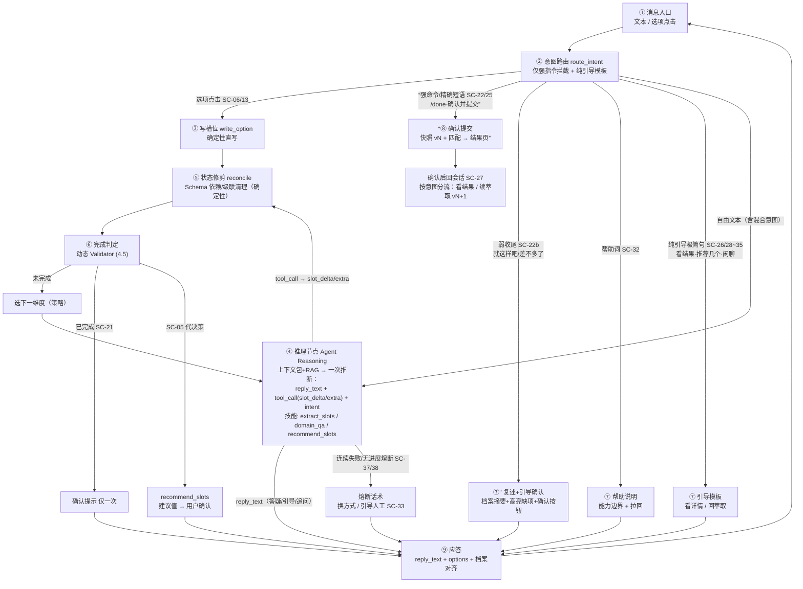
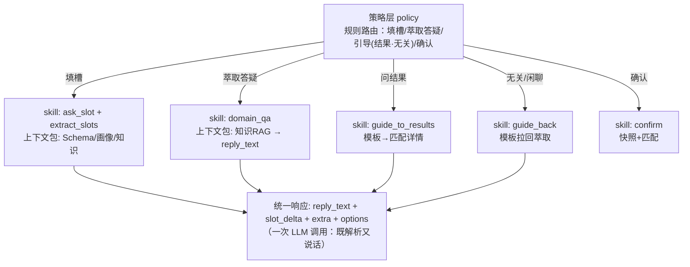

# 需脉枢纽 · 对话 Agent 设计 v2 大纲

> 版本：v0.1（草案） ｜ 定位：**以始为终**的评审大纲（效果驱动，非实现细节） ｜ 状态：待评审 ｜ 更新：2026-08-12
>
> 本大纲只回答三件事：**想达成什么效果（北极星）→ 怎么组织（架构）→ 怎么分步落地（L1/L2/L3）**。
> 评审通过后据此重写《代理详细设计》v2.0；旧文档（v1.2）仅作实现细节参考，不再作为骨架。

## 0. 一句话定位

对话 Agent = **垂直领域“选型顾问”**，且**只专注需求萃取**，而非“表单填写机器人”或“通用助手”：
- **目标明确**：萃取用户需求（含主动引导）
- **框架确定**：围绕需求萃取的会话；**匹配结果问题 → 引导去匹配详情；与萃取无关 → 引导回萃取主线**
- **过程灵活**：萃取域内用户可有各种疑问与诉求（答疑/澄清/纠偏/闲聊）
- **回答智能**：基于用户问题、画像、需求框架、领域知识组织响应（**仅限萃取相关**）

## 1. 北极星（最终效果 · 可度量）

| 北极星 | 含义 | 关键指标（示例） |
| --- | --- | --- |
| **顾问感** | 不机械复读、能答疑给建议 | 同文案重复出现次数 = 0；答疑正确率 ≥ 阈值；首字延迟 < 2s |
| **萃取质量** | 需求完整、准确、无需反复澄清 | 槽位抽取 F1；需求完整度（Schema 必填覆盖）；用户澄清轮次 |
| **对话效率** | 用最少轮次萃取核心信息（顾问不啰嗦） | 平均达成轮次；信息密度 Slots/Turn（对应 SC-04/07 批量合并） |
| **匹配增益** | Agent 是匹配的质量闸门 | 端到端 Top-1 命中率；匹配分数与需求完整度正相关 |
| **可信可解释** | 回答 grounded、不编造 | 答疑可溯源率；“不知道就明说”处理率；越界引导率 |
| **可演进可运营** | 事实数据完整、可回归、新品类可配置 | 评估回归通过率；事实数据完整率；新增品类配置成本 |

## 2. 场景全景与决策流转图（节点与边承载全部场景）

> 目标：列出“纯萃取 Agent”能处理的所有场景，并**用一个“节点与边”决策流转图把它们全部装下**——节点 = 处理环节/动作，边 = 场景触发（SC-xx）+ 处理策略 + 流转去向。
> 评审标准：**流转图完备 ↔ 场景清单完备**（二者互相校验，见 2.4 覆盖表）。

### 2.1 范围边界（先划清“做什么/不做什么”）

**对话 Agent 只专注一件事：需求萃取（含服务于萃取的答疑与引导）。**
- **萃取域（Agent 负责）**：开场/锚点 → 槽位萃取（填槽/打磨/扩展）→ 萃取答疑（仅服务当前槽位决策）→ 完成确认 → 确认提交。
- **引导域（Agent 不做，引导走）**：
  - 问**匹配结果** → 引导用户去“匹配详情”自行查看（Agent 不代答结果、不二次评价厂商）；
  - 与萃取**无关**（闲聊/厂商评价/报价/泛知识/敏感…）→ 引导回萃取主线。
- **横切异常**：任何涉及 LLM 的环节都有“重试→降级”兜底。

> **为什么“深井型”**：Agent 必须是“深井型”——代答匹配结果、二次评价厂商，既易触发 LLM 幻觉，也带来商业合规风险；将答疑严格限制在“服务当前槽位决策”，可控制 Token 消耗并防止用户把 Agent 当百科全书而偏离主线。

### 2.2 场景全景（按“萃取域 / 引导域 / 横切”分组）

> 编号 SC-xx 供流转图引用；支持度 = ✅已有 / ✅已修 / L1 / L2 / L3。

**萃取域 · A 开场 / 锚点**

| SC | 场景 / 输入 | 处理策略 | 流转落点 | 支持度 |
| --- | --- | --- | --- | --- |
| SC-01 | 问候开场（“你好”“我想找代工厂”） | 播报任务 + 首问品类锚点 | 追问 | ✅ |
| SC-02 | 明确品类（“我要做机顶盒”） | 锚点 SET → 进入萃取 | 萃取 | ✅ |
| SC-03 | 品类模糊（“做个电子产品”） | 澄清候选品类/让细化（不猜） | 澄清 | L1 |
| SC-04 | 一次给全（“机顶盒，Linux，CE，5万台”） | 批量多槽一次落库 | 萃取 | ✅ |
| SC-05 | 不知道要什么（“我也不确定”“你看着办”） | recommend_slots：基于画像/知识给建议值 → 用户确认（grounded，不替用户决定） | 推理→建议确认 | L2 |

**萃取域 · B 槽位萃取（填槽 / 打磨 / 扩展）**

| SC | 场景 / 输入 | 处理策略 | 流转落点 | 支持度 |
| --- | --- | --- | --- | --- |
| SC-06 | 回答当前追问（含选项点击“用Linux”） | 写槽位 → 下一维度 | 萃取 | ✅ |
| SC-07 | 一次补充多维度 | 批量合并（去重） | 萃取 | ✅ |
| SC-08 | 纠正（“不对，是Android”） | merge=replace 覆盖 | 萃取 | ✅ |
| SC-09 | 排除（“不要USB”） | EXCLUDED 硬过滤 | 萃取 | ✅ |
| SC-10 | 主动给扩展（“外壳要黑色”） | extra_constraints + 回显 | 萃取 | ✅已修 |
| SC-11 | 自创字段（“需要防水IP65”） | 归 extra_constraints（UC-10） | 萃取 | ✅ |
| SC-12 | 不知道/犹豫（“交期没想好”） | 知识引导或置通配 | 萃取 | L1 |
| SC-13 | 不限/跳过（“接口不限”） | WILDCARD（通配） | 萃取 | ✅ |
| SC-14 | 无信息量（“还有”“继续”） | 开放引导（不重复 confirm） | 萃取 | ✅已修 |
| SC-15 | 别名/模糊值归一（“要安卓”→Android） | 知识归一映射 | 萃取 | ✅ |
| SC-16 | 超长对话 | 早期历史摘要 | 萃取 | L3 |

**萃取域 · C 萃取答疑（仅服务当前槽位决策）**

| SC | 场景 / 输入 | 处理策略 | 流转落点 | 支持度 |
| --- | --- | --- | --- | --- |
| SC-17 | 领域答疑（“Linux和Android区别”——与当前品类/槽位相关） | 知识RAG ≤3~5句 + 引导回槽位 | 答疑→萃取 | L1 |
| SC-18 | 追问上一问（“认证指什么”） | 基于知识/上轮回复解释 | 答疑→萃取 | L1 |
| SC-19 | 重复问同一问题 | 稳定答疑（换角度，不机械复读） | 答疑→萃取 | L1 |
| SC-20 | 制程/认证/合规常识（与萃取相关） | 知识RAG | 答疑→萃取 | L1 |

**萃取域 · D 完成确认**

> **提交入口策略（已定）**：确认提交支持“聊天内提交”，按意图明确度**分级触发**，最终统一收敛到单端点 `/conversation/confirm`：
> - **直接提交（明确授权）**：UI 按钮 / 聊天选项“确认完成” / 强命令 `/done` / 精确短语“确认并提交匹配” → 生成需求档案快照 vN + 触发匹配 → 结果页；
> - **引导确认（弱收尾）**：“就这样吧 / 差不多了 / 可以了” → 简短摘要当前档案 + **高亮缺项** + 亮出“确认并提交匹配”按钮（**不直接提交**，防误触发）。

| SC | 场景 / 输入 | 处理策略 | 流转落点 | 支持度 |
| --- | --- | --- | --- | --- |
| SC-21 | 完成判定达成 | 主动确认提示（仅一次） | 确认提示 | ✅已修 |
| SC-22 | 用户明确授权提交（强命令/选项“确认完成”） | 生成需求档案快照 vN + 触发匹配 → 结果页 | 结束 | ✅ |
| SC-22b | 弱收尾（“就这样吧”“差不多了”） | 简短摘要档案 + 高亮缺项 + 亮出确认按钮（不直接提交） | 复述→引导 | L1 |
| SC-23 | 继续补充 | 开放引导 → 回萃取 | 萃取 | ✅已修 |
| SC-24 | 确认前修改槽位 | 更新 → 重新判定 | 萃取 | ✅ |
| SC-25 | 未达判定但主动完成（强命令） | 允许确认（标注缺项） | 结束 | L2 |

**引导域 · E 引导去匹配详情（Agent 不代答结果）**

| SC | 场景 / 输入 | 处理策略 | 流转落点 | 支持度 |
| --- | --- | --- | --- | --- |
| SC-26 | 问匹配结果/结果相关问题 | 引导“请到匹配详情查看”（不代答） | 引导→回萃取 | L1 |
| SC-27 | 确认后继续在会话发消息 | 按意图分流：问结果→引导看详情；继续补充→续萃取（生成 vN+1） | 引导→回萃取 | L1 |

**引导域 · F 引导回萃取主线（与萃取无关）**

| SC | 场景 / 输入 | 处理策略 | 流转落点 | 支持度 |
| --- | --- | --- | --- | --- |
| SC-28 | 闲聊/情绪（“谢谢”“辛苦了”） | 礼貌一句 + 拉回当前问题 | 引导→回萃取 | L1 |
| SC-29 | 厂商评价/比较（“推荐的厂靠谱吗”） | 不评价 + 引导（回萃取或看结果） | 引导→回萃取 | L1 |
| SC-30 | 报价/价格（“大概多少钱”） | 引导到预算字段 + 说明需规格估价（不承诺价） | 引导→回萃取 | L1 |
| SC-31 | 多话题混入（“机顶盒，另外智能音箱”） | 一会话一产品：聚焦当前 + 提示新会话 | 引导→回萃取 | L1 |
| SC-32 | 帮助/能力边界（“你能做什么”） | 能力说明 + 拉回 | 帮助→回萃取 | L1 |
| SC-33 | 人工/线下（“想跟人聊”） | 提供联系/说明 + 保留现场 | 引导→回萃取 | L2 |
| SC-34 | 敏感/合规诉求（“绕过认证”） | 合规拒绝 + 引导 | 引导→回萃取 | L2 |
| SC-35 | 无关泛知识（“物联网趋势”） | 与萃取无关 → 引导回萃取 | 引导→回萃取 | L1 |

**横切异常（任意涉及 LLM 的环节）**

| SC | 场景 | 处理策略 | 流转落点 | 支持度 |
| --- | --- | --- | --- | --- |
| SC-36 | 中途离开/回来 | 历史恢复现场 | 任意 | ✅ |
| SC-37 | LLM 输出非法 JSON | 重试≤2 → 降级（保留槽位） | 任意 | ✅ |
| SC-38 | 知识不足答不了 | “不知道 + 引导回槽位”（不编造） | 答疑→萃取 | L1 |
| SC-39 | 全链路失败 | 友好降级 + 不丢已确认槽位 | 任意 | ✅ |

### 2.3 决策流转图（节点与边 · 承载全部场景）

> **为什么用“节点与边”而非状态图**：本图要表达的是“每轮会碰到哪些场景、如何分流、如何应答”——本质是 **意图 → 处理 → 应答** 的决策流转（含循环回边），用“节点 = 处理环节 / 边 = 场景触发+策略+去向”最贴切；且与旧文档 2.3 的“节点与边”形态一致，可直接映射到实现（route_intent → skills）。
> 会话生命周期（active / 删除）仍是状态，但那属于**会话级**状态（见 4.4），与**轮级决策流转**分开描述，不混在一张图。



**节点职责说明**

| 节点 | 做什么 | 涉及 SC | 边界 |
| --- | --- | --- | --- |
| ① 消息入口 | 接收文本/选项点击 | 全部 | — |
| ② 意图路由 | 仅强指令拦截（选项/命令/精确短语/弱收尾/纯引导模板）；自由文本一律进推理节点 | 全部 | 确定性优先；自由文本不硬分流 |
| ③ 写槽位 | 选项确定性直写 | SC-06/13 | 不调 LLM |
| ④ 推理节点 | 上下文包+RAG 一次推断：reply_text + tool_call(slot_delta/extra) + intent；内含 extract_slots / domain_qa / recommend_slots | SC-05~20/28~35 | 混合意图一次处理；Tool Calling |
| ⑤ 状态修剪 | Schema 依赖/级联清理（确定性 prune） | SC-08/09/24 | 脏数据擦除，非 LLM |
| ⑥ 完成判定 | 动态 Validator：硬约束 100% 覆盖（4.5） | SC-21 | 确定性规则 |
| 追问下一维度 | 策略层选下一未填维度 → 注入推理节点 | SC-01/03/06 | — |
| 确认提示 | 主动提示（仅一次） | SC-21/23 | — |
| recommend_slots | 基于画像/知识给建议值 → 用户确认 | SC-05 | grounded，不替用户决定 |
| ⑦'' 复述+引导确认 | 档案摘要 + 高亮缺项 + 亮出确认按钮（弱收尾不直接提交） | SC-22b | 不落快照，仅引导 |
| ⑦ 帮助/引导模板 | 帮助说明；看详情；回萃取 | SC-26~35 | 模板、不代答、不评价 |
| ⑧ 确认提交 | 生成需求档案快照 vN + 触发匹配 | SC-22/25 | 单端点 |
| ⑨ 应答 | reply_text + options + 档案对齐 | 全部 | 回入口（循环） |
| 熔断 | 连续失败/无进展 → 换方式/引导人工 | SC-37/38/33 | _stall_counter |

### 2.4 覆盖校验（流转图完备性证明）

| 节点 | 覆盖 SC | 去向 |
| --- | --- | --- |
| 意图路由 | 强指令/纯引导/自由文本全部分流 | 各分支 |
| 写槽位 | SC-06/13 | → 状态修剪 |
| 推理节点 | SC-05~20/28~35（混合一次处理） | tool_call→状态修剪；reply_text→应答 |
| 状态修剪 | SC-08/09/24 | → 完成判定 |
| 完成判定 | SC-21 | → 追问/确认提示/recommend |
| 追问下一维度 | SC-01/03/06 | → 推理节点（策略注入） |
| recommend_slots | SC-05 | → 应答（建议值→确认） |
| 确认提示 | SC-21/23 | → 应答 |
| 复述引导 | SC-22b | → 应答 |
| 帮助/引导模板 | SC-26~35（纯引导极简句） | → 应答 |
| 确认提交 | SC-22/25 | → 结果页 |
| 熔断 | SC-37/38/33 | → 应答（换方式/引导人工） |
| 横切 | SC-36/39 | 恢复/全链路降级 |

> 覆盖校验：全部 SC-01~SC-39 均出现在流转图中，无孤儿场景；**新增场景必须先能在流转图找到落点，否则视为引导（回萃取/看结果）或需扩展节点**。

## 3. 体验原则（设计红线，评审重点）

1. **顾问感**：绝不机械复读同一文案；每轮给用户"新信息或新引导"。
2. **每轮 grounded**：回答基于注入上下文（知识/画像/档案）；知识不足 → "不知道就明说 + 引导"，不编造。
3. **边界清晰**：越界引导回主线；厂商评价唯一权威 = 匹配结果（Agent 不二次评价——既防幻觉，也规避商业合规风险，见 2.1）。
4. **活档案对齐**：用户始终知道"系统听到了什么"（侧边需求档案 + 槽位/扩展回显）。
5. **策略由规则定、表达由模型做**：问什么/引导/答疑由规则层决定，模型只负责理解与表达——可控、可评估、可回归。LLM 是优秀的“文本处理器/语义路由器”，但它是**糟糕的“状态机”**；状态流转交给确定性代码，模型只做 NLU/NLG。

## 4. 架构（草案）

### 4.1 分层：策略层（policy） + 技能层（skills）



> **实现映射（采纳评审修正）**：L1 将流转图实现为“路由 + 函数化 Handler”（每 skill 一个函数，`route_intent` 确定性分发），不引入职责链/编排框架；L3 若状态机分支复杂再 DAG 化（LangGraph），handler 签名保持不变。

### 4.2 一次调用 · 双通道输出（推荐 Tool Calling）

> 采纳外部评审：用 **Native Tool Calling（函数调用）** 替代“自由文本内输出 JSON”——现代模型对 Tool Calling 的结构遵循度远高于自由文本 JSON，且天然隔离 NLU（槽位）与 NLG（回复），根治 Attention Tax。

- **槽位更新 = Tool Call**：把需求 Schema 定义为 LLM 的一个 Tool `update_requirement_slots(os?, interfaces?, certifications?, …, extra_constraints?)`；槽位/扩展更新走 `tool_calls` 参数（结构化、强约束）。
- **回复生成 = message.content**：`reply_text`（答疑/引导/自然追问）走消息正文（自由文本，限长）。
- **轮次判定**：有 `tool_call` → 解析 `slot_delta/extra` → `merge_slot` → 状态修剪 → 完成判定 → 追问；无 `tool_call` 且正文为答疑 → 领域答疑（知识 RAG）；无 `tool_call` 且正文为引导 → 引导（模板兜底）。
- **混合意图一次处理（采纳评审漏洞一/二）**：自由文本（含“问结果 + 填槽”混合）统一进推理节点，LLM 同时产出 `reply_text`（可含引导）与 `tool_call`（槽位更新），不再由规则硬分流；LLM 输出 `intent` 供策略层校验/审计。
- **校验分离**：`tool_call` 参数必须过 Pydantic + 枚举（复用现有 `validate`）；`reply_text` 仅限长。
- **规则层兜底**：`reply_text` 为空时退回 `decide_question` 确定性追问；引导类（看结果/回萃取）用固定模板。
- **影响面（L1 最大改动）**：`llm/client.py` 的 `chat()` 扩展支持 `tools`/`tool_choice`；`agent.py` 的 `extract_slots` 重构为解析 `tool_calls`；`Schema → tool JSON Schema` 映射；评估/回归适配。
- **兜底**：若 Tool Calling 在目标模型上不稳（F1 不达标），退回“分离两调用”（NLU 一刀 + NLG 一刀，可并行抵消延迟）。

### 4.3 上下文包（context packs，按意图注入）

| 包 | 注入内容 | 用于 |
| --- | --- | --- |
| 填槽包 | Schema + 当前槽位（三态）+ 画像 + 知识RAG | 填槽/打磨 |
| 答疑包 | 知识RAG（优先）+ 当前品类 + 当前槽位 | domain_qa |
| 引导包 | 品类名（guide_back 回萃取）/ 匹配结果指针（guide_to_results 看详情） | 引导 |
| 确认包 | 需求档案快照 | confirm |

每包独立 Token 预算与裁剪、独立审计（`llm_call_logs`）。

### 4.4 状态模型（三层分离）

- **会话级（生命周期）**：`active` / 删除（逻辑删除 `deleted_at`）。**不再有 `confirmed` / `closed`**——提交是可重复事件，不是会话终态（见下方“会话状态重新设计”）。
- **轮级**：intent / pending_slot / options（现有 `_pending`，扩展）
- **需求级**：三态槽位 + 排除 + extra_constraints（现有）
- 明确约定：`_` 前缀键为轮级内部状态，不落快照（现有 `_slots_*` 已跳过）。

> **会话状态重新设计（评审确认 2026-08-12 · 仅文档层修订，代码随 v2.0 实现）**
>
> **旧设计问题**：`Conversation.status = active / confirmed / closed` 把两个不同维度的生命周期混进一个字段——
> - 会话本体的生命周期终点只有**删除**；`closed` 抢占“终态”位 → 与“会话不删除即可随时恢复”冲突；
> - 提交匹配是**可重复事件**（每次 confirm 生成新的需求档案快照 vN+1），用会话级“终态”表达 → 与“满足条件可无限次提交”冲突。
>
> **现状事实（代码核对）**：`confirm()` 每次生成新 `BuyerRequest`（`version` 递增）+ 新 `MatchRun`，互不覆盖；`conv.status` 实际只设过 `confirmed`，**从未设过 `closed`**；`message()` 不检查会话状态，确认后仍可继续萃取。即“**每次提交 = 一份需求档案快照**”已成立，会话天然支持无限次提交；坏的是会话级 `status` 承载了本不该它管的“提交态”。
>
> **重新设计（收敛）**：
> 1. `Conversation.status` 只保留生命周期：`active` / 删除（`deleted_at` 承担删除，删除 = 用户侧唯一终态）；移除 `confirmed` / `closed`。
> 2. 提交 / 匹配状态**全部下沉到需求级**：`BuyerRequest`（快照 vN，独立 request_id）+ `MatchRun`（running → ready / failed）各自表达“一次提交”的状态；会话不再记录“已提交过”。
> 3. 界面“已提交”提示 = **派生值**（`buyer_requests` 计数 / 最近匹配时间），不加会话级字段。
> 4. 本大纲连带修订：SC-22“→ closed”→“→ 生成需求档案快照 vN + 触发匹配 → 结果页”；SC-27“状态锁定”→“按意图分流：问结果→引导看详情；继续补充→续萃取（vN+1）”。

### 4.5 需求字段分级 + 动态完成判定（采纳评审，定评审问题 6）

- **字段分级**：Schema 字段增加必填级别 —— **硬约束（hard）**：品类锚点等缺失则无法匹配；**软引导（soft）**：细节参数（外壳材质/特定接口），可通配不阻塞；**可选（optional）**：预算等。
- **动态 Validator**：按当前品类拉取必填项列表（`fields_for(pt)` 扩展），仅硬约束 100% 覆盖才触发 SC-21（完成判定达成）。
- **提交门槛（修正评审口径）**：品类锚点缺失 → 禁止提交；其余硬约束缺失 + 强命令提交 → **允许但强制显著警示缺项**（不静默），对应 SC-25。
- **状态修剪 reconcile（采纳评审漏洞三）**：merge 后按 Schema 依赖/联动声明做确定性级联清理（如品类锚点变更→清空旧品类扩展字段），擦除脏数据，再进完成判定。
- **死循环熔断（采纳评审漏洞五）**：轮级状态加 `_stall_counter`（连续无进展：空 slot_delta + 无新信息），达阈值触发熔断话术（换方式/引导人工，关联 SC-33），防止“问询→废话→再问询”死锁。

### 4.5a 动态待填集注入（pending_slots，回应评审“依赖式 Schema 下如何向 LLM 传递追问优先级”)

> **核心立场**：待填槽位的**优先级是规则的输出、模型的输入**（红线 5）。LLM 不“决定”接下来问什么，只负责“理解用户说了什么 + 把该问的说自然”。追问顺序是确定性代码算好之后作为受控上下文注入的。

- **确定性函数 `pending_slots(pt, state)`**：按“当前品类 + 当前已填槽位”走 Schema 依赖/联动声明，算出**当前合法**的待填集，每条带（field、必填级别、问题模板、options、依赖来源）。排序由规则定：**硬约束 → 软引导 → 可选**；依赖未满足的槽位不出现（没选品类，不出现品类专用认证）。该函数与 4.5 动态 Validator `fields_for(pt)` 同源扩展，保证“判完成”与“问问题”口径一致。
- **三层受控注入**（而非让 LLM 自由发挥）：

| 注入层 | 内容 | 作用 |
| --- | --- | --- |
| 本轮锚点 `next_slot` | 策略层 ASK 已选定“下一维度”，只注入这一个字段 | 模型首要任务：围绕它自然提问 + 解析回答 |
| 合法待填集 `allowed_set` | 当前可写槽位显式清单（key + 模板 + 级别 + options） | 模型只能在此集合内落值 |
| 动态裁剪的 Tool Schema | `update_requirement_slots` 参数按 `allowed_set` 每轮实时生成 | **结构性强制**：当前不合法字段根本不进 tool 参数，想填也填不进 |

- **为什么“合乎逻辑且不突兀”**：① 不跳问——模型首要任务是当前 `next_slot`，混合意图也只允许顺带写入 `allowed_set` 内的值；② 不问失效字段——reconcile 确定性清掉失效槽位，pending 集随状态刷新；③ 问得有理有据——每条 pending 带“依赖来源”，模型可自然说“因为您选了 X，所以想确认 Y”；④ 兜底——`reply_text` 空/跑偏退回确定性模板问 `next_slot`，连续无进展触发 `_stall_counter` 熔断。
- **可评估性**：每轮把 `pending_slots` + `next_slot` 落 `conversation_events`，评估集可断言“品类=机顶盒、接口=HDMI 时，下一问必须是 HDMI 相关，不得问扩展认证”——**追问顺序合理性变成可回归的测试用例**，而非人工读对话判断。

### 4.6 轮次协议（turn protocol，可评估/可重放基础）

```
输入(消息/选项) → 策略层路由 → 执行 skill → 统一响应 → 落库（事实数据 + 档案）
```
每轮固定写 `conversation_events`（user_message / skill_x / question / reply + `pending_slots` / `next_slot`），保证可回放、可回归；其中 `pending_slots`/`next_slot` 供评估集断言“该问 B 时未问 A”（见 4.5a）。

## 5. 实现分步（L1 → L2 → L3，每步可交付可验收）

### L1 · 体验修复（近期，先解决“机械复读/不答疑/不会引导”）
- 范围：① **Tool Calling 化**（推理节点：一次推断 reply_text + tool_call + intent，混合意图一次处理；萃取答疑 SC-17~20 + 引导 SC-26~35）② **提交入口分级**（SC-22/22b/25）③ 完成判定：字段分级 + 动态 Validator + **状态修剪 reconcile** + **动态待填集注入 pending_slots**（见 4.5/4.5a）④ **死循环/失败熔断（_stall_counter）** ⑤ 扩展/槽位回显（已部分完成）
- 验收：萃取答疑（SC-17~20）、引导（SC-26~35）走通；同文案重复 = 0；回归现有对话链路
- 预估：后端 2 文件 + 前端 1 文件 + 契约微调

### L2 · 能力补全（体验与匹配增益）
- 范围：顾问反推（SC-05）、未达判定主动完成（SC-25）、画像驱动引导强化；答疑 grounded 优化（知识 Q 示例、命中反哺知识库）；多品类字段配置化
- 验收：SC-05/25 走通；答疑可溯源率达标；新品类无需改代码

### L3 · 工程化（体验与可运营）
- 范围：SSE 流式（`reply_text` 变长后必要）；LangGraph 化（若状态机分支复杂到需图级 checkpoint/重放，再引入；`route_intent`/skills 签名保持不变）；Token 成本与可观测优化；评估 CI 回归接入
- 验收：流式体验、回归自动化、成本可视化

## 6. 与旧文档关系

- 旧《代理详细设计 v1.2》：类型定义 / 状态机 / RAG / 记忆四层 / 校验 / 第 10 章三档框架 → **作为实现细节资料吸收**进 v2 对应章节，不作为骨架。
- v2 最终形态建议拆两份：《代理设计》（why/what，效果驱动）+《代理实现说明》（how，LLD，随实现展开）。

## 7. 待评审问题（请重点确认）

1. **北极星指标**：5 条是否对？哪些要加/减/换指标？
2. **图类型与覆盖**：改用“节点与边”决策流转图是否符合预期？（节点=处理环节，边=场景+策略+去向）39 个场景（SC-01~39）是否覆盖完整、有无遗漏/多余？
3. **纯萃取边界**：Agent 只专注萃取；匹配结果→引导看详情、无关→引导回萃取——是否认可？萃取答疑是否只限于“服务当前槽位决策”？
4. **Tool Calling（推荐）**：槽位更新走函数调用、回复走正文——L1 首选 Tool Calling（比单调用 JSON 更稳）；若目标模型不稳则退回“分离两调用”——是否认可？
5. **红线“策略规则定、表达模型做”**：是否确认为不可破原则？
6. **完成判定完善（采纳评审，已给建议口径）**：字段分级（硬/软/可选）+ 按品类动态 Validator；品类锚点缺失禁止提交、其余硬约束缺失强命令可提交但强制警示（SC-25）。——确认此口径？
7. **会话状态重新设计（已确认方向）**：会话级 status 收敛为 `active` / 删除，提交状态下沉到 `BuyerRequest` / `MatchRun`，SC-22 / SC-27 措辞已同步修订（见 4.4）。——确认后进入《代理详细设计》v2.0。
