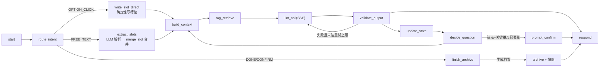
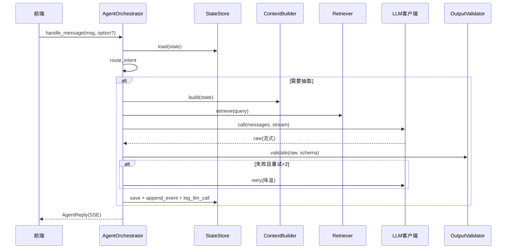
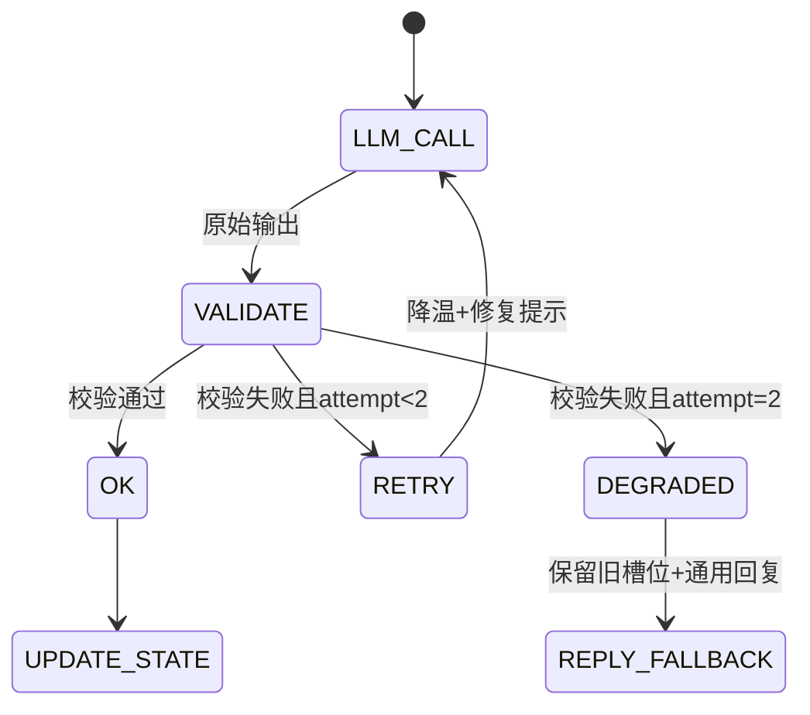
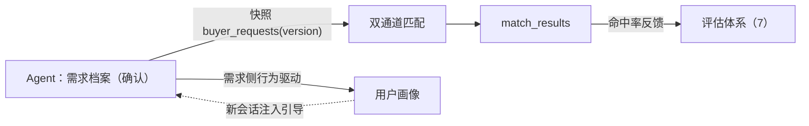

# 需脉枢纽 · 代理详细设计（LLD）

> 版本：v1.1 ｜ 状态：指导编码 ｜ 更新：2026-08-09
>
> 本文档是**需求对话代理（专属 Agent）**的详细设计（Low-Level Design），目标是**可直接指导编码**：包含领域类型定义、组件接口、算法伪代码、流程图、组件图、状态转换表、异常路径与关键用例。
>
> **相关文档**：《系统架构设计.md》（3.4 异步层 / 5.x 契约 / 6.4 Prompt）、《核心系统需求.md》（3.1 对话Agent）、《用户画像设计.md》、《系统开发计划.md》（M3 对话Agent）。

## 目录
0. 类型与接口总览
1. 目标与设计原则
2. LangGraph 状态图（类型 / 意图分类 / 节点 / 转换表 / 时序 / 完成判定）
3. 上下文组装管线（模板 / Token 预算 / 裁剪算法）
4. 记忆四层架构（接口 / 窗口 / 摘要）
5. RAG 整合（query 算法 / 参数 / 注入模板）
6. 输出解析与校验（模型 / 校验器 / 重试降级状态机）
7. Agent 评估体系（指标函数 / 评估集结构 / 稳定性采样）
8. 与双通道匹配的接口（调用契约 / 数据结构）
9. PoC 落地项 vs 演进项 + 关键用例

---

## 0. 类型与接口总览（编码坐标系）

> 本部分是全部领域类型、枚举、组件接口的集中定义，实现时以本部分为唯一事实源；后续各章引用这些类型。

### 0.1 领域枚举
```python
class IntentType(str, Enum):
    OPTION_CLICK = "option_click"   # 选项按钮点击（确定性写槽位）
    FREE_TEXT    = "free_text"      # 自由文本（LLM 解析，含补充/纠正/排除，即“需求打磨”）
    CONFIRM      = "confirm"        # 确认需求档案
    DONE         = "done"           # 完成需求描述
    HELP         = "help"           # 帮助

class SlotTriState(str, Enum):
    SET      = "set"       # 已指定
    WILDCARD = "wildcard"  # 未指定（通配，null）
    EXCLUDED = "excluded"  # 明确排除（负向过滤）

class CompletionSignal(str, Enum):
    NONE           = "none"             # 未到完成
    AGENT_PROMPTED = "agent_prompted"   # Agent 已主动提示"确认完成？"
    USER_ACTIVE    = "user_active"      # 用户主动完成/确认

class Verdict(str, Enum):               # 与匹配通道B共用
    MATCHED   = "matched"
    PARTIAL   = "partial"
    MISSING   = "missing"
    UNMATCHED = "unmatched"
```

### 0.2 核心状态与消息类型
```python
class SlotValue(TypedDict):
    value: object            # 已指定时的值（str/list/number）
    state: SlotTriState      # 三态

class TurnMessage(TypedDict):
    role: str                # "user" | "assistant"
    content: str
    options: list[str]       # assistant 可选：选项按钮
    slot_delta: dict         # assistant 可选：本轮槽位变化（供前端三态渲染）

class KnowledgeHit(TypedDict):
    knowledge_id: str
    category: str            # terminology/trap/dependency/faq
    content: str
    score: float

class ProfileContext(TypedDict):
    user_id: str
    summary: dict            # {维度key: 值}，已按 use_in_prompt 过滤
    confidence: dict         # {维度key: 置信度}

class AgentState(TypedDict):
    conversation_id: str
    current_slots: dict[str, SlotValue]
    history: list[TurnMessage]
    retrieved_knowledge: list[KnowledgeHit]
    profile_context: ProfileContext | None
    pending_question: str | None       # 当前待追问维度（Schema 未填项）
    completion_signal: CompletionSignal
    archive: dict | None               # 确认后的需求档案
    raw_llm: dict | None               # 上一轮 LLM 原始输出（审计）
    error: str | None                  # 最近一次异常标记
```

### 0.3 组件接口（conversation 域内部）
```python
class StateStore(Protocol):
    """持久化 AgentState 到 PG + 写事实数据"""
    async def load(self, conversation_id: str) -> AgentState
    async def save(self, state: AgentState) -> None
    async def append_event(self, conversation_id: str, seq: int,
                           event_type: str, payload: dict) -> None
    async def log_llm_call(self, call: dict) -> None   # -> llm_call_logs

class Retriever(Protocol):
    """领域知识检索（RAG）"""
    async def retrieve(self, query: str, industry: str | None,
                       top_k: int, min_score: float) -> list[KnowledgeHit]

class ContextBuilder(Protocol):
    """组装每轮 messages（第 3 章）"""
    async def build(self, state: AgentState) -> list[dict]

class OutputValidator(Protocol):
    """校验并结构化 LLM 输出（第 6 章）"""
    async def validate(self, raw: str, schema: type) -> dict

class AgentOrchestrator(Protocol):
    """Agent 主入口：接收消息 → 返回回复"""
    async def handle_message(self, conversation_id: str,
                             message: str | None,
                             clicked_option: str | None) -> AgentReply

class AgentReply(TypedDict):
    text: str
    options: list[str]
    updated_slots: dict[str, SlotValue]
    completion_flagged: bool
    archive: dict | None     # confirm/done 后返回
    error: str | None
```

### 0.4 配置常量
```python
CONFIG = {
  "llm":     {"model": "deepseek-chat", "temperature": 0.2,
              "max_tokens": 1024, "retry": 2},
  "history": {"window_turns": 10, "summary_threshold": 12},
  "rag":     {"top_k": 3, "min_score": 0.6},
  "completion": {
      "key_dims": ["os", "interfaces", "certifications"],  # 关键维度（按品类扩展）
      "prompt_on_anchor_and_key": True,
  },
  "eval":    {"stability_runs": 5,
              "slot_consistency_threshold": 0.95,
              "score_std_threshold": 2.0,
              "top5_jaccard_threshold": 0.9,
              "rank_shift_max": 1},
}
```

---

## 1. 目标与设计原则

### 1.1 目标
通过多轮对话，把采购方自然语言转化为**完整、准确、可计算、可匹配、可解释**的结构化需求档案（`structured_demand`），并推动"档案→匹配→反馈"闭环。

### 1.2 设计原则
| # | 原则 | 落地 |
| --- | --- | --- |
| 1 | **Schema 驱动** | 抽取/追问仅在 Schema（分层+三态）坐标系内；自创字段只入 `extra_constraints` |
| 2 | **判定确定性优先** | 选项点击直写 / 枚举映射 / 数值比较走规则，LLM 只处理语义模糊部分（第 2/6 章） |
| 3 | **记忆分层** | 短期/工作/长期/领域四层不混用（第 4 章） |
| 4 | **可评估可回归** | 任何变更过评估集回归（第 7 章） |
| 5 | **成本可控** | Token 预算化；事实数据可离线分析（第 3 章） |

---

## 2. LangGraph 状态图

### 2.1 状态类型
见 0.2 `AgentState`；状态通过 `StateStore` 持久化到 PG（`conversations.current_slots` + `conversation_history`），进程重启不丢。

### 2.2 意图分类算法（route_intent）
```python
def route_intent(message: str | None,
                 clicked_option: str | None,
                 state: AgentState) -> IntentType:
    if clicked_option:
        return IntentType.OPTION_CLICK          # 确定性
    if message is None:
        return IntentType.CONFIRM               # 无文本=确认动作
    m = message.strip()
    if re.match(r"^/done$", m, re.I) or "完成需求" in m or "就这样" in m:
        return IntentType.DONE
    if "确认" in m and state.current_slots.get("product_type"):
        return IntentType.CONFIRM
    if m in ("帮助", "help", "?") or m.startswith("/help"):
        return IntentType.HELP
    return IntentType.FREE_TEXT    # 补充/纠正/排除统一按文本解析，经 merge_slot 合并（6.4）
```

### 2.3 节点与边


**每节点方法签名**：
```python
async def write_slot_direct(state, slot_key, value) -> None    # 确定性写槽位（三态 SET）
async def extract_slots(state, message, intent) -> dict        # LLM 解析；返回 slot_delta（merge_slot 合并见 6.4）
async def build_context(state) -> list[dict]                    # 第 3 章
async def rag_retrieve(state) -> None                           # 第 5 章
async def llm_call(messages) -> str                             # 统一封装（0.4 参数）
async def validate_output(raw, schema) -> dict                  # 第 6 章
async def update_state(state, validated) -> None                # 写槽位/历史/标记
async def decide_question(state) -> str | None                  # 2.6
async def prompt_confirm(state) -> bool                         # 是否主动提示
async def finish_archive(state) -> dict                         # 生成档案+快照
```

### 2.4 状态转换表
| 当前状态 | 输入事件 | 动作 | 下一状态 |
| --- | --- | --- | --- |
| 采集中 | OPTION_CLICK | 直写槽位 | 采集中（若关键维度齐→可提示完成） |
| 采集中 | FREE_TEXT | LLM 解析 → merge_slot 合并（补充/纠正/排除；不新档案、不重匹配） | 采集中 |
| 采集中 | DONE | 生成档案（vN） | 待确认 |
| 采集中 | CONFIRM | 生成档案 + 快照（version++）+ 触发匹配 | 已确认（closed） |
| 待确认 | 修改槽位 | 生成 vN+1 + 提示"是否重新匹配" | 待确认 |
| 已确认 | — | 会话关闭 | closed |

### 2.5 每轮对话时序


### 2.6 完成判定与追问选择算法
```python
def decide_question(state) -> str | None:
    """从 Schema 未填项选下一追问维度；全部覆盖返回 None"""
    dims = load_schema_dimensions(state.current_slots.get("product_type"))
    for d in dims:                      # 按 Schema 顺序（关键维度优先）
        if d not in state.current_slots or state.current_slots[d].state in (WILDCARD,):
            return d
    return None

def should_prompt_confirm(state) -> bool:
    if state.completion_signal == CompletionSignal.USER_ACTIVE:
        return False                    # 用户已主动，不再提示
    anchor = state.current_slots.get("product_type")
    if not anchor or anchor.state != SlotTriState.SET:
        return False                    # 品类锚点未确认
    key = CONFIG["completion"]["key_dims"]
    covered = sum(1 for d in key if d in state.current_slots
                  and state.current_slots[d].state == SlotTriState.SET)
    if covered >= len(key) and state.completion_signal != CompletionSignal.AGENT_PROMPTED:
        return True                     # 关键维度齐 + 未提示过
    return False
```

---

## 3. 上下文组装管线

### 3.1 System Prompt 七段模板与 Token 预算

固定装配顺序（优先级从高到低），每段有明确占位符与 Token 预算：

| 序 | 段 | 模板（占位符） | 预算 |
| --- | --- | --- | --- |
| 1 | 角色与任务 | `你是需脉AI选型助手，专业的B2B代工需求采集专家…` | ~120 |
| 2 | 需求 Schema | `# 需求Schema（分层+三态）\n固定字段：{schema_fixed}\n品类扩展：{schema_category}\n三态说明：…` | ~400 |
| 3 | 用户画像 | `# 当前用户画像\n{profile_summary}`（无画像则省略） | ~200 |
| 4 | 领域知识 | `# 行业背景知识\n{knowledge_blocks}`（低于阈值不注入） | ~300 |
| 5 | 会话历史 | `# 当前对话历史\n{history_compressed}` | 窗口或摘要，~800 |
| 6 | 当前槽位 | `# 当前需求槽位（三态）\n{slots_view}` | ~300 |
| 7 | 输出要求 | `必须输出 JSON：{assistant_message, options, updated_slots}…` | ~150 |

### 3.2 对话 System Prompt 全文模板（静态段）
> 动态段（`{user_profile_context}` / `{retrieved_knowledge}` / `{conversation_history}` / `{slots_view}`）由 3.1 装配管线填充；下为静态部分全文（由架构 6.4 下沉）：

```markdown
你是需脉AI选型助手，一个专业的B2B代工制造需求采集专家。

# 你的任务
通过多轮对话，帮助采购方明确他们的代工需求，最终输出一个完整的结构化需求JSON。

# 需求Schema（分层 + 三态；未指定即通配）
固定字段（未指定置 null = 通配，不限制匹配）：
{
  "product_type": "string, 必填品类锚点: 机顶盒/智能音箱/IoT设备/其他",
  "os": ["string, 多选: Linux/Android/RTOS/其他"],
  "interfaces": ["string, 多选: 网口/USB/HDMI/GPIO/其他"],
  "certifications": ["string, 多选: CE/FCC/CCC/SRRC/ISO9001/其他"],
  "moq": "number, 最小起订量(台)",
  "lead_time_days": "number, 交期(天)",
  "application_scenario": "string, 应用场景",
  "customization_needs": "string, 定制需求",
  "budget_range": "string, 可选, 预算范围"
}
三态：已指定 / 未指定(null，通配) / 排除(标记 excluded:true)
品类扩展：按产品类型加载（如机顶盒→OS/接口等特有维度）
开放扩展：用户提出的未预定义维度，存入 extra_constraints[]（附加约束，不参与参数级计分）

# 对话规则
1. 每轮对话后，你必须输出一个JSON，包含：assistant_message（给用户的话）、options（选项按钮）、updated_slots（更新后的槽位）
2. 萃取中对需求档案的变更（补充/纠正/排除，即“需求打磨”）仅更新对应槽位，不视为新档案
3. 当 product_type 已确认且关键维度有覆盖时，主动提示"确认完成？还是继续补充？"；用户点击"完成需求描述"或输入 /done 时结束萃取
4. 不要编造用户没说过的信息；未提字段置 null（通配）
5. 如果用户对某个字段犹豫，你可以根据行业知识给出建议
6. 已确认档案被修改时，提示"是否基于新需求重新匹配？"

# 当前用户画像
{user_profile_context}

# 行业背景知识
{retrieved_knowledge}

# 当前对话历史
{conversation_history}

请基于以上信息，生成你的回复。
```

### 3.3 拼装算法（build_context）
```python
async def build_context(state: AgentState) -> list[dict]:
    sys = "\n".join([
        TEMPLATE_ROLE,
        render_schema(state.current_slots),          # 段2：固定+品类扩展
        render_profile(state.profile_context),       # 段3（可省略）
        render_knowledge(state.retrieved_knowledge), # 段4（可省略）
        render_history(compress_history(state.history)),  # 段5（窗口/摘要）
        render_slots(state.current_slots),           # 段6（三态展示）
        TEMPLATE_OUTPUT,                             # 段7
    ])
    messages = [{"role": "system", "content": sys}]
    messages += [{"role": t["role"], "content": t["content"]}
                 for t in state.history[-CONFIG["history"]["window_turns"]:]]
    return messages
```

### 3.4 历史裁剪/摘要算法
```python
def compress_history(history: list[TurnMessage]) -> list[TurnMessage]:
    """超过窗口则把更早历史压缩为一段摘要（演进：摘要缓存）"""
    n = CONFIG["history"]["window_turns"]
    if len(history) <= n:
        return history
    early = history[:-n]
    recent = history[-n:]
    digest = summarize(early)          # LLM 摘要：早期要点（一段）
    return [{"role": "assistant", "content": f"[早期对话摘要] {digest}"}] + recent
```
- 槽位**始终全量注入**（三态），是工作记忆核心，不可省略；
- Token 超预算时**优先裁剪段 4（知识）与段 5（历史）**，不裁剪段 2（Schema）与段 6（槽位）。

### 3.5 事实数据记录（append-only）
所有 Agent 会话、LLM 输入输出以**事实数据**只增不删不改保存，与可观测性指标分离。

```sql
CREATE TABLE llm_call_logs (
  llm_call_id   UUID PRIMARY KEY DEFAULT gen_random_uuid(),
  conversation_id UUID,
  turn          INT,
  task          VARCHAR(50),         -- dialogue/extract/verdict/explain/profile
  input_full    JSONB,               -- 完整入参：System Prompt 各区块 + messages
  output_raw    JSONB,               -- 模型原始输出
  model         VARCHAR(100),
  params        JSONB,               -- temperature/max_tokens 等
  latency_ms    INT,
  tokens        JSONB,               -- {prompt, completion, total}
  status        VARCHAR(20),         -- ok/retried/failed/degraded
  retry_of      UUID,
  created_at    TIMESTAMP DEFAULT CURRENT_TIMESTAMP
);
-- 不可变：应用层禁止 UPDATE/DELETE；仅读 + 冷归档

CREATE TABLE conversation_events (
  event_id    UUID PRIMARY KEY DEFAULT gen_random_uuid(),
  conversation_id UUID,
  seq         INT,
  event_type  VARCHAR(30),           -- user_message/agent_reply/slot_update/
                                     --   completion_flagged/confirm/archive/snapshot
  payload     JSONB,
  created_at  TIMESTAMP DEFAULT CURRENT_TIMESTAMP
);
```

**消费链路**：事实数据 → ① 评估集建设（7.3）② 稳定性重放（7.2）③ 问题回溯（重放完整入参）④ 优化分析。

---

## 4. 记忆四层架构

### 4.1 四层接口与存储映射
| 层 | 接口 | 存储 | 生命周期 |
| --- | --- | --- | --- |
| 短期（会话历史） | `history_read/write(conversation_id)` | `conversations.conversation_history` | 会话内 |
| 工作（当前槽位） | `slots_read/write(conversation_id)` | `conversations.current_slots` | 会话内 |
| 长期（用户画像） | `profile_read(user_id)` / `profile_update` | `user_profiles.profile_data`（Schema 驱动，画像设计） | 跨会话 |
| 领域（知识库） | `knowledge_retrieve(query)` | `knowledge_items` + `knowledge_base`（Milvus） | 全局 |

```python
# 工作记忆访问（确定性，不经过 LLM）
async def set_slot(state, key, value, tri=SlotTriState.SET) -> None
async def exclude_slot(state, key) -> None              # 用户明确排除
async def wildcard_slot(state, key) -> None             # 用户表示"不限"
```

### 4.2 窗口与摘要策略
- 短期记忆窗口：最近 `10` 轮（常量）；超过 `12` 轮触发早期摘要（3.3）；
- 长期画像：由 `structured_demand` + 对话显式偏好**异步**提取（画像设计 4），不阻塞主流程；
- 摘要结果缓存（演进项：按会话+版本缓存，避免重复计费）。

### 4.3 约束
- 四层**不混用**：短期历史绝不写进画像；画像/知识不进匹配打分（第 8 章）；
- 进程重启不丢：短期/工作记忆均在 PG（ADR-09）。

---

## 5. RAG 整合

### 5.1 query 构造算法
```python
def build_rag_query(state: AgentState) -> str:
    """query = 已确认槽位摘要 + 最近用户消息"""
    slots = " ".join(f"{k}:{v['value']}" for k, v in state.current_slots.items()
                     if v["state"] == SlotTriState.SET)
    last_user = next((t["content"] for t in reversed(state.history)
                      if t["role"] == "user"), "")
    return f"{slots} {last_user}".strip()
```

### 5.2 检索参数与过滤
- 集合：`knowledge_base`；`top_k=3`、`min_score=0.6`（低于阈值不注入，防噪声）；
- 过滤：按品类/行业（`product_type` → `industry` 维度）过滤后再相似度排序；
- 注入：System Prompt 第 4 区块，固定格式 `[来源:{category}] {content}`，与 Schema/指令隔离（防 Prompt 注入）；
- 边界：知识只增强对话专业性，**不参与匹配打分**（第 8 章）。

---

## 6. 输出解析与校验

### 6.1 对话输出模型（Pydantic）
```python
class AssistantOutput(BaseModel):
    assistant_message: str          # 给用户的话
    options: list[str] = []        # 选项按钮（可空）
    updated_slots: dict[str, SlotValue] = {}   # 更新后的槽位（三态）
    completion_flagged: bool = False           # 是否主动提示确认
```
> `SlotValue` 需枚举校验 `state ∈ {set, wildcard, excluded}`；`updated_slots` 的 key 必须存在于 active Schema（自创 key → 归入 `extra_constraints` 或丢弃）。

### 6.2 OutputValidator 接口与校验流程
```python
async def validate(raw: str, schema: type) -> dict:
    # 1) 提取 JSON 片段（容忍 markdown 代码块包裹）
    json_str = extract_json_fragment(raw)
    # 2) 反序列化 + Schema 校验；失败重试 ≤2 次
    for attempt in range(CONFIG["llm"]["retry"] + 1):
        try:
            return schema.model_validate(json.loads(json_str)).model_dump()
        except (json.JSONDecodeError, ValidationError):
            if attempt < CONFIG["llm"]["retry"]:
                json_str = await repair_attempt(raw)   # 降温 + "严格按格式"修复提示
            else:
                raise OutputValidationError(raw)
```
- **降级**：校验仍失败 → 保留旧槽位 + 返回通用引导话术（不阻塞对话）；
- **确定性强化**：选项点击**直写槽位**（不走 LLM）；枚举字段 strict 映射；数值比较（交期/起订量）走规则。

### 6.3 重试/降级状态机


### 6.4 槽位合并规则（merge_slot，需求打磨的变更落点）
用户输入（补充/纠正/排除）统一经 LLM 解析出 `slot_delta` 后，由 `merge_slot` 按**字段类型**决定合并语义——这是“需求打磨=对需求档案的完善与变更”的实现核心：

```python
def merge_slot(slots: dict[str, SlotValue],
               key: str, delta: SlotValue) -> None:
    """按字段类型决定覆盖/追加/排除"""
    field = schema_field(key)                 # 从 Schema 取字段类型
    if delta.state == SlotTriState.EXCLUDED:
        slots[key] = delta                    # 排除（负向过滤），直接覆盖
        return
    if field["multi"]:                        # 多选字段（os/interfaces/certifications）
        if delta.state == SlotTriState.WILDCARD:
            slots[key] = delta                # 明确"不限"
            return
        old = slots.get(key, {"value": [], "state": SlotTriState.SET})
        if delta.get("merge", "append") == "append":
            merged = old["value"] + [v for v in delta["value"] if v not in old["value"]]
        else:                                 # “覆盖”（如纠正成新值）
            merged = delta["value"]
        slots[key] = {"value": merged, "state": SlotTriState.SET}
    else:                                     # 单选字段（product_type 等）
        slots[key] = {"value": delta["value"], "state": SlotTriState.SET}
```

**规则要点**：
- **排除**（“不要 USB”）→ 直接置 `EXCLUDED`，参与负向过滤；
- **多选追加**（“再加个 CE”）→ 去重追加；
- **多选覆盖 / 单选**（“改成 Android”）→ 覆盖旧值；
- 未提及字段一律不动（`merge_slot` 只处理 delta 中的 key）；
- 任何变更**不生成新档案、不触发重匹配**——只有“已确认档案修改”才产生 vN+1（2.4 状态分界）。

---

## 7. Agent 评估体系

### 7.1 六维指标（函数签名）
```python
# 输入：评估集 + Agent 输出；返回指标
def slot_extraction_f1(gold: dict, pred: dict) -> float        # 正确性（per-field）
def completeness_score(gold: dict, pred: dict) -> float        # 完整度（关键字段覆盖率）
def guidance_quality(events: list) -> dict                     # 引导：轮数/纠正次数/重复询问
def e2e_top1_hit(gold: dict, matches: list) -> float          # 端到端：档案→匹配Top-1命中
def latency_and_cost(logs: list) -> dict                       # 体验：首字延迟/Token
def stability_metrics(runs: list[dict]) -> dict                # 稳定性（7.2）
```

### 7.2 稳定性（重点）
- **定义**：同需求档案 + 同数据集 + 同配置，多次运行结果一致或方差可控；
- **判定不稳定必须稳定**（槽位/verdict/完成判定），表述不稳定可容忍（措辞）；
- **采样流程**：同一输入重复运行 `N=5` 次 → 计算：

| 指标 | 建议阈值 |
| --- | --- |
| 槽位抽取一致率 | ≥ 95% |
| `match_score` 标准差 | ≤ 2 分 |
| Top-5 厂商集合重合率（Jaccard） | ≥ 90% |
| 排序位移（平均 |Δrank|） | ≤ 1 名 |

```python
def stability_metrics(runs: list[dict]) -> dict:
    return {
        "slot_consistency": mean(same_slot(runs)) >= CONFIG["eval"]["slot_consistency_threshold"],
        "score_std": std([r["match_score"] for r in runs]) <= CONFIG["eval"]["score_std_threshold"],
        "top5_jaccard": jaccard_over_runs(runs) >= CONFIG["eval"]["top5_jaccard_threshold"],
        "rank_shift": mean_abs_rank_shift(runs) <= CONFIG["eval"]["rank_shift_max"],
    }
```

**提升手段**（按优先级）：① 确定性优先（第 6 章）② 低温度（0.2）③ verdict 强枚举 Few-shot（架构 6.4.3）④ 相同输入缓存 ⑤ 回归纳入。

### 7.3 评估集与回归
- **黄金集**：50~100 条真实风格对话，JSON 结构：
```json
{
  "case_id": "C001",
  "category": "机顶盒",
  "dialog": [{"role": "user", "content": "..."}, {"role": "assistant", "content": "..."}],
  "gold_slots": {"product_type": "机顶盒", "os": ["Linux"], "certifications": ["CE"]},
  "gold_vendor_id": "uuid"
}
```
- **评估脚本接口**：`evaluate(cases, agent, mode="offline") -> Report`；Report 含六维指标 + 失败用例清单；
- **回归**：抽取固定回归子集，任何 Prompt/温度/图结构变更后必跑；可接入 CI。

### 7.4 端到端闭环
Agent 档案 → 双通道匹配 → Top-1 命中"人工标注正确厂商"比例，作为**终极指标**（好 Agent = 让匹配更准）；评估数据取材自事实数据（3.4），保证可追溯。

---

## 8. 与双通道匹配的接口

### 8.1 调用契约（confirm → match）
```python
# Agent 侧（conversation 域）确认后：
async def on_confirm(state: AgentState) -> MatchTrigger:
    snapshot = {
        "conversation_id": state["conversation_id"],
        "user_id": state["profile_context"]["user_id"],
        "version": next_version(state["conversation_id"]),
        "structured_demand": to_demand_snapshot(state["current_slots"]),  # 含三态/排除
        "extra_constraints": state.get("extra_constraints", []),
    }
    # 1) 落库 buyer_requests（快照）  2) 生成需求向量  3) 触发 POST /match/compute
    return MatchTrigger(request_id=..., version=snapshot["version"])
```

### 8.2 画像驱动源（修正后，重要）

- **画像只由需求侧行为驱动**（确认的 `structured_demand` + 对话显式偏好，异步提取）；**`match_results` 不进入画像**——① 语义错位（适配度 ≠ 长期偏好）② 数据隔离（厂商数据不混入买家画像，核心需求 3.4.2）③ 避免"结果→画像→引导→需求→结果"反馈环污染稳定性与评估纯净（7.2）；
- 两个**独立**闭环：`需求→匹配→评估→优化` 与 `需求→画像→引导`；
- **演进项**：用户对匹配结果的**后续行为**（点开/收藏/询价）可作画像弱信号（属用户行为，非匹配结果内容；PoC 不引入）。

---

## 9. PoC 落地项 vs 演进项 + 关键用例

### 9.1 PoC 落地 vs 演进
**PoC 落地**：状态图与类型（第 0/2 章）、上下文组装（3）、记忆四层（4）、RAG（5）、输出校验（6）、评估集 v1 + 六维脚本 + 稳定性基线（7）、事实数据（3.4）。
**演进项**：历史自动摘要缓存、在线行为埋点与 AB、画像演化历史、主动澄清歧义、稳定性 CI 巡检、匹配结果行为弱信号（8.2）。

### 9.2 关键用例（验收用例，可转单测/评估集条目）
| ID | 用例 | 期望结果 |
| --- | --- | --- |
| UC-01 | 用户点击选项"机顶盒" | 槽位 `product_type=机顶盒` **确定性直写**（不走 LLM） |
| UC-02 | 自由文本"要 Linux 和 CE 认证" | `os=[Linux]`、`certifications=[CE]` 抽取成功 |
| UC-03 | 文本纠正“不对，是 Android”（需求打磨） | 经 merge_slot 覆盖 `os`；其余槽位不动；不生成新档案、不触发重匹配 |
| UC-04 | 用户明确排除"不要 HDMI" | `interfaces` 排除 HDMI（负向过滤语义） |
| UC-05 | 品类锚点已确认 + 关键维度齐 | Agent 主动提示"确认完成？还是继续补充？"（仅一次） |
| UC-06 | 输入 `/done` | 生成需求档案（vN），进入待确认 |
| UC-07 | 确认需求 | 生成快照（version++）+ 触发匹配；会话 closed |
| UC-08 | 待确认后修改槽位 | 生成 vN+1 + 提示"是否重新匹配" |
| UC-09 | LLM 输出非法 JSON | 重试 ≤2 次；仍失败则保留旧槽位 + 通用回复（不阻塞） |
| UC-10 | LLM 自创字段 | 归入 `extra_constraints` 或丢弃，不入固定槽位 |
| UC-11 | RAG 知识相关度 < 0.6 | 不注入知识（防噪声） |
| UC-12 | 同一需求重复跑 5 次 | 槽位一致率 ≥95%、match_score 标准差 ≤2、Top-5 重合率 ≥90% |


