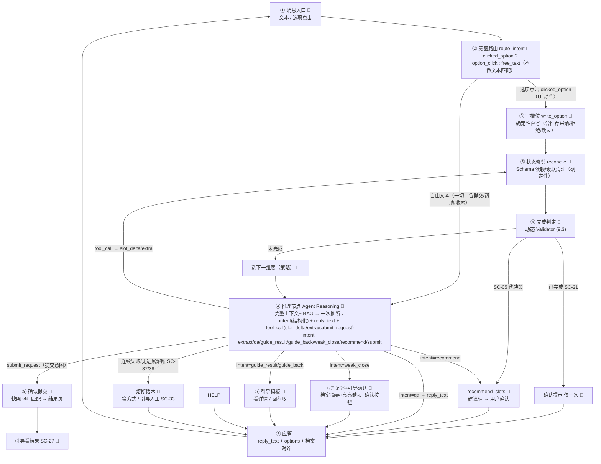

# 需脉枢纽 · 对话 Agent 详细设计 v2.0

> 版本：v2.0 ｜ 定位：**对话 Agent 的完整设计**（效果驱动 + 工程落地） ｜ 状态：**设计定稿（评审确认 2026-08-13）** ｜ 更新：2026-08-13
>
> - **本文件取代** `代理详细设计.md`（v1.2）：新设计落地后旧文档删除（见第 18 章映射）。
> - 结构约定（评审确认）：**单文档、分章节**——第一部分「实现说明」（现状 → 目标，工程视角），第二部分「详细设计」（why/what + LLD）。
> - 效果依据：《代理设计v2大纲.md》（北极星 / 场景 SC-01~39 / 体验原则 / 架构 / L1~L3）——本文件按其落地，不再重复评审过程。

> **⚠ 设计变更（2026-08-16，对齐《AI核心总体架构设计v2》D5-D11，仅契约级修订、未全文重写）**：与本文件 v2.0 定稿冲突处，以 AI核心 为准：
> ① 需求 Schema 三态 → **正向点**（去 `excluded`，wildcard 降 Agent 私有标记，D6）；
> ② **strictness 两档**（Agent 从语言推断 + 确认框只读展示可微调，D7）；
> ③ `extra_constraints` → **extended 结构化 `{label, value, strictness}`**（D8）；
> ④ 去 `level`（hard/soft/optional）→ **完成判定 = 品类锚定 + ≥1 需求点 + 用户确认、追问交 LLM**（D11/D12；`KEY_DIMS`/pending_slots 完成判定机制移除）；
> ⑤ 需求点 = **需求点 schema** 的实例、需求档案 = **品类 Schema**（通用+品类+扩展）的实例（§9/§15）。

---

## 目录

**第一部分 · 实现说明**
- 1. 现状实现快照（代码事实）
- 2. 目标实现概览（现状 → 目标改动映射）
- 3. 分步实施与验收（L1 → L2 → L3）

**第二部分 · 详细设计**
- 4. 定位与北极星
- 5. 范围边界与场景全景（SC-01~39）
- 6. 体验原则（设计红线）
- 7. 架构（分层 / Tool Calling / 上下文包）
- 8. 决策流转与节点设计（LLD）
- 9. 需求 Schema 数据模型（v2.0 新章）
- 10. 状态模型（三层分离 + 会话状态重新设计）
- 11. 上下文组装管线
- 12. 记忆四层与 RAG
- 13. 输出解析与校验（tool_call + 重试降级 + merge_slot/reconcile）
- 14. 评估体系
- 15. 与匹配接口的契约
- 16. 开放性问题处置（答疑 / 引导 / 守门）
- 17. 风险与兜底
- 18. 旧文档映射与删除计划

---

# 第一部分 · 实现说明

> 本部分写给"要动代码的人"：先讲清现状（代码事实），再讲清要改什么、分几步落地。与第二部分设计相互引用，不重复论证。

## 1. 现状实现快照（代码事实）

> 以下为 2026-08-12 代码核对结论，作为改版基线。

### 1.1 现状链路

- 接口层 `api/conversation.py`：`POST /conversation/start`、`POST /conversation/message`、`POST /conversation/confirm`；历史读接口 `/conversations`、`/{id}/messages`、`/{id}/requests`、删除接口。**message 为 JSON 聚合返回（非 SSE）**。
- 服务层 `domains/conversation/service.py`：
  - `start()`：建会话（`status="active"`）+ 首条"请告诉我需要找什么类型的代工厂？"+ 品类选项。
  - `message()`：载入 `current_slots` → `route_intent` → **选项精确命中则 `write_option` 确定性直写；否则 `extract_slots`（LLM 解析 JSON）→ `merge_slot` 三态合并**；完成态下"还有/继续"短句直接开放引导（跳过 LLM）；`decide_question` 产出下一追问；`_pending` 存选项；`_append_event` 埋点。
  - `confirm()`：锚点缺失报 400 → 生成 `customerRequest`（`version++`、`structured_demand=_slots_snapshot`）→ 建 `MatchRun(running)` → **`conv.status="confirmed"`** → 异步画像更新。
- 意图/合并逻辑 `domains/conversation/agent.py`：
  - `route_intent()`：`option_click / confirm / done / help / free_text`（关键词规则，**无第 10 章 B/C 档正则**——实际代码未含 `_REDIRECT_PAT/_OFFTOPIC_PAT`）。（**v2.1 收敛**：见 §8.2，仅 `option_click / free_text`，不再文本匹配。）
  - `merge_slot()`：三态合并（排除/覆盖/追加），自创字段归 `extra_constraints`。
  - `completion_ready()`：锚点 + `KEY_DIMS`（os/interfaces/certifications）覆盖 → 完成。
  - `decide_question()`：完成态首次提示确认（`_confirm_prompted` 去重）→ 开放引导；否则 `next_unfilled` 按 Schema 顺序追问。
  - `extract_slots()`：单次 LLM 调用，System Prompt 要求输出 JSON `{slot_delta, extra_constraints}`；`re.search(r"\{.*\}")` 截取 + `json.loads`；失败静默降级。
- LLM 封装 `llm/client.py`：`chat()` 走 OpenAI 兼容 SDK，**不支持 tools/tool_choice**；`extract_slots` 固定 `temperature=0.1, max_tokens=512`。

### 1.2 现状 Schema

- `domains/conversation/schema.py`：
  - `FIXED_FIELDS`（product_type/os/interfaces/certifications/moq/lead_time_days/application_scenario/customization_needs/budget_range）：仅 `product_type` 带 `required:True`、`budget_range` 带 `optional:True`；**无 hard/soft 分级、无字段间依赖/联动声明**。
  - `CATEGORY_EXTENSIONS`（机顶盒/智能音箱/IoT设备/其他）：**无必填级别、无依赖声明**。
  - `KEY_DIMS=["os","interfaces","certifications"]`：硬编码完成判定关键维度。
  - `fields_for(pt)`：固定 + 品类扩展；`next_unfilled(state,pt)`：按顺序返回下一未填且非 optional 字段（确定性追问）。
- 结论：**当前 Schema 是"扁平字段 + 少量 optional 标记 + 硬编码 KEY_DIMS"**，尚未承载第 9 章要求的"级别 + 依赖声明 + 动态待填集"。

### 1.3 现状对话状态与存储

- 会话级：`Conversation.status = active / confirmed`（`closed` 从未实际设置）；逻辑删除 `deleted_at`。
- 轮级：`_pending`（选项 key/options）、`_confirm_prompted`（确认提示去重）；`_` 前缀键不落快照。
- 需求级：`current_slots` 三态槽位 + `extra_constraints`；快照 `_slots_snapshot`（三态）落 `customerRequest.structured_demand`。
- 事件流：`conversation_events`（session_started / user_message / slot_updated / question / confirmed）；`llm_call_logs`（extract_slots 等，append-only）。

### 1.4 现状画像与 RAG

- 画像 `domains/conversation/profile.py`：`build_profile_context` 按 `use_in_prompt` 维度注入 EXTRACT_PROMPT；confirm 后 `schedule_profile_update` 异步提取（LLM 产出增量 updates，代码逐条校验后合并）。
- RAG `domains/conversation/retriever.py`：`build_rag_query`（已确认槽位摘要 + 最近消息）→ 智谱 embedding → Milvus `knowledge_base`（industry 过滤 + 余弦）→ 回 PG 取 content；`RAG_MIN_SCORE=0.4`（实测校准）；低于阈值不注入；异常静默降级。

### 1.5 现状问题清单（改版动因）

| # | 问题 | 表现 | 根因 |
| --- | --- | --- | --- |
| P1 | 机械复读 | 固定模板追问、无答疑、无自然引导，"像机器人客服" | 决策/表达全在模板 + 单 JSON 输出无 NLG 空间 |
| P2 | 不答疑 | 领域问题被当槽位解析或答非所问 | 无答疑机制（第 10 章 A 档未实现于代码） |
| P3 | 不引导 | 问结果/闲聊被硬塞进萃取 | 无 B/C 档规则拦截与引导话术 |
| P4 | 死循环/无进展 | "继续补充"死循环、连续空转 | 无 `_stall_counter`、无熔断 |
| P5 | 级联脏数据 | 改品类后旧扩展字段残留 | 无 reconcile 状态修剪 |
| P6 | 无分级判定 | 完成判定只看 KEY_DIMS，软/可选不区分 | 无 hard/soft/optional 分级 + 动态 Validator |
| P7 | 追问顺序靠 Schema 顺序 | 依赖式字段（选 A 才问 B）无法表达 | 无依赖声明 + 动态待填集 |
| P8 | 字符串匹配语义误判 | "就这样吧，接口加个USB"被弱收尾吞；"我想补充外观需求"被 is_continuation 吞；"确认并提交匹配是什么意思？"有误触提交风险 | 用子串/精确/正则做语义判定（v2.1 根治：语义全部下沉推理节点） |

## 2. 目标实现概览（现状 → 目标改动映射）

> 目标架构见第二部分第 7/8/9/10 章；本章给出"现有代码怎么改"的映射。

| 现状 | 目标 | 改动落点 |
| --- | --- | --- |
| `route_intent` 多意图+正则（option/confirm/help/accept·decline·skip/free_text） | **意图路由（②节点）**：仅 `clicked_option ? option_click : free_text`；**不做任何字符串匹配** | `agent.py` route_intent 收敛 |
| 文本命令（确认并提交/帮助/采纳·拒绝·跳过/继续补充） | 删除程序匹配；提交→UI 按钮或 `submit_request`；帮助/收尾/推荐→推理节点判定 | `agent.py`/`service.py` 删分支 |
| 无提交意图工具 | 推理节点新增 `submit_request`：LLM 识别提交意图→程序执行 `_do_confirm`（带护栏） | `agent.py` 工具集 + `service.py` 执行 |
| `guide_override_for`（B/C 正则兜底） | 删除；合规=指令约束 + 评测验证（14.3） | `agent.py` 删函数及 `_REDIRECT_PAT/_OFFTOPIC_PAT/_RESULT_VIEW_PAT` |
| `extract_slots` 单 JSON 输出 | **推理节点（④）**：一次推断 `reply_text + tool_call(slot_delta/extra) + intent` | `agent.py` 重构 + `llm/client.py` chat() 支持 tools |
| `merge_slot` 直接落库 | `merge_slot` → **reconcile（⑤状态修剪）** → 完成判定 | `agent.py` 新增 reconcile |
| `completion_ready` + KEY_DIMS | **完成判定（D12）**：品类锚定（product_type 已定）+ **≥1 需求点（dimensions/extended 非空，后台校验）** + 用户确认（两步化确认框）；`KEY_DIMS`/pending_slots 完成判定机制移除 | `agent.py`/`service.py` |
| `decide_question` 按序追问 | **追问交 LLM（D11）**：按"当前上下文 + 待确认需求点（allowed_set）+ 重要性"自然引导，不再程序分级 | 推理节点 Prompt |
| `conv.status=confirmed/closed` | 会话级只留 `active/删除`；提交下沉 `customerRequest`/`MatchRun`（第 10 章） | `service.py` confirm/message |
| 无答疑/引导分支 | 推理节点产出 `intent`（extract/qa/guide…）+ 引导模板兜底（第 16 章） | `agent.py` + 模板常量 |
| 无熔断 | `_stall_counter` 轮级计数 + 熔断话术（8.2/16） | `agent.py`/`service.py` |
| JSON 聚合返回 | 保留（SSE 流式放 L3，见 3.3） | — |

## 3. 分步实施与验收（L1 → L2 → L3）

> 每步可交付、可验收；与大纲第 5 章对齐。

### 3.1 L1 · 体验修复（近期）

- **范围**：
  1. **Tool Calling 化**：`llm/client.py` `chat()` 扩展 `tools/tool_choice`；`agent.py` `extract_slots` 重构为解析 `tool_calls`；`Schema → tool JSON Schema` 映射（第 9 章 9.4）；一次推断 `reply_text + tool_call + intent`，混合意图一次处理。
  2. **提交入口分级**（SC-22/22b/25）：直接提交（选项/强命令/`/done`）+ 弱收尾复述引导（RECAP）+ 未达判定强命令提交警示。（**v2.1 收敛**：`/done`/强命令移除，提交 = UI 按钮 或 `submit_request`，见 §8.2/§16。）
  3. **完成判定（D11/D12）**：品类锚定（product_type 已定）+ **≥1 需求点（dimensions/extended 非空）** + 用户确认（两步化）；无 hard/soft 分级、无 pending_slots；配合 **reconcile**（第 9 章）。
  4. **死循环/失败熔断**：`_stall_counter`。
  5. 扩展/槽位回显（已部分完成）。
  6. **会话状态重新设计**（第 10 章，评审确认纳入 L1）：`confirm()` 不再写 `conv.status="confirmed"`；`Conversation.status` 只留 active/删除；前端"已提交"提示改派生值（`customer_requests` 计数 / 最近匹配时间）。
- **涉及文件**：后端 `llm/client.py`、`conversation/agent.py`、`conversation/service.py`、`conversation/schema.py`（约 4 文件）+ 契约（openapi 重新导出 → `packages/api`）+ 前端 `ChatView.vue` 文案/提交按钮（约 1 文件）。
- **验收**：萃取答疑（SC-17~20）、引导（SC-26~35）走通；同文案重复 = 0；**完成判定生效（0 需求点提交被拦）**、追问顺序合理（allowed_set 注入 + 评估集断言）；回归现有对话链路（容器内 e2e）。

### 3.2 L2 · 能力补全

- 顾问反推（SC-05 `recommend_slots`）、未达判定主动完成（SC-25）、画像驱动引导强化；答疑 grounded 优化（知识 Q 示例、命中反哺知识库）；多品类字段配置化（新品类不改代码）。
- 验收：SC-05/25 走通；答疑可溯源率达标。

> ✅ **L2 已落地（2026-08-13）**：SC-05 顾问反推（不确定/你看着办 → 画像→行业默认→枚举首项给建议 → 采纳/拒绝/跳过，grounded 不替决定）、SC-25（L1 已含）、画像驱动引导（建议 reason="基于您历史需求偏好"）、答疑可溯源（Prompt 规则 5 加"依据：…"来源）、多品类配置化（`schema_categories.json` 加载，新品类不改代码）。验证：e2e 21/21 PASS。

### 3.3 L3 · 工程化

- SSE 流式（`reply_text` 变长后必要）；LangGraph 化（若状态机分支复杂到需图级 checkpoint/重放再引入；`route_intent`/handler 签名保持不变）；Token 成本与可观测优化；评估 CI 回归接入。

---

# 第二部分 · 详细设计

## 4. 定位与北极星

### 4.1 一句话定位

对话 Agent = 垂直领域**选型顾问**，且**只专注需求萃取**，而非"表单填写机器人"或"通用助手"：
- 目标明确：萃取用户需求（含主动引导）；
- 框架确定：匹配结果问题 → 引导去匹配详情；与萃取无关 → 引导回萃取主线；
- 过程灵活：萃取域内可答疑/澄清/纠偏/闲聊；
- 回答智能：基于用户问题、画像、需求框架、领域知识组织响应（仅限萃取相关）。

### 4.2 北极星（最终效果 · 可度量）

| 北极星 | 含义 | 关键指标（示例） |
| --- | --- | --- |
| **顾问感** | 不机械复读、能答疑给建议 | 同文案重复出现次数 = 0；答疑正确率 ≥ 阈值；首字延迟 < 2s |
| **萃取质量** | 需求完整、准确、无需反复澄清 | 槽位抽取 F1；需求完整度（Schema 必填覆盖）；用户澄清轮次 |
| **对话效率** | 用最少轮次萃取核心信息 | 平均达成轮次；信息密度 Slots/Turn |
| **匹配增益** | Agent 是匹配的质量闸门 | 端到端 Top-1 命中率；匹配分数与需求完整度正相关 |
| **可信可解释** | 回答 grounded、不编造 | 答疑可溯源率；"不知道就明说"处理率；越界引导率 |
| **可演进可运营** | 事实数据完整、可回归、新品类可配置 | 评估回归通过率；事实数据完整率；新增品类配置成本 |

## 5. 范围边界与场景全景（SC-01~39）

### 5.1 范围边界（深井型）

- **萃取域（Agent 负责）**：开场/锚点 → 槽位萃取（填槽/打磨/扩展）→ 萃取答疑（仅服务当前槽位决策）→ 完成确认 → 确认提交。
- **引导域（Agent 不做，引导走）**：问匹配结果 → 引导去匹配详情；与萃取无关 → 引导回萃取主线。
- **横切异常**：任何涉及 LLM 的环节有"重试 → 降级"兜底。

> 为什么"深井型"：代答匹配结果、二次评价厂商，既易触发幻觉，也带来商业合规风险；答疑严格限制在"服务当前槽位决策"，控 Token 并防偏离主线。

### 5.2 场景全景

> 编号 SC-xx 供流转图与节点引用；支持度 = ✅已有 / ✅已修 / L1 / L2 / L3。全部场景在流转图（8.1）有落点（2.4 覆盖校验）。

**萃取域 · A 开场 / 锚点**

| SC | 场景 / 输入 | 处理策略 | 流转落点 | 支持度 |
| --- | --- | --- | --- | --- |
| SC-01 | 问候开场 | 播报任务 + 首问品类锚点 | 追问 | ✅ |
| SC-02 | 明确品类 | 锚点 SET → 进入萃取 | 萃取 | ✅ |
| SC-03 | 品类模糊 | 澄清候选品类/让细化（不猜） | 澄清 | L1 |
| SC-04 | 一次给全 | 批量多槽一次落库 | 萃取 | ✅ |
| SC-05 | 不知道要什么 | recommend_slots：画像/知识建议 → 用户确认（grounded 不替决定） | 推理→建议确认 | L2 |

**萃取域 · B 槽位萃取（填槽 / 打磨 / 扩展）**

| SC | 场景 / 输入 | 处理策略 | 流转落点 | 支持度 |
| --- | --- | --- | --- | --- |
| SC-06 | 回答当前追问（含选项点击） | 写槽位 → 下一维度 | 萃取 | ✅ |
| SC-07 | 一次补充多维度 | 批量合并（去重） | 萃取 | ✅ |
| SC-08 | 纠正 | merge=replace 覆盖 | 萃取 | ✅ |
| SC-09 | 排除（"不要USB"） | EXCLUDED 硬过滤 | 萃取 | ✅ |
| SC-10 | 主动给扩展 | extra_constraints + 回显 | 萃取 | ✅已修 |
| SC-11 | 自创字段 | 归 extra_constraints | 萃取 | ✅ |
| SC-12 | 不知道/犹豫 | 知识引导或置通配 | 萃取 | L1 |
| SC-13 | 不限/跳过 | WILDCARD（通配） | 萃取 | ✅ |
| SC-14 | 无信息量（"还有""继续"） | 点击"继续补充"=确定性开放引导；自由文本由推理节点判定 | 萃取 | ✅已修 |
| SC-15 | 别名/模糊值归一 | 知识归一映射 | 萃取 | ✅ |
| SC-16 | 超长对话 | 早期历史摘要 | 萃取 | L3 |

**萃取域 · C 萃取答疑（仅服务当前槽位决策）**

| SC | 场景 / 输入 | 处理策略 | 流转落点 | 支持度 |
| --- | --- | --- | --- | --- |
| SC-17 | 领域答疑（与当前品类/槽位相关） | 知识RAG ≤3~5句 + 引导回槽位 | 答疑→萃取 | L1 |
| SC-18 | 追问上一问 | 基于知识/上轮回复解释 | 答疑→萃取 | L1 |
| SC-19 | 重复问同一问题 | 稳定答疑（换角度，不机械复读） | 答疑→萃取 | L1 |
| SC-20 | 制程/认证/合规常识（相关） | 知识RAG | 答疑→萃取 | L1 |

**萃取域 · D 完成确认**

> **提交入口策略**：确认提交统一收敛到单端点 `/conversation/confirm`，两条入口共用同一执行器（带护栏）：
> - **直接提交（UI 动作 / 语义意图）**：UI 按钮"确认并提交匹配"；或用户在聊天中表达提交意图（"确认并提交匹配 / 帮我提交 / 可以提交了"）→ 推理节点识别 → `submit_request` → 快照 vN + 触发匹配 → 结果页；
> - **引导确认（弱收尾）**：用户表示收尾（"就这样吧/差不多了/可以了"）→ 推理节点判定 `weak_close` → 摘要档案 + 高亮缺项 + 亮出确认按钮（**不直接提交**）。

| SC | 场景 / 输入 | 处理策略 | 流转落点 | 支持度 |
| --- | --- | --- | --- | --- |
| SC-21 | 完成判定达成 | 主动确认提示（仅一次） | 确认提示 | ✅已修 |
| SC-22 | 明确授权提交（UI 按钮 / submit_request 意图） | 快照 vN + 触发匹配 → 结果页 | 结束 | ✅ |
| SC-22b | 弱收尾 | 摘要档案 + 高亮缺项 + 亮出确认按钮（不直接提交） | 复述→引导 | L1 |
| SC-23 | 继续补充 | 开放引导 → 回萃取 | 萃取 | ✅已修 |
| SC-24 | 确认前修改槽位 | 更新 → 重新判定 | 萃取 | ✅ |
| SC-25 | 未达判定但主动完成（submit_request） | 允许确认（标注缺项） | 结束 | L2 |

**引导域 · E 引导去匹配详情**

| SC | 场景 / 输入 | 处理策略 | 流转落点 | 支持度 |
| --- | --- | --- | --- | --- |
| SC-26 | 问匹配结果/结果相关问题 | 引导"请到匹配详情查看"（不代答） | 引导→回萃取 | L1 |
| SC-27 | 确认后继续发消息 | 按意图分流：问结果→引导看详情；继续补充→续萃取（vN+1） | 引导→回萃取 | L1 |

**引导域 · F 引导回萃取主线**

| SC | 场景 / 输入 | 处理策略 | 流转落点 | 支持度 |
| --- | --- | --- | --- | --- |
| SC-28 | 闲聊/情绪 | 礼貌一句 + 拉回当前问题 | 引导→回萃取 | L1 |
| SC-29 | 厂商评价/比较 | 不评价 + 引导（回萃取或看结果） | 引导→回萃取 | L1 |
| SC-30 | 报价/价格 | 引导到预算字段 + 说明需规格估价（不承诺价） | 引导→回萃取 | L1 |
| SC-31 | 多话题混入 | 一会话一产品：聚焦当前 + 提示新会话 | 引导→回萃取 | L1 |
| SC-32 | 帮助/能力边界 | 能力说明 + 拉回（推理节点直接回答，不程序匹配"帮助"词） | 答疑→回萃取 | L1 |
| SC-33 | 人工/线下 | 提供联系/说明 + 保留现场 | 引导→回萃取 | L2 |
| SC-34 | 敏感/合规诉求 | 合规拒绝 + 引导 | 引导→回萃取 | L2 |
| SC-35 | 无关泛知识 | 与萃取无关 → 引导回萃取 | 引导→回萃取 | L1 |

**横切异常（任意涉及 LLM 的环节）**

| SC | 场景 | 处理策略 | 流转落点 | 支持度 |
| --- | --- | --- | --- | --- |
| SC-36 | 中途离开/回来 | 历史恢复现场 | 任意 | ✅ |
| SC-37 | LLM 输出非法 JSON | 重试≤2 → 降级（保留槽位） | 任意 | ✅ |
| SC-38 | 知识不足答不了 | "不知道 + 引导回槽位"（不编造） | 答疑→萃取 | L1 |
| SC-39 | 全链路失败 | 友好降级 + 不丢已确认槽位 | 任意 | ✅ |

## 6. 体验原则（设计红线）

1. **顾问感**：绝不机械复读同一文案；每轮给用户"新信息或新引导"。
2. **每轮 grounded**：回答基于注入上下文（知识/画像/档案）；知识不足 → "不知道就明说 + 引导"，不编造。
3. **边界清晰**：越界引导回主线；厂商评价唯一权威 = 匹配结果（Agent 不二次评价——防幻觉 + 规避合规风险）。
4. **活档案对齐**：用户始终知道"系统听到了什么"（侧边需求档案 + 槽位/扩展回显）。
5. **语义由大脑定、执行由电路做**：意图识别（填槽/答疑/引导/收尾/推荐/提交/帮助）全部由推理节点（LLM）在完整上下文中判定；程序（外围电路）只做执行——状态机、槽位直写、护栏、话术模板。LLM 是优秀的"大脑/语义路由器"，但它是糟糕的"状态机"；状态流转与执行交给确定性代码，模型只做意图识别 + NLU/NLG。
6. **绝不用字符串匹配判定语义**：任何基于文本内容的正则/子串/精确匹配都不做意图判定。确定性层只认"动作来源"（`clicked_option`=UI 点击）与"状态条件"（如 `_recommend`），不认"文本长得像命令"。

## 7. 架构

### 7.1 分层：策略层（policy） + 技能层（skills）

```
策略层 policy（外围电路：只执行、不猜语义）
  调度：点击（UI 动作）确定性执行 / 自由文本→推理节点 / 提交执行（护栏）/ 完成判定 / 熔断
      │
      ├─ skill: extract_slots   (推理节点内：上下文包+Tool Calling → slot_delta/extra + reply_text)
      ├─ skill: domain_qa       (推理节点内：知识RAG → reply_text，含引导回槽位)
      ├─ skill: recommend_slots (SC-05：画像/知识 → 建议值 → 用户确认)
      ├─ skill: guide_to_results(SC-26/27：模板 → 匹配详情)
      ├─ skill: guide_back      (SC-28~35：模板拉回萃取)
      ├─ skill: confirm         (SC-22/22b/25：快照 vN + 匹配；由 UI 按钮 或 submit_request 触发)
      └─ skill: submit_request  (推理节点内：LLM 识别提交意图 → 程序执行快照 vN + 匹配，带护栏)
统一响应: reply_text + slot_delta + extra + intent + options（一次 LLM 调用：既解析又说话）
```

> **实现映射**：L1 将流转图实现为"路由 + 函数化 Handler"（每 skill 一个函数，`route_intent` 仅 `clicked_option ? option_click : free_text` 分发），不引入职责链/编排框架；L3 若状态机分支复杂再 DAG 化（LangGraph），handler 签名保持不变。

### 7.2 一次调用 · 双通道输出（Tool Calling）

- **槽位更新 = Tool Call**：需求 Schema 定义为 LLM 的一个 Tool `update_requirement_slots(os?, interfaces?, certifications?, …, extra_constraints?)`；槽位/扩展更新走 `tool_calls` 参数（结构化、强约束）。
- **回复生成 = message.content**：`reply_text`（答疑/引导/自然追问）走消息正文（自由文本，**不截断**——简短由提示词约束（≤3~5 句、答完拉回主线），程序不按长度腰斩模型语义产出（2026-08-14 修正：废除硬截断，见 §13.1）。
- **轮次判定（意图由推理节点产出，评审确认 2026-08-13 路径A / v2.1 收敛）**：`intent=extract`（有 `tool_call`）→ 解析 `slot_delta/extra` → `merge_slot` → 状态修剪 → 完成判定 → 追问；`intent=qa` → 领域答疑（知识 RAG，短答+引导回槽位）；`intent=guide_result/guide_back` → 引导模板（看详情/回萃取）；`intent=weak_close` → 复述+引导确认（不提交）；`intent=recommend` → 建议值+确认（SC-05）；**`intent=submit`（submit_request）→ 提交执行器（快照 vN + 匹配，带护栏）**。
- **混合意图一次处理**：自由文本（含"问结果 + 填槽"混合）统一进推理节点，LLM 同时产出 `reply_text`（可含引导）与 `tool_call`（槽位更新），不再由规则硬分流；`intent` 为**结构化输出**供策略层校验/审计。
- **意图的机械实现（三工具）**：`update_requirement_slots`（填槽）+ `classify_turn{intent, reply_text}`（非填槽轮：答疑/引导/弱收尾/推荐）+ **`submit_request`**（用户明确要结束并提交 → 程序执行带护栏的 `_do_confirm`）；`tool_choice="auto"`，模型按上下文选择。判定优先级：`slot_delta` → extract；`submit_request` → submit；`classify_turn` → 对应 intent；正文 → qa；空 → empty。混合意图由 `update_requirement_slots` + content 双通道一次处理。
- **校验分离**：`tool_call` 参数必须过 Pydantic + 枚举；`reply_text` 仅去 markdown + 折叠空白（卫生，**不做长度截断**）。
- **规则层兜底**：`reply_text`/`intent` 为空或异常时退回 `decide_question` 确定性追问；引导/复述/推荐话术均用固定模板（模型只定意图，话术由代码）。
- **兜底方案**：若 Tool Calling 在目标模型上不稳（F1 不达标），退回"分离两调用"（NLU 一刀 + NLG 一刀，可并行抵消延迟）——见第 17 章。

> ✅ **PoC 验证通过（2026-08-13）**：在 `deepseek-chat`（真实 key，容器内）验证 Tool Calling 遵循度——6 用例（批量填槽/纠正/排除/混合意图/纯答疑/自创字段）结构指标全过：函数名 5/5、参数 JSON 5/5、key 合法 5/5、枚举遵循 6/6、槽位命中 5/5；**纯答疑（T5）不误触工具**；**三态 `__states__` 编码被正确理解**（T3 排除 `{"interfaces":"excluded"}`）；**混合意图一次处理成立**（T4 同时产出 tool_call + content 答疑）；稳定性 T1×5 = 100% 一致；平均延迟 1.38s。**结论：首选 Tool Calling 路径成立，L1 按 Tool Calling 实施，不启用"分离两调用"兜底。** 观察点：填槽轮 `content` 常为空（模型倾向只调工具），追问话术由策略层 `next_slot` 注入驱动 + `reply_text` 为空时确定性兜底（见 9.3/13.2）。

### 7.3 上下文包（context packs，按意图注入）

| 包 | 注入内容 | 用于 |
| --- | --- | --- |
| 填槽包 | Schema（分级+依赖） + 当前槽位（三态）+ 待填集 `next_slot/allowed_set` + 画像 + 知识RAG | 填槽/打磨 |
| 答疑包 | 知识RAG（优先）+ 当前品类 + 当前槽位 | domain_qa |
| 引导包 | 品类名（guide_back）/ 匹配结果指针（guide_to_results） | 引导 |
| 确认包 | 需求档案快照 | confirm |

每包独立 Token 预算与裁剪、独立审计（`llm_call_logs`）。

## 8. 决策流转与节点设计（LLD）

### 8.1 决策流转图（节点与边 · 承载全部场景）

> 用"节点与边"而非状态图：表达"每轮会碰到哪些场景、如何分流、如何应答"——本质是 **意图 → 处理 → 应答** 的决策流转（含循环回边）。会话生命周期（active/删除）是**会话级状态**（第 10 章），与**轮级决策流转**分开描述。



> **图例**：🤖 = **调用 LLM**（模型推理）｜ 🧩 = **确定性 / 纯代码**（规则层，不调 LLM）。全图仅 **④ 推理节点** 与 **recommend_slots（建议值生成）** 两处调 LLM，其余全部为纯代码——这是红线 5"策略规则定、表达模型做"的直观体现。

### 8.2 节点职责与接口（函数签名）

| 节点 | 是否调 LLM | 做什么 | 涉及 SC | 边界 |
| --- | --- | --- | --- | --- |
| ① 消息入口 | 🧩 否 | 接收文本/选项点击 | 全部 | — |
| ② 意图路由 | 🧩 否 | `clicked_option ? option_click : free_text`；**不做任何文本匹配** | 全部 | 语义判定全在推理节点；程序只认"动作来源" |
| ③ 写槽位 | 🧩 否 | 选项确定性直写 | SC-06/13 | 不调 LLM |
| ④ 推理节点 | 🤖 **是** | 完整上下文一次推断：**intent（extract/qa/guide_result/guide_back/weak_close/recommend/submit）+ reply_text + tool_call(slot_delta/extra/submit_request)**；内含 extract_slots / domain_qa / recommend_slots / submit_request | SC-05~20/28~35 | 混合意图一次处理；Tool Calling；意图=上下文判定；不做字符串匹配 |
| ⑤ 状态修剪 | 🧩 否 | Schema 依赖/级联清理（确定性 prune） | SC-08/09/24 | 脏数据擦除，非 LLM |
| ⑥ 完成判定 | 🧩 否 | 动态 Validator：硬约束 100% 覆盖（9.3） | SC-21 | 确定性规则 |
| 追问下一维度 | 🧩 否 | 策略层选下一未填维度 → 注入推理节点 | SC-01/03/06 | — |
| 确认提示 | 🧩 否 | 主动提示（仅一次） | SC-21/23 | — |
| recommend_slots | 🤖 **是** | 基于画像/知识生成建议值 → 用户确认（确认环节为代码） | SC-05 | grounded，不替用户决定 |
| ⑦'' 复述+引导确认 | 🧩 否 | 档案摘要 + 高亮缺项 + 亮出确认按钮（弱收尾不直接提交） | SC-22b | 不落快照，仅引导 |
| ⑦ 帮助/引导模板 | 🧩 否 | 帮助说明；看详情；回萃取 | SC-26~35 | 模板、不代答、不评价 |
| ⑧ 确认提交 | 🧩 否 | 快照 vN + 触发匹配（提交事件，会话保持 active）；由 **UI 按钮** 或 **submit_request** 触发 | SC-22/25 | 单端点 |
| ⑨ 应答 | 🧩 否 | reply_text + options + 档案对齐 | 全部 | 回入口（循环） |
| 熔断 | 🧩 否 | 连续失败/无进展 → 换方式/引导人工 | SC-37/38/33 | `_stall_counter` |

> **LLM 使用点汇总**：全图仅 2 处调 LLM——**④ 推理节点**（每轮自由文本的主处理，一次推断产出回复+槽位+意图）与 **recommend_slots**（SC-05 建议值生成，可复用 ④ 的产出）。其余 12 个节点全部是确定性/纯代码（模板、状态机、执行、装配），零 LLM 成本、可单测、可回归。这也是"把 LLM 当糟糕的状态机、当优秀的语义路由器"的落地：**凡是"执行/状态流转/话术"都是代码，凡是"理解/意图"才是模型**。

> **意图判定架构（评审确认 2026-08-13，路径A）**：
> - **结论**：**无上下文的内容正则不能作意图主判定**——一词多义（"推荐几个"：追问接口时=SC-05推荐、提交后=引导看结果）、混合意图、否定转折、阶段相关都会判错；确定性层只保留"用户动作定义"的无歧义命令。
> - **确定性层（`route_intent`，v2.1 收敛）**：仅 `clicked_option ? option_click : free_text`——点击（UI 动作）走确定性执行；自由文本（**包括** 提交/帮助/采纳·拒绝·跳过 等一切语义）一律进推理节点。**不做任何文本匹配**（删 `_CONTINUATION`/`CONFIRM_COMMANDS`/`ACCEPT_RECOMMEND_PAT`/斜杠命令）。
> - **语义判定下沉推理节点**：弱收尾(SC-22b)/引导(B·C)/推荐(SC-05)/答疑 由推理节点在**完整上下文**（当前槽位 + next_slot + 历史 + 画像 + 知识）判定并输出结构化 `intent`；话术模板（复述/引导/建议）仍为确定性代码。
> - **合规（红线3：不评价厂商）约束方式（v2.1 收敛）**：不再用程序正则兜底——`classify_turn` 工具描述 + System Prompt 明确"厂商比较/优劣/推荐 → intent=guide_result，正文不评价厂商、只引导到匹配详情"；行为正确性由**评测用例**验收（14.3：断言 intent=guide_result 且正文不含厂商名/优劣词）。可选 L3：输出级厂商名校验（对执行结果检查，非意图匹配）。

**Handler 签名（L1 实现）**：

```python
# 策略层（外围电路，确定性，可单测；不做文本匹配）
async def route_intent(text: str | None, clicked_option: str | None, state: dict) -> Intent: ...
#   Intent = OPTION_CLICK | FREE_TEXT（点击=UI 动作；自由文本=一切语义 → 推理节点）

async def write_option(state: dict, key: str, value) -> dict: ...           # ③
async def reconcile(state: dict) -> dict: ...                               # ⑤ 依赖/级联清理
async def validate_completion(state: dict) -> CompletionVerdict: ...        # ⑥ 动态 Validator
async def choose_next_dim(state: dict) -> NextSlot | None: ...              # 追问下一维度（pending_slots）
async def confirm_submit(db, conv, user_id, mode) -> ConfirmResult: ...     # ⑧ 快照+匹配（UI 按钮 / submit_request 共用）

# 技能层（推理节点内，一次 LLM 调用；意图=上下文判定）
async def agent_reasoning(state, message, ctx) -> ReasoningOutput: ...      # ④ 一次推断
#   ReasoningOutput = { intent, reply_text, tool_call(slot_delta/extra | submit_request) | None }
#   intent ∈ {extract, qa, guide_result, guide_back, weak_close, recommend, submit, empty}

# 引导模板（确定性，零 LLM）
def guide_to_results(category: str) -> str: ...                             # SC-26/27
def guide_back(category: str) -> str: ...                                   # SC-28~35
def weak_close_recap(state) -> RecapResult: ...                             # SC-22b
def help_text() -> str: ...                                                 # SC-32
def stall_text() -> str: ...                                                # 熔断
```

### 8.3 轮次协议（turn protocol，可评估/可重放基础）

```
输入(消息/选项) → 策略层路由 → 执行 skill → 统一响应 → 落库（事实数据 + 档案）
```

每轮固定写 `conversation_events`（user_message / skill_x / question / reply + `pending_slots` / `next_slot`），保证可回放、可回归；其中 `pending_slots`/`next_slot` 供评估集断言"该问 B 时未问 A"（见 9.3 / 14）。

## 9. 需求 Schema 数据模型（v2.0 新章）

> Schema 非扁平键值对，而是**带依赖关系的品类 Schema**（选 A 才追问 B；= 通用 + 品类 + 扩展，AI核心 §3.4/3.5/3.6）。本章数据模型已对齐 AI核心 D6/D7/D8/D11：**需求点 = 需求点 schema 的实例**、**需求档案 = 品类 Schema 的实例**（schema_ref，§15.1）。

### 9.1 字段定义扩展

现有字段对象扩展两个属性：

```python
{
  "key": "certifications",     # 需求点 schema（维度元数据，见《供需Schema设计》§2/§3.4/§3.5）
  "label": "认证",
  "value_type": "enum",        # enum/scalar/number/text
  "kind": "multi",             # enum: single/multi
  "options": ["CE", "FCC", "CCC", "SRRC", "ISO9001", "其他"],
  "depends_on": None,           # 依赖声明：None 无依赖；否则 "字段key" 或 ["字段A","字段B"]（任一满足）
  "depends_on_value": None,     # 可选：仅当依赖字段为指定值时本字段才生效（如品类=机顶盒 才加载解码能力）
  "question": "请问需要哪些认证？",   # 追问模板（模型表达时参考，可润色）
}
```

- 每个字段 = **需求点 schema**（维度元数据）；**值属需求点实例**（`{value, strictness}`，D7）。`level`（hard/soft/optional）**已移除**（D11：匹配端无必填、采集端只靠品类锚定 + LLM 追问）。
- `depends_on` 与 `depends_on_value` 组成**联动声明**：`depends_on` 未满足（依赖字段未指定）时，本字段**不生效**（不追问、不入档）。
- 字段定义（需求点 schema）以《供需Schema设计》§2/§3.4/§3.5 为准，本处为 Agent 侧使用视图。

### 9.2 示例：品类锚点驱动 + 字段依赖

```
product_type   level=hard,  depends_on=None            # 根锚点
interfaces     level=soft,  depends_on=None
output_interfaces level=soft, depends_on="product_type", depends_on_value=["机顶盒"]
   # 仅当品类=机顶盒 才询问/加载"输出接口"
tv_standard    level=soft,  depends_on="product_type", depends_on_value=["机顶盒"]
certifications level=hard,  depends_on=None
```

### 9.3 确定性算法（对齐 D11：品类锚定 + LLM 追问）

```python
def category_schema(pt: str) -> dict:
    """品类 Schema = 通用 + 品类 + 扩展；schema_ref 指向其版本（AI核心 §3.4/3.5/3.6）。"""

def active_fields(state: dict, pt: str | None) -> list[dict]:
    """当前生效字段（依赖满足才生效），即 LLM 可追问/落值的 allowed_set。"""

def validate_completion(state: dict, pt: str | None) -> bool:
    """完成判定（D12）：品类锚定（product_type 已定）+ 至少 1 个需求点（dimensions 或 extended 非空）
       → 可提交；最终由用户确认（两步化确认框）把关——不强求"hard 采齐"（SC-25）。"""
```

> **核心立场（红线 5，D11）**：追问**优先级交由 LLM**——按"当前上下文 + 待确认需求点（allowed_set）+ 重要性"自然引导；程序不再分档/选锚点。策略层只注入：

**受控注入（追问参考，非强制顺序）**：

| 注入层 | 内容 | 作用 |
| --- | --- | --- |
| 品类 Schema `allowed_set` | 当前生效且未填的需求点（key + 模板 + options） | 模型参考"还能问什么"，**自然排序**（考虑上下文与重要性） |
| 已填需求点 | 需求点实例（`{value, strictness}`） | 模型知道"已有什么、缺什么" |
| 动态裁剪的 Tool Schema | `update_requirement_slots` 参数按 `allowed_set` 生成 | 结构性强制：当前不合法字段不进 tool 参数 |

- **自然追问**：模型按上下文决定问哪个（可带理由"因为您选了 X，想确认 Y"），程序不指定"本轮必须问 X"。
- **不问失效字段**：reconcile 清掉失效槽位，`allowed_set` 随状态刷新。
- **兜底**：`reply_text` 空/跑偏 → 退回确定性模板（按 Schema 顺序问首个未填）；连续无进展触发 `_stall_counter` 熔断。

### 9.4 Schema → tool JSON Schema 映射（L1）

- `update_requirement_slots` 的 parameters 由 `allowed_set` 动态生成：
  - 每个字段 → 一个 property：`kind` → type（`multi` → `array of string` + 枚举 `options`；`number` → `number`；`single` → `string`）；
  - **只在 `allowed_set` 内的字段才出现在 properties**（结构性强制，模型填不进当前不合法的字段）；
  - **`extended` 固定附加**：`array of {label, value, strictness}`（扩展需求点，D8）——本体外自由需求点；
  - **`__states__`（三态编码）已移除**（D6：去 `excluded`；wildcard 降 Agent 私有标记，不落档、不进 tool）。
- `tool_choice`：**`"auto"`**（评审确认 2026-08-13，PoC 实证：填槽轮正常产出 `tool_call`，纯答疑轮不误触工具——比强制指定函数更省事且天然支持答疑轮）。
- 兜底（模型不支持/不稳）：退"分离两调用"——NLU 一刀输出 JSON（旧 `extract_slots` 格式）+ NLG 一刀（`reply_text`），可并行；见第 17 章。

## 10. 状态模型（三层分离 + 会话状态重新设计）

### 10.1 三层分离

- **会话级**：`active` / 删除（逻辑删除 `deleted_at`）。**不再有 `confirmed` / `closed`**——提交是可重复事件，不是会话终态。
- **轮级**：intent / `pending_slot` / options（现有 `_pending`，扩展）+ `_stall_counter`（熔断计数）。
- **需求级**：三态槽位 + 排除 + extra_constraints（现有）。
- 明确约定：`_` 前缀键为轮级内部状态，不落快照（现有 `_slots_*` 已跳过）。

### 10.2 会话状态重新设计（评审确认 2026-08-12）

- **旧问题**：`status=active/confirmed/closed` 把两个维度混进一个字段——会话本体的终态只有删除；提交匹配是可重复事件（每次 confirm 生成新快照 vN+1），用会话级"终态"表达与"无限次提交"冲突。
- **现状事实**：`confirm()` 每次生成新 `customerRequest`（version 递增）+ 新 `MatchRun`，互不覆盖；`conv.status` 只设过 `confirmed`，从未设过 `closed`；`message()` 不检查会话状态，确认后仍可继续萃取。即"每次提交 = 一份需求档案快照"已成立；坏的是会话级 `status` 承载了提交态。
- **重新设计（收敛）**：
  1. `Conversation.status` 只保留生命周期：`active` / 删除（`deleted_at` 承担删除）；移除 `confirmed`/`closed`。
  2. 提交/匹配状态**全部下沉需求级**：`customerRequest`（快照 vN，独立 request_id）+ `MatchRun`（running → ready/failed）各自表达"一次提交"。
  3. 界面"已提交"提示 = **派生值**（`customer_requests` 计数 / 最近匹配时间），不加会话级字段。
  4. 关联修订：SC-22"→ closed"→"→ 生成需求档案快照 vN + 触发匹配 → 结果页"；SC-27"状态锁定"→"按意图分流：问结果→引导看详情；继续补充→续萃取（vN+1）"。
- **代码落点（纳入 L1，评审确认 2026-08-13）**：`confirm()` 不再写 `conv.status="confirmed"`；`message()` 不按状态门禁（SC-27 分流）；前端"已提交"提示改派生值。

## 11. 上下文组装管线

### 11.1 上下文包拼装（推理节点）

```
system = ROLE段 + SCHEMA段(分级+依赖+三态) + PROFILE段 + KNOWLEDGE段
         + HISTORY段(窗口/摘要) + SLOTS段(三态) + PENDING段(next_slot/allowed_set) + 输出指令段
```

| 序 | 段 | 预算 |
| --- | --- | --- |
| 1 | 角色与任务（选型顾问，只做萃取） | ~120 |
| 2 | 需求 Schema（分级 + 依赖 + 三态） | ~400 |
| 3 | 用户画像（use_in_prompt 维度；无则省略） | ~200 |
| 4 | 领域知识（低于阈值不注入） | ~300 |
| 5 | 会话历史（窗口/摘要） | ~800 |
| 6 | 当前槽位（三态展示） | ~300 |
| 7 | 待填集（`next_slot` + `allowed_set` + 级别 + 依赖来源） | ~200 |
| 8 | 输出要求（Tool Calling：`tool_call` 填槽 + `reply_text` 回复 + `intent`） | ~150 |

### 11.2 历史裁剪/摘要

- 窗口最近 `10` 轮，超过 `12` 轮触发早期摘要（LLM 一段）；槽位**始终全量注入**（三态，工作记忆核心）；
- Token 超预算优先裁剪段 4（知识）、段 5（历史），**不裁剪段 2（Schema）、段 6（槽位）、段 7（待填集）**。

### 11.3 事实数据记录（append-only）

- `llm_call_logs`：`input_full`（各区块 + messages + tools 定义）、`output_raw`（含 `tool_calls` 与 `content`）、`model/params/latency_ms/tokens/status`；应用层禁止 UPDATE/DELETE。
- `conversation_events`：`event_type` 扩展 `agent_reply / qa_answer / redirect / guard / reconcile / stall / confirm`；payload 存 `pending_slots`/`next_slot`。
- 消费链路：评估集建设 → 稳定性重放 → 问题回溯 → 优化分析。

## 12. 记忆四层与 RAG

### 12.1 四层架构

| 层 | 接口 | 存储 | 生命周期 |
| --- | --- | --- | --- |
| 短期（会话历史） | `history_read/write` | `conversations.conversation_history` | 会话内 |
| 工作（当前槽位） | `slots_read/write` | `conversations.current_slots` | 会话内 |
| 长期（用户画像） | `profile_read/update` | `user_profiles.profile_data`（Schema 驱动） | 跨会话 |
| 领域（知识库） | `knowledge_retrieve` | `knowledge_items` + `knowledge_base`（Milvus） | 全局 |

约束：四层不混用（短期历史不写画像；画像/知识不进匹配打分）；进程重启不丢（PG）。

### 12.2 RAG

- `build_rag_query`：已确认槽位摘要 + 最近用户消息。
- 检索：`knowledge_base` 集合，`top_k=3`、`min_score=0.4`（实测校准，相关≈0.5+ / 无关≈0.2）；按品类/行业过滤后再余弦排序。
- 注入：System Prompt 第 4 区块，固定格式 `[来源:{category}] {content}`，与 Schema/指令隔离（防 Prompt 注入）。
- 边界：知识只增强对话专业性，**不参与匹配打分**。

## 13. 输出解析与校验

### 13.1 Tool Call 校验

- `tool_call` 参数必须过 Pydantic + 枚举（复用现有 `validate`）；`key` 必须在 `allowed_set`（当前合法）内，否则拒绝该字段或归 `extra_constraints`；
- `reply_text` **不截断**：简短由提示词约束（≤3~5 句、答完拉回主线，见 `classify_turn`/规则 B/F）；程序仅去 markdown + 折叠空白。**不做长度截断**——截断属程序篡改模型语义产出（2026-08-14 修正，废除原 ≤300 字硬切）；异常超长兜底另议（若需，按句末标点收尾而非硬切）。
- `intent` 枚举：`extract`（填槽）/ `qa`（答疑）/ `guide`（引导，供策略层校验）。

### 13.2 重试 / 降级状态机（吸收旧 6.3）

```
LLM_CALL → VALIDATE → OK → UPDATE_STATE（merge_slot → reconcile → 完成判定）
                     → RETRY（降温+修复提示，attempt<2）
                     → DEGRADED → REPLY_FALLBACK（保留旧槽位 + 通用回复）
```

### 13.3 merge_slot + reconcile（需求打磨的变更落点）

- `merge_slot`（吸收旧 6.4）：排除 → `EXCLUDED`；多选 append 去重 / `merge=replace` 覆盖；单选覆盖；未提及字段不动；自创字段归 `extra_constraints`。
- **reconcile（⑤ 状态修剪，新）**：merge 后按 Schema 依赖/联动声明做确定性级联清理——如品类锚点变更 → 清空旧品类扩展字段、失效依赖字段复位（`set → None`），擦除脏数据，再进完成判定。非 LLM。

### 13.4 熔断（死循环/无进展）

- 轮级 `_stall_counter`：连续无进展（空 `slot_delta` + 无新信息 + 无 QA/引导产出）自增，达阈值（建议 3）触发熔断话术（换方式 / 引导人工，关联 SC-33）；有进展清零。

## 14. 评估体系

### 14.1 六维指标（吸收旧 7.1，对齐北极星）

```python
def slot_extraction_f1(gold, pred) -> float      # 正确性（per-field）
def completeness_score(gold, pred) -> float      # 完整度（Schema 硬约束覆盖）
def guidance_quality(events) -> dict             # 引导：轮数/纠正/重复询问/答疑后回槽率
def e2e_top1_hit(gold, matches) -> float        # 端到端 Top-1
def latency_and_cost(logs) -> dict               # 首字延迟/Token
def stability_metrics(runs) -> dict              # 稳定性（14.2）
```

### 14.2 稳定性

- 判定必须稳定（槽位/verdict/完成判定），表述可容忍（措辞）；同输入重复 `N=5`：
  - 槽位抽取一致率 ≥ 95%；`match_score` 标准差 ≤ 2；Top-5 Jaccard ≥ 90%；平均 |Δrank| ≤ 1。
- 提升手段：确定性优先 → 低温度（0.2）→ 强枚举 Few-shot → 相同输入缓存 → 回归纳入。

### 14.3 评估集与回归（新增追问顺序断言）

- 黄金集 50~100 条；`evaluate(cases, agent, mode="offline") -> Report`。
- **新断言（4.5a/pending_slots）**：每轮记录 `pending_slots` + `next_slot`，可断言"品类=机顶盒、接口=HDMI 时，下一问必须是 HDMI 相关，不得问扩展认证"——**追问顺序合理性变成可回归的测试用例**。
- **意图判定用例组（v2.1 新增，替代正则兜底）**：
  - 厂商比较类：`"这两家谁更好？"` → 断言 `intent=guide_result` **且** 回复正文不含厂商名/优劣评价词（合规红线3，替代 `_REDIRECT_PAT`）。
  - 提交易向：`"确认并提交匹配"` → 断言调 `submit_request`；`"确认接口要USB"` → 断言**不**调（是填槽不是提交）。
  - 语义判定回归：弱收尾（`"就这样吧"`→weak_close）、推荐（`"你推荐几个"`→recommend）、答疑（`"Linux和Android区别"`→qa）、帮助（`"你能做什么"`→qa 回答能力）、无信息量（`"我想补充外观需求"`→不得吞成开放引导）。
- 回归子集固定，任何 Prompt/温度/图结构/Schema 变更后必跑，可接入 CI。

### 14.4 端到端闭环

Agent 档案 → 双通道匹配 → Top-1 命中"人工标注正确厂商"比例 = 终极指标；评估数据取材事实数据，可追溯。

## 15. 与匹配接口的契约

### 15.1 confirm → match（单端点）

```python
async def on_confirm(db, conv, user_id, mode: str) -> MatchTrigger:
    # mode: strong（UI 按钮 或 submit_request：LLM 已识别提交意图） | weak→先 recap 不落快照（SC-22b，推理节点判定 weak_close）
    snapshot = {
        "conversation_id": ...,
        "user_id": ...,
        "schema_ref": state["_schema_ref"],       # 品类 Schema 引用（D5/D11：档案 = 品类 Schema 的实例）
        "version": next_version(...),             # version++
        "structured_demand": to_demand_snapshot(state),   # 正向点（仅明确设置），去三态/excluded
        "extended": state["extended"],            # D8：结构化 {label, value, strictness}
    }
    # 0) 两步化：返回"待确认"（需求点列表，含 Agent 判定的 strictness）→ 前端确认框只读展示、可微调
    # 1) 用户确认 → 落库 customer_requests（快照） 2) 生成需求向量（自然语言描述，D9） 3) 触发 match_runs
```

- **提交门槛（D12）**：① 品类锚点（product_type）缺失 → 禁止提交；② **已锚定但需求点数为 0（dimensions 与 extended 均为空）→ 禁止提交**（后台校验 `len(dimensions)+len(extended)==0` 拦截，提示"请补充至少 1 个需求点"）；③ 已锚定 + ≥1 需求点 + 用户确认 → 允许提交（不强求"hard 采齐"，SC-25）。
- **两步化（D7）**：提交前确认框**只读展示 Agent 判定的 strictness**（品类锁定必须、可微调）→ 确认后生成需求档案快照（schema_ref + 正向点）。

### 15.2 画像驱动源（吸收旧 8.2）

- 画像只由**需求侧行为**驱动（确认的 `structured_demand` + 对话显式偏好，异步提取）；`match_results` 不进入画像（语义错位 / 数据隔离 / 防反馈环污染稳定性）。
- 两个独立闭环：`需求→匹配→评估→优化` 与 `需求→画像→引导`。

## 16. 开放性问题处置（答疑 / 引导 / 守门）

> 吸收旧第 10 章，按 v2 收敛：A/B/C 档**全部并入推理节点**（不增加额外调用，意图由 LLM 在上下文中判定，话术由确定性模板执行）。

| 档位 | 触发 | 典型输入 | 处置 | LLM 成本 |
| --- | --- | --- | --- | --- |
| A 领域答疑 | 推理节点判别（intent=qa） | "Linux和Android区别？" | 知识RAG ≤3~5句 + 引导回槽位；不追问下一维度 | 复用推理 1 次 |
| B 厂商相关 | 推理节点判别（classify_turn → guide_result） | "这两家谁更好？" | 引导模板重定向匹配详情（不回答优劣） | 复用推理 1 次 |
| C 无关话题 | 推理节点判别（classify_turn → guide_back） | "今天天气" | 守门话术拉回主线 | 复用推理 1 次 |

**设计红线**：
1. **厂商评价唯一权威 = 匹配结果**（`match_score` + 判定三组 matched/partial/unmatched + source 原文溯源）；对话 Agent 不生成任何厂商优劣评价。
2. **领域答疑只服务"需求决策"**：回答必须帮用户把需求说准，答完带引导回萃取。
3. **不再有"状态锁定"**（v2 修订）：会话生命周期只由 active/删除决定；提交后可继续发消息（SC-27 分流）。

**System Prompt 行为规则（推理节点内）**：
```
7. 领域问题：基于"行业背景知识"简短回答（≤3~5句，可给倾向建议），末尾带引导回槽位的问题；
   知识未覆盖则明说"暂不确定，建议咨询厂商确认"；本轮 intent=qa，不更新槽位。
8. 厂商比较/推荐/评价：不回答优劣，引导到"匹配结果详情页查看参数判定与原文溯源"（intent=guide）。
9. 无关话题：礼貌拉回"我们专注于帮你梳理{品类}代工需求，继续吧"（intent=guide）。
```

## 17. 风险与兜底

| 风险 | 影响 | 兜底 |
| --- | --- | --- |
| Tool Calling 在目标模型上不稳（F1 不达标） | 槽位抽取质量下降 | 退"分离两调用"（NLU+NLG 并行）；L1 先做 PoC 验证（第 3 章） |
| `reply_text` 跑偏/空 | 追问不自然/缺失 | 规则层兜底：退 `next_slot` 确定性模板 |
| 长对话 Token 膨胀 | 成本/延迟 | 历史摘要 + 裁剪顺序（第 11 章） |
| 依赖式 Schema 配置错误 | 追问逻辑错乱 | `pending_slots`/Validator 纯确定性，可单测 + 评估断言（14.3） |
| 混合意图漏解析 | 槽位丢失 | tool_call + reply_text 双通道；`intent` 供审计 |
| 合规（越界评价/报价承诺） | 法律/信任风险 | 红线 1/2/3 + 指令约束（classify_turn 不评价厂商）+ 评测用例（14.3）；可选 L3：输出级厂商名校验 |
| LLM 行为方差（无程序语义兜底） | 偶发意图误判/机械复读 | 低温度 + 评测回归（14.3）；语义判定失败退回 `decide_question` 确定性追问 |

## 18. 旧文档映射与删除计划

| 旧《代理详细设计.md》（v1.2） | v2.0 落点 |
| --- | --- |
| 0 类型与接口 / 0.4 常量 | 第 8/10/13 章（Handler 签名、配置常量） |
| 1 目标与设计原则 | 第 4/6 章（定位/北极星/红线） |
| 2 LangGraph 状态图 / 意图分类 | 第 8 章（节点与边，route_intent 收敛为 点击/自由文本 两态） |
| 3 上下文组装管线 / 事实数据 | 第 11 章 |
| 4 记忆四层 | 第 12 章 |
| 5 RAG 整合 | 第 12 章 |
| 6 输出解析与校验 / merge_slot | 第 13 章（+ reconcile） |
| 7 Agent 评估体系 | 第 14 章（+ 追问顺序断言） |
| 8 与匹配接口 / 画像驱动源 | 第 15 章 |
| 9 PoC vs 演进 + 用例 | 第 3 章 + 第 5 章 SC 表（UC 并入 SC） |
| 10 开放性问题处置 | 第 16 章（A 档并入推理节点） |
| 会话状态 active/confirmed/closed | 第 10 章（重新设计，去 confirmed/closed） |

**删除计划**：L1 落地并回归通过后删除 `代理详细设计.md`（v1.2）；大纲《代理设计v2大纲.md》保留为效果依据/评审记录。

---

*（文档完）*
