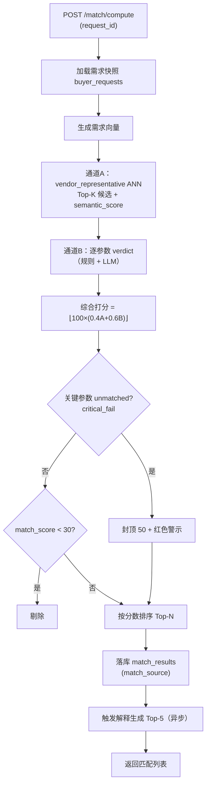
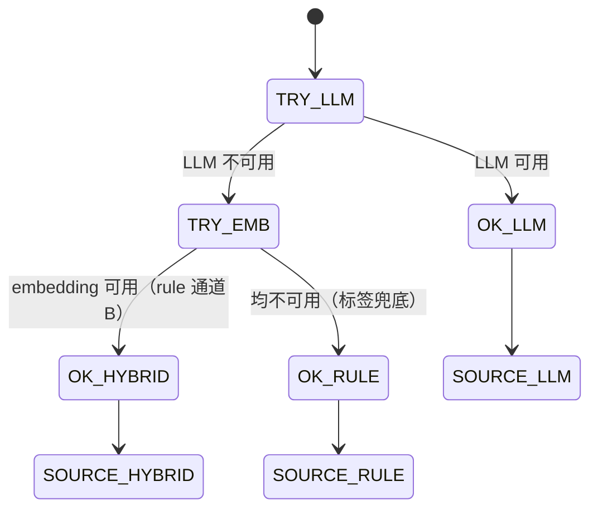

# 需脉枢纽 · 匹配详细设计（LLD）

> 版本：v1.0 ｜ 状态：指导编码 ｜ 更新：2026-08-09
>
> 本文档是**语义匹配引擎**的详细设计（Low-Level Design），目标**可直接指导编码**：包含类型定义、双通道算法伪代码、字段映射表、流程图、组件接口、兜底路径与关键用例。
>
> **相关文档**：《系统架构设计.md》（6.2 向量库 / 6.3.3 匹配接口 / 6.5.3 匹配流程）、《核心系统需求.md》（3.2 语义匹配引擎）、《代理详细设计.md》（Agent 产出快照为匹配输入）、《系统开发计划.md》（M4 匹配引擎）。

## 目录
0. 类型与接口总览
1. 目标与设计原则
2. 匹配流程总览
3. 通道A：语义检索
4. 通道B：参数判定
5. 综合打分与过滤
6. 兜底与来源（rule/hybrid）
7. 数据落库与结果结构
8. 接口契约（Agent → 匹配 → 解释）
9. 稳定性与评估
10. PoC 落地项 vs 演进项 + 关键用例

---

## 0. 类型与接口总览（编码坐标系）

### 0.1 枚举
```python
class Verdict(str, Enum):            # 与 Agent 共用
    MATCHED   = "matched"
    PARTIAL   = "partial"
    MISSING   = "missing"
    UNMATCHED = "unmatched"

class MatchSource(str, Enum):
    LLM    = "llm"      # 双通道完整
    RULE   = "rule"     # 通道B 规则兜底（LLM 不可用）
    HYBRID = "hybrid"   # 通道A 标签兜底（embedding 不可用）

class ParamKind(str, Enum):
    RULE      = "rule"      # 规则判定（数值/枚举集合）
    SEMANTIC  = "semantic"  # LLM 判定（语义模糊）
```

### 0.2 核心数据结构
```python
class DemandSnapshot(TypedDict):
    request_id: str
    conversation_id: str
    version: int
    user_id: str
    structured_demand: dict           # 三态：{key: {value, state}}，含 excluded
    extra_constraints: list[str]
    embedding_id: str | None          # 需求向量（通道A）

class VendorCandidate(TypedDict):
    vendor_id: str
    capability_id: str
    structured_tags: dict             # 厂商能力（6.1）
    summary_text: str
    semantic_score: float             # 通道A
    embedding_id: str

class ParamJudgement(TypedDict):
    param: str                        # 规范参数名（见 4.1 映射）
    demand_value: object
    supply_value: object
    verdict: Verdict
    weight: float
    kind: ParamKind
    note: str                         # 差异说明
    source: dict | None               # {doc_id, page, chunk_text}（溯源）

class MatchResultRow(TypedDict):
    vendor_id: str
    capability_id: str
    match_score: float
    semantic_score: float
    param_hit_rate: float
    critical_fail: bool
    match_source: MatchSource
    judgements: list[ParamJudgement]  # 落库前按 verdict 拆为三组
```

### 0.3 组件接口
```python
class SemanticRetriever(Protocol):
    """通道A：需求向量 → 厂商代表向量 ANN"""
    async def retrieve(self, demand_embedding: list[float],
                       top_k: int, min_score: float) -> list[VendorCandidate]

class ParamJudger(Protocol):
    """通道B：对单厂商判定已指定参数 verdict（规则 + LLM）"""
    async def judge(self, demand: DemandSnapshot,
                    cand: VendorCandidate) -> list[ParamJudgement]

class Scorer(Protocol):
    """综合打分 + 封顶 + 阈值过滤"""
    def score(self, semantic: float,
              judgements: list[ParamJudgement]) -> MatchScore
    # MatchScore: {match_score, param_hit_rate, critical_fail}

class FallbackRouter(Protocol):
    """兜底路由：判断 LLM/embedding 可用性 → match_source"""
    async def channel_b_rule(self, demand, cand) -> list[ParamJudgement]
    async def channel_a_tag(self, demand, cand) -> list[VendorCandidate]

class MatchStore(Protocol):
    async def save_results(self, rows: list[MatchResultRow]) -> list[str]
    async def load_by_request(self, request_id: str) -> list[MatchResultRow]

class MatchService(Protocol):
    """主入口（对 POST /match/compute）"""
    async def compute(self, request_id: str) -> ComputeResult
```

### 0.4 配置常量（与架构/需求一致）
```python
CONFIG = {
  "channel_a": {"top_k": 50, "min_semantic": 0.35},
  "channel_b": {"min_score_denom": True},      # 分母=已指定权重和
  "weights": {                                  # 规范参数权重表
      "product_type": 2.0, "os_support": 1.5, "certifications": 1.5,
      "application_scenes": 1.0, "interfaces": 1.0, "min_order_qty": 1.0,
      "process": 0.5, "lead_time_days": 0.5, "customization": 0.5,
  },
  "critical_params": ["product_type", "os_support", "certifications"],
  "blend": {"sem": 0.4, "param": 0.6},
  "threshold": {"min_match_score": 30.0, "critical_cap": 50.0},
  "explain": {"top_n": 5},
}
```

---

## 1. 目标与设计原则

### 1.1 目标
给定需求匹配快照（Agent 产出），对候选厂商进行双通道打分，输出**可解释、可追溯、稳定**的匹配结果列表。

### 1.2 设计原则
| # | 原则 | 落地 |
| --- | --- | --- |
| 1 | **判定确定性优先** | 能规则判定的参数（数值比较/枚举集合）不走 LLM（与 Agent 一致，防幻觉、保稳定） |
| 2 | **分母=已指定** | 通道B 只对已指定参数计分，未指定通配不计入，少填不稀释 |
| 3 | **关键参数封顶** | `product_type/os_support/certifications` unmatched → critical_fail → 封顶 50 |
| 4 | **兜底可追溯** | LLM/embedding 不可用时降级 rule/hybrid，`match_source` 如实标注 |
| 5 | **输入受限** | 只读需求快照 + 厂商能力（含原文块），不访问无关上下文（防幻觉） |

---

## 2. 匹配流程总览



**伪代码**：
```python
async def compute(request_id: str) -> ComputeResult:
    demand = await load_snapshot(request_id)          # 需求快照（三态）
    embedding = await embed(demand.structured_demand) # 需求向量
    cands = await retriever.retrieve(embedding, CONFIG["channel_a"]["top_k"],
                                     CONFIG["channel_a"]["min_semantic"])
    rows = []
    for c in cands:
        jud = await judger.judge(demand, c)           # 通道B（4.4）
        sc = scorer.score(c.semantic_score, jud)      # 综合+封顶+阈值（5.2）
        if sc.match_score < CONFIG["threshold"]["min_match_score"]:
            continue
        rows.append(to_row(c, sc, jud))
    rows.sort(key=lambda r: -r["match_score"])
    await store.save_results(rows)
    await trigger_explain(rows[:CONFIG["explain"]["top_n"]])  # 异步
    return {"match_results": rows[:top_n], "total_matches": len(rows)}
```

---

## 3. 通道A：语义检索

### 3.1 职责
用需求向量在 `vendor_representative` 集合检索 Top-K 厂商候选，产出 `semantic_score`。

### 3.2 需求向量化文本
```python
def demand_embedding_text(demand: dict) -> str:
    return " ".join(f"{k}:{v['value']}" for k, v in demand.items()
                    if v["state"] == "set")
# 示例："product_type:机顶盒 os:Linux certifications:CE, FCC"
```

### 3.3 检索
- 集合 `vendor_representative`（1 档案=1 向量，1024 维）；
- 距离→相似度 `s_sem = clip(cos, 0, 1)`；
- 参数：`top_k=50`、`min_semantic=0.35`（低于阈值直接不进候选，节省通道B LLM 调用）。

### 3.4 边界
- 通道A 只负责"相关召回"，不负责精确判定（精确判定交给通道B）；
- 通道A 不读原文块（`doc_chunks` 仅供溯源，不参与排序）。

---

## 4. 通道B：参数判定

### 4.1 字段对齐（规范参数 = 需求字段 ↔ 厂商能力字段）
```python
PARAM_MAP = [
  # (规范参数, 权重, 需求字段, 厂商能力字段, 判定方式)
  ("product_type",      2.0, "product_type",        "application_scenarios", SEMANTIC),
  ("os_support",        1.5, "os",                  "os_support",            RULE),
  ("certifications",    1.5, "certifications",      "certifications",        RULE),
  ("application_scenes", 1.0, "application_scenario","application_scenarios", SEMANTIC),
  ("interfaces",        1.0, "interfaces",          "interfaces",            RULE),
  ("min_order_qty",     1.0, "moq",                 "moq",                   RULE),
  ("process",           0.5, None,                  "process_types",         SEMANTIC),  # 需求隐含于品类
  ("lead_time_days",    0.5, "lead_time_days",      "lead_time_days",        RULE),
  ("customization",     0.5, "customization_needs", None,                    SEMANTIC),  # 供方看 summary_text
]
```

### 4.2 规则判定（确定性，不走 LLM）
```python
def judge_rule(param, d_val, s_val) -> Verdict:
    if s_val is None or s_val == [] or s_val == {}:
        return Verdict.MISSING                 # 厂商未声明
    if isinstance(d_val, list):                # 枚举集合：需求值 ⊆ 厂商值
        missing = [v for v in d_val if v not in s_val]
        if not missing: return Verdict.MATCHED
        return Verdict.PARTIAL if any(v in s_val for v in d_val) else Verdict.UNMATCHED
    if isinstance(d_val, (int, float)):        # 数值：需求 ≤ 厂商（moq/交期）
        if d_val <= s_val: return Verdict.MATCHED
        return Verdict.PARTIAL if d_val <= s_val * 1.25 else Verdict.UNMATCHED
    return Verdict.UNMATCHED
```

### 4.3 LLM 判定（语义参数）
- 仅对 `SEMANTIC` 参数（product_type / application_scenes / process / customization）调用 LLM；
- 一次调用**批量判定**该厂商全部语义参数（省 Token、降延迟）：
```markdown
给定买家需求 {demand_json} 与厂商能力 {capability_json}，
对以下语义参数逐项判定 verdict（matched/partial/missing/unmatched），
strict 只输出 JSON：{"params": [{"param","verdict","note"}]}
关键参数（product_type）unmatched 需显式标注 critical=true。
```

### 4.4 汇总（param_hit_rate）
```python
def param_hit_rate(judgements: list[ParamJudgement]) -> float:
    """分母=已指定参数权重和（未指定不计入；排除项按负向过滤，见 4.5）"""
    num = sum(j["weight"] * VERDICT_SCORE[j["verdict"]] for j in judgements)
    den = sum(j["weight"] for j in judgements)          # 分母=已指定
    return num / den if den > 0 else 1.0

VERDICT_SCORE = {MATCHED: 1.0, PARTIAL: 0.5, MISSING: 0.3, UNMATCHED: 0.0}
```

### 4.5 排除项（excluded，负向过滤）
- 需求"明确排除"的参数（如排除 HDMI）**不进入分母**；
- 单独做**硬过滤**：厂商能力命中排除值 → 该厂商直接淘汰（不进结果），并记录原因；
- 与既有"排除项按 unmatched 处理"一致，此处细化为"排除=硬约束"。

---

## 5. 综合打分与过滤

### 5.1 公式
$$\text{match\_score} = \left\lfloor 100 \times (0.4 \cdot s_{sem} + 0.6 \cdot s_{param}) \right\rfloor$$

### 5.2 Scorer 算法
```python
class MatchScore(TypedDict):
    match_score: float
    param_hit_rate: float
    critical_fail: bool

def score(semantic: float, judgements: list[ParamJudgement]) -> MatchScore:
    rate = param_hit_rate(judgements)                     # 4.4
    raw = 100 * (CONFIG["blend"]["sem"] * semantic +
                 CONFIG["blend"]["param"] * rate)
    crit = any(j["param"] in CONFIG["critical_params"]
               and j["verdict"] == Verdict.UNMATCHED
               for j in judgements)
    if crit:
        raw = min(raw, CONFIG["threshold"]["critical_cap"])   # 封顶 50
    return {"match_score": floor(raw),
            "param_hit_rate": rate,
            "critical_fail": crit}
```

### 5.3 过滤规则
- `match_score < 30` → 剔除（不进结果）；
- `critical_fail=True` → 结果标注 `critical_fail`，前端详情顶部红色警示条；
- 排序：`match_score` 降序 → 取 Top-N（默认 10，可配）。

---

## 6. 兜底与来源（rule/hybrid）

### 6.1 兜底路由
```python
async def channel_b_with_fallback(demand, cand) -> tuple[list[ParamJudgement], MatchSource]:
    if await llm_available():
        return await judger.judge(demand, cand), MatchSource.LLM
    # LLM 不可用 → 规则兜底：仅判定 RULE 参数；SEMANTIC 参数判 missing（不虚报）
    j = [await judge_rule_safe(demand, cand, p) for p in RULE_PARAMS]
    return j, MatchSource.RULE

async def channel_a_with_fallback(demand) -> tuple[list[VendorCandidate], MatchSource]:
    if await embedding_available():
        return await retriever.retrieve(...), MatchSource.LLM
    # embedding 不可用 → 标签检索兜底：structured_tags 直接命中（GIN 索引）
    return await retriever.tag_search(demand), MatchSource.HYBRID
```

### 6.2 来源标注与语义
| match_source | 含义 | 前端呈现 |
| --- | --- | --- |
| `llm` | 双通道完整（LLM 判定语义参数） | 正常 |
| `rule` | 通道B 规则兜底（LLM 不可用），语义参数按 missing | 标注"基于规则匹配" |
| `hybrid` | 通道A 标签兜底（embedding 不可用） | 标注"基于规则匹配" |

- `match_source` 记录在 `match_results`，供后台追溯（架构 10）；
- 兜底时**不虚报**：无法判定的参数一律 `missing`，宁可低分不伪造。

### 6.3 降级状态机


---

## 7. 数据落库与结果结构

### 7.1 落库（match_results，架构 6.1）
```python
def to_row(cand, sc, judgements) -> MatchResultRow:
    return {
        "vendor_id": cand["vendor_id"],
        "capability_id": cand["capability_id"],
        "match_score": sc["match_score"],
        "semantic_score": cand["semantic_score"],
        "param_hit_rate": sc["param_hit_rate"],
        "critical_fail": sc["critical_fail"],
        "match_source": source,
        # 三组 JSONB（与 6.4.3 params[] 一一对应）
        "matched_params":   [j for j in judgements if j["verdict"] == MATCHED],
        "partial_params":   [j for j in judgements if j["verdict"] in (PARTIAL, MISSING)],
        "unmatched_params": [j for j in judgements if j["verdict"] == UNMATCHED],
    }
```

### 7.2 查询接口
- `GET /match/detail/{id}`：返回行 + 三组判定 + `ai_comment`（异步生成，未生成返回骨架标记）；
- `GET /conversation/{id}/requests`：快照列表含 `match_count`（联表统计）。

### 7.3 保留策略
- `match_results` **无过期时间**，长期保留（除非会话被删除）；
- 重匹配：同一快照重复 `compute` 时**覆盖该 request_id 旧结果**（以新版本为准），保留历史快照（version 演化）。

---

## 8. 接口契约（Agent → 匹配 → 解释）

### 8.1 输入：Agent 快照
匹配只消费 `buyer_requests` 快照（Agent 确认时生成，见《代理详细设计》8.1 `on_confirm`）；**不访问对话历史**，保证输入纯净。

### 8.2 触发与返回
```python
# POST /match/compute
Request:  {"request_id": "uuid"}
Response: {
  "match_results": [ {vendor_id, company_name, location, summary,
                      match_score, semantic_score, param_hit_rate,
                      critical_fail, match_source, matched_count, unmatched_count} ],
  "total_matches": int,
  "computation_time_ms": int,
}
```

### 8.3 输出：解释生成（异步）
- `compute` 落库后，对 Top-5 触发异步解释（`TaskQueue`，进程内）；
- 解释结果（三组判定 + `ai_comment` + `source`）回写 `match_results`，详情接口按需读取；
- **匹配计算本身不做任何 LLM 解释**（打分与解释解耦，避免阻塞）。

### 8.4 数据隔离
- 匹配不读取用户画像（画像只影响 Agent 引导，不进打分）；
- 匹配不写画像（画像只由需求侧行为驱动，见《代理详细设计》8.2）；
- 排除项硬过滤在**打分前**执行（4.5）。

### 8.5 解释生成 Prompt 全文（由架构 6.4 下沉）
对 Top-5 异步生成解释时使用：

```markdown
你是一个供需匹配分析专家。给定买家的需求和一个厂商的能力，分析匹配情况并生成解释。

# 买家需求
{demand_json}

# 厂商能力
{vendor_capability_json}

# 输出格式（严格遵循）
{
  "params": [
    {
      "param": "参数名",
      "demand_value": "需求值",
      "supply_value": "供给值",
      "verdict": "matched | partial | missing | unmatched",
      "note": "差异说明（partial标注'需协商'，missing标注'厂商未声明'）",
      "source": {"doc_id": "...", "page": 3, "chunk_text": "原文片段"}  // 可空
    }
  ],
  "ai_comment": "一句话综合评语，20-50字"
}

# 规则
1. matched=完全满足；partial=需协商（如交期30 vs 45）；missing=厂商未声明该能力；unmatched=明确不满足
2. 每个判定尽量附 source（来自厂商原文），便于"查看原文"
3. ai_comment要客观，指出优势和不足
```

> 输入受限于需求快照 + 单厂商能力（含原文块检索），不访问对话历史（防幻觉，架构 3.3 输入受限）。

---

## 9. 稳定性与评估

### 9.1 匹配侧稳定性（与《代理详细设计》7.2 同源）
同需求快照 + 同数据集 + 同配置，重复运行 N=5 次：
| 指标 | 阈值 |
| --- | --- |
| `match_score` 标准差 | ≤ 2 分 |
| Top-5 厂商集合重合率（Jaccard） | ≥ 90% |
| 排序位移（平均 \|Δrank\|） | ≤ 1 名 |

### 9.2 稳定性根源与缓解
- 根源：**通道B 的 SEMANTIC 参数走 LLM**（温度随机）；RULE 参数与通道A 是确定性的；
- 缓解（按优先级）：① `temperature=0.2` ② SEMANTIC 判定严格枚举 + Few-shot ③ **同输入判定缓存**（LLM verdict 按 `demand+capability` 哈希缓存，命中即复用，大幅提升稳定性与降本）④ 稳定性纳入回归集。

### 9.3 评估
- **端到端**：需求快照 → 匹配 → Top-1 命中"人工标注正确厂商"比例（黄金集，与《代理详细设计》7.3 共用评估集）；
- **组件级**：通道A 召回率（正确厂商是否在 Top-K）、通道B verdict 与人工标注一致率；
- 评估脚本：`evaluate_match(cases, service) -> Report`，取材自事实数据（`llm_call_logs` 含匹配判定调用）。

---

## 10. PoC 落地项 vs 演进项 + 关键用例

### 10.1 PoC 落地 vs 演进
**PoC 落地**：双通道打分（3/4/5 章）、字段映射表（4.1）、兜底 rule/hybrid（6）、落库与详情（7）、判定缓存（9.2）、匹配侧评估脚本（9.3）。
**演进项**：批量 Top-K 并发通道B、分布式缓存（引入 Redis 时）、个性化重排（画像参与，明确另议）、多品类 Schema 动态加载。

### 10.2 关键用例（验收用例，可转单测/评估集）
| ID | 用例 | 期望结果 |
| --- | --- | --- |
| UC-M1 | 同款产品+同OS+同认证 | 高 matched 权重 → `match_score` 高、`critical_fail=false` |
| UC-M2 | 交期 30 vs 45 | `lead_time_days` = partial（可协商） |
| UC-M3 | 需求要 CE 而厂商无 | `certifications` = unmatched → **critical_fail=true** → 封顶 50 |
| UC-M4 | 需求排除 HDMI，厂商支持 | **硬过滤淘汰**，不进结果 |
| UC-M5 | 未指定 OS | `os_support` 不计入分母（不稀释分数） |
| UC-M6 | `match_score < 30` | 剔除，不进结果 |
| UC-M7 | LLM 不可用 | 通道B 规则兜底，`match_source='rule'`，语义参数=missing 不虚报 |
| UC-M8 | 同输入跑 5 次 | `match_score` 标准差 ≤2、Top-5 集合重合 ≥90% |
| UC-M9 | 重匹配 | 覆盖该 request_id 旧结果；历史快照 version 保留 |
| UC-M10 | 排除项与关键参数并存 | 排除硬过滤先生效；关键参数再判 critical |


