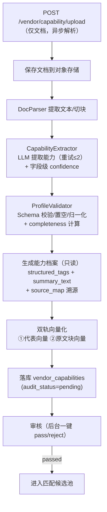
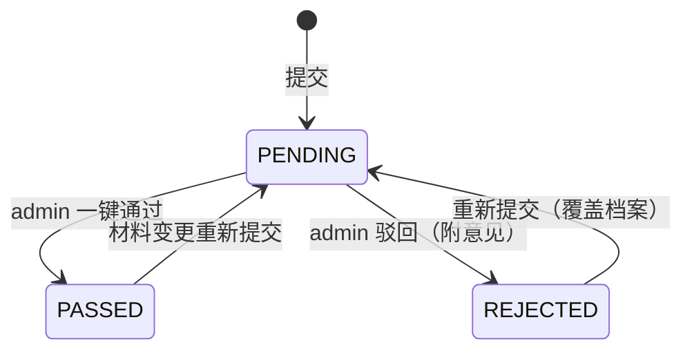

# 需脉枢纽 · 厂商解析详细设计（LLD）

> 版本：v1.0 ｜ 状态：指导编码 ｜ 更新：2026-08-09
>
> 本文档是**厂商能力解析**（输入侧）的详细设计（Low-Level Design），目标**可直接指导编码**：覆盖"资料上传 → 文档解析 → LLM 提取能力档案 → 双轨向量化 → 审核状态"全链路。
>
> **相关文档**：《系统架构设计.md》（3.3 vendor-service / 6.1 vendor_capabilities / 6.2 双轨向量）、《核心系统需求.md》（3.5 厂商能力解析子系统）、《匹配详细设计.md》（通道B 消费 structured_tags）、《系统开发计划.md》（M2 基础业务）。

## 目录
0. 类型与接口总览
1. 目标与设计原则
2. 流程总览
3. 文档解析与文本提取
4. LLM 能力提取（含 Prompt 全文）
5. 能力档案生成（只读）
6. 双轨向量化
7. 审核状态流转
8. 接口契约
9. 质量与稳定性
10. PoC 落地项 vs 演进项 + 关键用例

---

## 0. 类型与接口总览（编码坐标系）

### 0.1 枚举
```python
class SourceType(str, Enum):
    DOC    = "doc"      # 上传文档（唯一来源；能力录入仅接受文档，无表单/自由文本）

class AuditStatus(str, Enum):
    PENDING  = "pending"    # 审核中（不参与匹配）
    PASSED   = "passed"     # 通过（进入匹配候选池）
    REJECTED = "rejected"   # 驳回
```

### 0.2 核心数据结构
```python
# 能力 Schema（与匹配 PARAM_MAP 厂商侧字段同源，见《匹配详细设计》）
# hard=True 硬能力（RULE 判定主锚，缺失计入完备度）；hard=False 软标签（语义召回，不设硬门槛）
CAPABILITY_SCHEMA_FIELDS = [
    # 硬能力（7 项）
    {"key": "process_types",        "kind": "multi",  "hard": True},
    {"key": "certifications",       "kind": "multi",  "hard": True},
    {"key": "os_support",           "kind": "multi",  "hard": True},
    {"key": "interfaces",           "kind": "multi",  "hard": True},
    {"key": "moq",                  "kind": "number", "hard": True},   # 起订量（数值）
    {"key": "lead_time_days",       "kind": "number", "hard": True},   # 交期(天)
    {"key": "monthly_capacity",     "kind": "number", "hard": True},   # 月产能
    # 软标签（3 项）
    {"key": "product_types",        "kind": "multi",  "hard": False},  # 历史产品标签，创新产品不误杀
    {"key": "application_scenarios","kind": "multi",  "hard": False},
    {"key": "customization",        "kind": "single", "hard": False},
]

class ExtractedCapability(TypedDict):
    process_types: list[str]        # 工艺（硬）
    certifications: list[str]       # 认证（硬）
    os_support: list[str]           # OS（硬）
    interfaces: list[str]           # 接口（硬）
    moq: int | None                 # 起订量（硬）
    lead_time_days: int | None      # 交期(天)（硬）
    monthly_capacity: int | None    # 月产能（硬）
    product_types: list[str]        # 产品类型（软）
    application_scenarios: list[str]# 应用场景（软）
    customization: str | None       # 定制化（软）
    summary_text: str               # 一句话摘要 ≤50 字

class SourceRef(TypedDict):
    doc_id: str
    doc_name: str
    page: int
    chunk_text: str
    confidence: float            # 字段级解析置信度 0-1，<0.6 低置信度（档案页黄色提示）

class CapabilityProfile(TypedDict):
    capability_id: str
    vendor_id: str
    structured_tags: dict           # = ExtractedCapability 主体（JSONB，key 与 Schema 一一对应）
    summary_text: str
    source_type: SourceType         # 恒为 "doc"（仅文档）
    version: int                    # 档案版本号：每次重新解析（增/删文档）+1
    updated_at: str                 # 档案生成时间（ISO）
    doc_count: int                  # 本次档案基于的文档数
    completeness: float             # 能力完备度：硬能力已提取字段 / 硬能力总数（7）
    source_map: dict                # { field_key: SourceRef }，字段级溯源+置信度（每个能力值 → 文档·第N页）
    doc_urls: list[str]
    audit_status: AuditStatus
```

### 0.3 组件接口
```python
class FileStorage(Protocol):
    """文档存储：PoC 本地盘，演进 MinIO/OSS/S3（与本地队列同哲学）"""
    async def save(self, path: str, data: bytes) -> str      # 返回 URL
    async def read(self, url: str) -> bytes
    async def delete(self, url: str) -> None
    async def exists(self, url: str) -> bool

class DocParser(Protocol):
    """文档 → 文本（Unstructured / PyPDF2 / python-pptx）"""
    async def extract_text(self, doc_path: str) -> str
    async def chunk(self, text: str, page: int | None = None) -> list[dict]
    # chunk: [{text, page}]，用于原文块向量

class CapabilityExtractor(Protocol):
    """LLM：文档文本 → ExtractedCapability（含字段级 confidence 于 SourceRef，重试/校验）"""
    async def extract(self, doc_text: str) -> ExtractedCapability

class ProfileValidator(Protocol):
    """Schema 校验 + 无信息置空 + 枚举归一化"""
    def validate(self, cap: dict) -> ExtractedCapability

class VectorIndexer(Protocol):
    """双轨向量化：代表向量 + 原文块向量"""
    async def index_representative(self, profile: CapabilityProfile) -> str   # -> rep_embedding_id
    async def index_doc_chunks(self, vendor_id, doc_id, chunks) -> None

class AuditStore(Protocol):
    async def set_audit_status(self, vendor_id, status, comment=None) -> None
```

### 0.4 配置常量
```python
CONFIG = {
  "llm": {"temperature": 0.2, "retry": 2, "max_tokens": 2048},
  "doc": {"max_size_mb": 20, "allowed": [".pdf", ".ppt", ".pptx", ".doc", ".docx"]},
  "chunk": {"max_chars": 800, "overlap": 100},
  "vector": {"dim": 1024, "collection_rep": "vendor_representative",
             "collection_chunks": "doc_chunks"},
}
```

---

## 1. 目标与设计原则

### 1.1 目标
把厂商**上传的文档**（产品册/认证证书/产线参数等）转化为**结构化、可匹配、可溯源**的只读能力档案，并完成双轨向量化与审核闸门。**能力录入仅接受文档**（无表单、无自由文本）：能力 Schema 由 AI 从文档解析得出，全部匹配可溯源到文档。

### 1.2 设计原则
| # | 原则 | 落地 |
| --- | --- | --- |
| 1 | **档案只读** | 能力档案由 AI 自动生成，无人工编辑；材料变更→重新上传文档→覆盖（仅保留最新） |
| 2 | **仅文档输入** | 录入只接受文档（PDF/PPT/Word）；Schema 全部由 AI 解析，无表单/自由文本来源 |
| 3 | **无信息置空** | 文档未体现的能力置空数组/null，不做猜测补全（保证 verdict=missing 语义真实） |
| 4 | **Schema 一致** | 解析输出字段与《匹配详细设计》PARAM_MAP 厂商侧同源（硬/软分层），档案页按 Schema 遍历渲染，页面内容与 Schema 一一对应 |
| 5 | **硬/软分层** | 硬能力（工艺/认证/OS/接口/起订量/交期/月产能）= RULE 判定主锚，缺失计入完备度；软标签（产品类型/应用场景/定制化）= 语义召回，不设硬门槛（历史产品标签，创新产品不误杀） |
| 6 | **可信可追溯** | 每个能力值带**字段级解析置信度**（source_map 内 confidence，<0.6 低置信度黄色提示）+ `source_map` 溯源（文档·第N页），完备度 = 硬能力覆盖比例，引导厂商补文档 |
| 7 | **审核闸门** | `audit_status=passed` 才进入匹配候选池；pending 不参与匹配 |
| 8 | **可追溯原文** | 原文块向量携带出处（vendor_id/doc_id/page/chunk_text），支撑"查看原文" |

---

## 2. 流程总览



**伪代码**：
```python
async def upload_capability(vendor_id, documents):
    doc_urls = [await save_file(d) for d in documents]
    doc_text, chunks = await parse_all(documents)              # 3
    cap = await extractor.extract(doc_text)                    # 4（含字段级 confidence 于 SourceRef，重试）
    cap = validator.validate(cap)                              # 4.3（含 completeness）
    profile = build_profile(vendor_id, cap, doc_urls)          # 5（含 source_map 溯源+置信度）
    rep_id = await indexer.index_representative(profile)       # 6
    await indexer.index_doc_chunks(vendor_id, doc_id, chunks)
    await store.save(profile, rep_id, status=PENDING)          # 7
    return profile
```

> **异步解析**：前端上传后文档立即入表（状态=解析中），解析完成→已完成；档案生成后跳转/提示查看档案页（01D）。解析失败可"重试"。

---

## 3. 文档解析与文本提取

| 来源 | 工具 | 说明 |
| --- | --- | --- |
| PDF | PyPDF2 / Unstructured | 按页提取文本；扫描件 OCR 为演进项 |
| PPT/PPTX | python-pptx / Unstructured | 提取每页文本 |
| Word | python-docx / Unstructured | 提取段落文本 |

> 能力录入仅接受文档（无表单、无自由文本），故解析输入恒为文档。

- **限制**：大小 ≤20MB、扩展名白名单（.pdf/.ppt/.pptx/.doc/.docx）；
- **切块**：`max_chars=800`、`overlap=100`，携带 `page` 号（用于原文块向量、"查看原文"定位与 `source_map.page`）；
- **失败处理**：单文件解析失败不阻断整体——其余文档继续解析，失败文档标记"解析失败"（前端表格可重试）。

---

## 4. LLM 能力提取

### 4.1 Prompt 全文（由架构 6.4 下沉）
```markdown
你是一个制造业能力解析专家。你的任务是分析厂商上传的文档，提取结构化的制造能力标签。

# 输出Schema
{
  "process_types": ["string"],          # 工艺（硬能力）
  "certifications": ["string"],         # 认证（硬能力）
  "os_support": ["string"],             # 操作系统（硬能力）
  "interfaces": ["string"],             # 接口（硬能力）
  "moq": number,                        # 起订量（硬能力）
  "lead_time_days": number,             # 交期(天)（硬能力）
  "monthly_capacity": number,           # 月产能（硬能力）
  "product_types": ["string"],          # 产品类型（软标签）
  "application_scenarios": ["string"],  # 应用场景（软标签）
  "customization": "string",            # 定制化（软标签）
  "summary_text": "一句话摘要，不超过50字",
  "sources": {                          # 字段级溯源+置信度：每个能力值 → 出处（文档名+页码+原文片段+把握程度）
    "process_types": {"doc_name": "产能介绍.pdf", "page": 1, "chunk_text": "...", "confidence": 0.0-1.0}
  }
}

# 输入资料
文档内容：{document_text}

请解析并输出符合Schema的JSON。如果某项信息在文档中不存在，使用空数组或null（不猜测补全）。
硬能力（工艺/认证/OS/接口/起订量/交期/月产能）缺失时，sources 中不包含该字段。
```

### 4.2 调用与重试
```python
async def extract(doc_text) -> ExtractedCapability:
    raw = await llm_call(render(PROMPT_PARSE, doc_text),
                         temperature=CONFIG["llm"]["temperature"])
    for attempt in range(CONFIG["llm"]["retry"] + 1):
        try:
            data = json.loads(extract_json(raw))
            # 字段级置信度随 sources（SourceRef.confidence）一并校验，无总体 parse_confidence
            return PROFILE_SCHEMA.model_validate(data)
        except (ValidationError, JSONDecodeError):
            if attempt < CONFIG["llm"]["retry"]:
                raw = await llm_call(repair_prompt(raw))   # 修复重试
            else:
                raise ParseFailed("LLM 输出校验失败")
```

### 4.3 Schema 校验、归一化与完备度
- **置空**：文档未体现 → `[]` / `null`（不猜测补全）；
- **归一化**：枚举类（certifications/os_support/interfaces）映射到预定义枚举；无法映射的保留原文但标记；
- **完备度（completeness）**：`已提取硬能力字段数 / 硬能力总数(7)`，0-1。由 validator 依据 CAPABILITY_SCHEMA_FIELDS（hard=True）计算，与档案页缺失项标红严格一致；
- **字段级置信度**：LLM 为每个已提取字段输出 `confidence`（0-1，随 SourceRef），**无总体 parse_confidence**；`<0.6` 视为低置信度（档案页黄色提示补文档）；
- **溯源（source_map）**：LLM 返回 `sources` 经校验归一为 `{field_key: SourceRef}`（含 confidence），仅已提取字段保留；缺失字段无溯源；
- **summary_text**：≤50 字一句话摘要（代表向量成分之一）。

---

## 5. 能力档案生成（只读）

- `structured_tags` = ExtractedCapability 主体（JSONB，key 与能力 Schema 一一对应）；**档案页按 Schema 遍历渲染**，页面内容与 Schema 完全对应；
- `summary_text` = 一句话摘要；
- `source_type` = 恒为 `doc`（仅文档）；
- `completeness` = 硬能力覆盖比例（校验阶段计算，档案页综合评估文字展示 X/N）；
- `source_map` = 字段级溯源+置信度 `{field_key: {doc_id, doc_name, page, chunk_text, confidence}}`，档案页每个能力值展示"文档·第N页"可点击预览，并**独立列展示字段级置信度**（低置信度黄色）；
- **只读约束**：档案无人工编辑入口；重新上传文档 → 覆盖旧档案（不保留生成历史，仅保留最新）。

---

## 6. 双轨向量化

| 轨 | 集合 | 内容 | 用途 |
| --- | --- | --- | --- |
| 代表向量 | `vendor_representative` | `structured_tags` 拼装 + `summary_text`（1 档案=1 向量） | 匹配通道A |
| 原文块向量 | `doc_chunks` | 文档切块 + `{vendor_id, doc_id, page, chunk_text}` | 引用溯源/查看原文 |

```python
def rep_text(profile) -> str:
    t = profile["structured_tags"]
    return (f"工艺:{t.get('process_types')} 认证:{t.get('certifications')} "
            f"OS:{t.get('os_support')} 接口:{t.get('interfaces')} "
            f"起订量:{t.get('moq')} 交期:{t.get('lead_time_days')}天 "
            f"月产能:{t.get('monthly_capacity')} 产品:{t.get('product_types')} "
            f"场景:{t.get('application_scenarios')} 定制:{t.get('customization')} "
            f"其他:{profile['summary_text']}")
```
- 重新提交时：先删旧代表向量/原文块，再写入新向量（保持"仅最新"）；
- 失败补偿：向量写入失败 → 重试；重试失败 → 档案标记 `index_status=partial`（可修复，不阻断审核）。

---

## 7. 审核状态流转


- `pending` 不参与匹配；`passed` 进入候选池；预置 100 家厂商为 `passed`（种子数据）；
- 审核动作写 `admin_logs`（审计）。

---

## 8. 接口契约

```python
# POST /api/v1/vendor/capability/upload
Request:  Multipart/form-data { vendor_id, documents[] }   # 仅文档；无 form_data / free_text
Response: { capability_id, structured_tags, summary_text, version, updated_at, doc_count,
            completeness, source_map, doc_urls, audit_status: "pending" }
# source_map = { field_key: {doc_id, doc_name, page, chunk_text, confidence} }，无顶层 parse_confidence

# GET /api/v1/vendor/capability/{vendor_id}
Response: { capability_id, structured_tags, summary_text, version, updated_at, doc_count,
            completeness, source_map, doc_urls, audit_status }

# DELETE /api/v1/vendor/capability/{vendor_id}/documents/{document_id}  —— 删除能力文档（触发重新解析，版本+1）
Response: 更新后的 CapabilityOut（version+1, doc_count-1, updated_at 刷新）

# POST /api/v1/admin/vendors/{vendor_id}/audit
Request:  { action: "pass"|"reject", comment? }
Response: { vendor_id, audit_status, audited_at }
```
- 契约由后端自动产出 openapi（ADR-10），前端据此生成类型与 mock（ADR-11）。

---

## 9. 质量与稳定性

- **质量指标**：解析字段与人工标注一致率（抽样评估）；**字段级 confidence 校准**（低置信度提示补文档）；summary 相关性；
- **稳定性**：同一文档重复解析 N 次，`structured_tags` 一致率 ≥95%（低温度 + 枚举归一化 + 相同输入缓存）；
- **失败路径**：文档解析失败 → 前端表格标记"解析失败"可重试；LLM 校验失败 → 重试 → 标记解析失败（可重新上传）；
- **事实数据**：解析 LLM 调用写入 `llm_call_logs`（input_full 含文档文本，output_raw 含结果与字段级置信度），供回溯/评估。

---

## 10. PoC 落地项 vs 演进项 + 关键用例

### 10.1 PoC 落地 vs 演进
**PoC 落地**：文档解析（PyPDF2/pptx/docx）、LLM 提取 + 校验（含字段级 confidence）、只读档案（含 completeness/source_map）、双轨向量化、审核闸门、种子数据 100 家。
**演进项**：OCR 扫描件、多文档合并去重、解析质量自动巡检、档案变更审计历史。

### 10.2 关键用例
| ID | 用例 | 期望结果 |
| --- | --- | --- |
| UC-P1 | 上传 PDF 文档（多份） | 生成档案（pending），`source_type=doc`，异步解析完成后前端状态=已完成 |
| UC-P2 | 文档未写认证 | `certifications=[]`（不猜测），计入完备度缺失，档案页标红 + 建议 |
| UC-P3 | 某 PDF 解析失败 | 其余文档继续，失败文档标记"解析失败"，前端可重试，不阻断 |
| UC-P4 | LLM 输出非法 JSON | 重试 ≤2 次；仍失败 → 标记解析失败 |
| UC-P5 | 同一文档重复解析 5 次 | `structured_tags` 一致率 ≥95% |
| UC-P6 | 审核通过 | `passed` → 进入匹配候选池 |
| UC-P7 | 重新上传文档 | 覆盖旧档案 + 旧向量；`audit_status=pending`；completeness/source_map（含字段级 confidence）一并更新；**version+1、updated_at 刷新** |
| UC-P8 | pending 档案 | 不参与匹配（不出现在结果） |
| UC-P9 | 档案页展示 | 按 Schema 遍历：硬能力缺失标红 + 建议，软标签中性；每个能力值**独立置信度列**（<60% 黄色，综合评估文字提示低置信度字段）；每个能力值带 source_map 溯源（文档·第N页可预览）；**头部显示版本 vN / 更新时间 / 基于 N 份文档** |
| UC-P10 | 删除能力文档 | `DELETE` 移除文档 → 触发重新解析 → **version+1、doc_count-1**；档案覆盖更新 |
