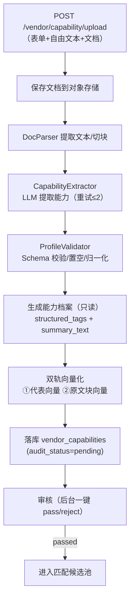
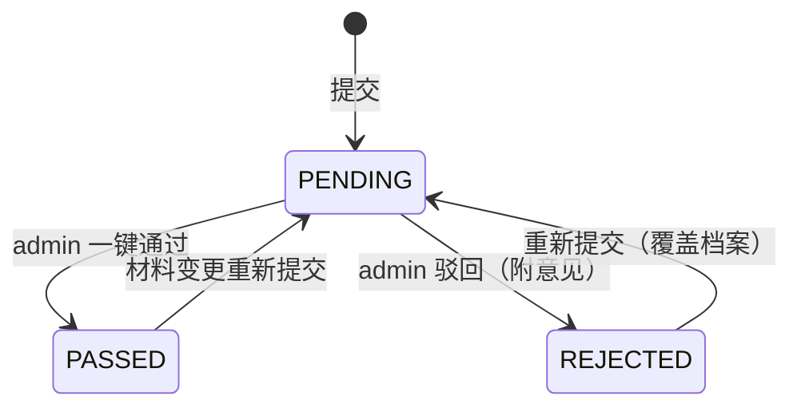

# 需脉枢纽 · 厂商解析详细设计（LLD）

> 版本：v1.0 ｜ 状态：指导编码 ｜ 更新：2026-08-09
>
> 本文档是**厂商能力解析**（输入侧）的详细设计（Low-Level Design），目标**可直接指导编码**：覆盖"资料上传 → 文档解析 → LLM 提取能力档案 → 双轨向量化 → 审核状态"全链路。
>
> **相关文档**：《系统架构设计.md》（3.3 vendor-service / 6.1 vendor_capabilities / 6.2 双轨向量）、《核心系统需求.md》（3.5 厂商能力解析子系统）、《匹配详细设计.md》（通道B 消费 structured_tags）、《系统开发计划.md》（M2 基础业务）。

## 目录
0. 类型与接口总览
1. 目标与设计原则
2. 流程总览
3. 文档解析与文本提取
4. LLM 能力提取（含 Prompt 全文）
5. 能力档案生成（只读）
6. 双轨向量化
7. 审核状态流转
8. 接口契约
9. 质量与稳定性
10. PoC 落地项 vs 演进项 + 关键用例

---

## 0. 类型与接口总览（编码坐标系）

### 0.1 枚举
```python
class SourceType(str, Enum):
    FORM   = "form"     # 模板表单
    TEXT   = "text"     # 自由文本
    DOC    = "doc"      # 上传文档
    MIXED  = "mixed"

class AuditStatus(str, Enum):
    PENDING  = "pending"    # 审核中（不参与匹配）
    PASSED   = "passed"     # 通过（进入匹配候选池）
    REJECTED = "rejected"   # 驳回
```

### 0.2 核心数据结构
```python
class ExtractedCapability(TypedDict):
    process_types: list[str]        # 工艺
    certifications: list[str]       # 认证
    os_support: list[str]           # OS
    interfaces: list[str]           # 接口
    equipment: list[dict]           # [{name, count, year}]
    moq: dict                       # {min, unit}
    lead_time_days: int | None
    application_scenarios: list[str]
    summary_text: str               # 一句话摘要 ≤50 字

class CapabilityProfile(TypedDict):
    capability_id: str
    vendor_id: str
    structured_tags: dict           # = ExtractedCapability 主体（JSONB）
    summary_text: str
    source_type: SourceType
    doc_urls: list[str]
    audit_status: AuditStatus
```

### 0.3 组件接口
```python
class DocParser(Protocol):
    """文档 → 文本（Unstructured / PyPDF2 / python-pptx）"""
    async def extract_text(self, doc_path: str) -> str
    async def chunk(self, text: str, page: int | None = None) -> list[dict]
    # chunk: [{text, page}]，用于原文块向量

class CapabilityExtractor(Protocol):
    """LLM：资料 → ExtractedCapability（含重试/校验）"""
    async def extract(self, form: dict, free_text: str,
                      doc_text: str) -> ExtractedCapability

class ProfileValidator(Protocol):
    """Schema 校验 + 无信息置空 + 枚举归一化"""
    def validate(self, cap: dict) -> ExtractedCapability

class VectorIndexer(Protocol):
    """双轨向量化：代表向量 + 原文块向量"""
    async def index_representative(self, profile: CapabilityProfile) -> str   # -> rep_embedding_id
    async def index_doc_chunks(self, vendor_id, doc_id, chunks) -> None

class AuditStore(Protocol):
    async def set_audit_status(self, vendor_id, status, comment=None) -> None
```

### 0.4 配置常量
```python
CONFIG = {
  "llm": {"temperature": 0.2, "retry": 2, "max_tokens": 2048},
  "doc": {"max_size_mb": 20, "allowed": [".pdf", ".ppt", ".pptx", ".doc", ".docx"]},
  "chunk": {"max_chars": 800, "overlap": 100},
  "vector": {"dim": 1536, "collection_rep": "vendor_representative",
             "collection_chunks": "doc_chunks"},
}
```

---

## 1. 目标与设计原则

### 1.1 目标
把厂商资料（表单/自由文本/文档）转化为**结构化、可匹配、可溯源**的只读能力档案，并完成双轨向量化与审核闸门。

### 1.2 设计原则
| # | 原则 | 落地 |
| --- | --- | --- |
| 1 | **档案只读** | 能力档案由 AI 自动生成，无人工编辑、无预览；材料变更→重新提交→覆盖（仅保留最新） |
| 2 | **无信息置空** | 资料未体现的能力置空数组/null，不做猜测补全（保证 verdict=missing 语义真实） |
| 3 | **口径与匹配一致** | 解析输出字段与《匹配详细设计》PARAM_MAP 同源（os_support/interfaces/certifications/moq/lead_time_days/application_scenarios） |
| 4 | **审核闸门** | `audit_status=passed` 才进入匹配候选池；pending 不参与匹配 |
| 5 | **可追溯** | 原文块向量携带出处（vendor_id/doc_id/page/chunk_text），支撑"查看原文" |

---

## 2. 流程总览



**伪代码**：
```python
async def upload_capability(vendor_id, form, free_text, documents):
    doc_urls = [await save_file(d) for d in documents]
    doc_text, chunks = await parse_all(documents)          # 3
    cap = await extractor.extract(form, free_text, doc_text)  # 4（含重试）
    cap = validator.validate(cap)                            # 4.3
    profile = build_profile(vendor_id, cap, doc_urls)        # 5
    rep_id = await indexer.index_representative(profile)     # 6
    await indexer.index_doc_chunks(vendor_id, doc_id, chunks)
    await store.save(profile, rep_id, status=PENDING)        # 7
    return profile
```

---

## 3. 文档解析与文本提取

| 来源 | 工具 | 说明 |
| --- | --- | --- |
| PDF | PyPDF2 / Unstructured | 按页提取文本；扫描件 OCR 为演进项 |
| PPT/PPTX | python-pptx / Unstructured | 提取每页文本 |
| Word | python-docx / Unstructured | 提取段落文本 |
| 表单/自由文本 | 直接使用 | 不需解析 |

- **限制**：大小 ≤20MB、扩展名白名单；
- **切块**：`max_chars=800`、`overlap=100`，携带 `page` 号（用于原文块向量与"查看原文"定位）；
- **失败处理**：单文件解析失败不阻断整体——用表单/自由文本兜底，文档部分标记"解析失败"（3.5 需求）。

---

## 4. LLM 能力提取

### 4.1 Prompt 全文（由架构 6.4 下沉）
```markdown
你是一个制造业能力解析专家。你的任务是分析厂商提交的资料，提取结构化的制造能力标签。

# 输出Schema
{
  "process_types": ["string"],
  "certifications": ["string"],
  "os_support": ["string"],
  "interfaces": ["string"],
  "equipment": [{"name": "string", "count": number, "year": number}],
  "moq": {"min": number, "unit": "string"},
  "lead_time_days": number,
  "application_scenarios": ["string"],
  "summary_text": "一句话摘要，不超过50字"
}

# 输入资料
表单数据：{form_data}
自由文本：{free_text}
文档内容：{document_text}

请解析并输出符合Schema的JSON。如果某项信息不存在，使用空数组或null。
```

### 4.2 调用与重试
```python
async def extract(form, free_text, doc_text) -> ExtractedCapability:
    raw = await llm_call(render(PROMPT_PARSE, form, free_text, doc_text),
                         temperature=CONFIG["llm"]["temperature"])
    for attempt in range(CONFIG["llm"]["retry"] + 1):
        try:
            return PROFILE_SCHEMA.model_validate(json.loads(extract_json(raw)))
        except (ValidationError, JSONDecodeError):
            if attempt < CONFIG["llm"]["retry"]:
                raw = await llm_call(repair_prompt(raw))   # 修复重试
            else:
                raise ParseFailed("LLM 输出校验失败")
```

### 4.3 Schema 校验与归一化
- **置空**：资料未体现 → `[]` / `null`（不猜测补全）；
- **归一化**：枚举类（certifications/os_support/interfaces）映射到预定义枚举；无法映射的保留原文但标记；
- **summary_text**：≤50 字一句话摘要（代表向量成分之一）。

---

## 5. 能力档案生成（只读）

- `structured_tags` = ExtractedCapability 主体（JSONB，与匹配 PARAM_MAP 对齐）；
- `summary_text` = 一句话摘要；
- `source_type` = form/text/doc/mixed；
- **只读约束**：档案无人工编辑入口、无预览独立页；重新提交 → 覆盖旧档案（不保留生成历史，仅保留最新）。

---

## 6. 双轨向量化

| 轨 | 集合 | 内容 | 用途 |
| --- | --- | --- | --- |
| 代表向量 | `vendor_representative` | `structured_tags` 拼装 + `summary_text`（1 档案=1 向量） | 匹配通道A |
| 原文块向量 | `doc_chunks` | 文档切块 + `{vendor_id, doc_id, page, chunk_text}` | 引用溯源/查看原文 |

```python
def rep_text(profile) -> str:
    t = profile["structured_tags"]
    return (f"工艺:{t.get('process_types')} 认证:{t.get('certifications')} "
            f"OS:{t.get('os_support')} 接口:{t.get('interfaces')} "
            f"起订量:{t.get('moq')} 交期:{t.get('lead_time_days')}天 "
            f"场景:{t.get('application_scenarios')} 其他:{profile['summary_text']}")
```
- 重新提交时：先删旧代表向量/原文块，再写入新向量（保持"仅最新"）；
- 失败补偿：向量写入失败 → 重试；重试失败 → 档案标记 `index_status=partial`（可修复，不阻断审核）。

---

## 7. 审核状态流转


- `pending` 不参与匹配；`passed` 进入候选池；预置 100 家厂商为 `passed`（种子数据）；
- 审核动作写 `admin_logs`（审计）。

---

## 8. 接口契约

```python
# POST /api/v1/vendor/capability/upload
Request:  Multipart/form-data { vendor_id, form_data, free_text, documents[] }
Response: { capability_id, profile: {structured_tags, summary_text},
            audit_status: "pending" }

# GET /api/v1/vendor/capability/{vendor_id}
Response: { capability_id, structured_tags, summary_text, audit_status }

# POST /api/v1/admin/vendors/{vendor_id}/audit
Request:  { action: "pass"|"reject", comment? }
Response: { vendor_id, audit_status, audited_at }
```
- 契约由后端自动产出 openapi（ADR-10），前端据此生成类型与 mock（ADR-11）。

---

## 9. 质量与稳定性

- **质量指标**：解析字段与人工标注一致率（抽样评估）；summary 相关性；
- **稳定性**：同一资料重复解析 N 次，`structured_tags` 一致率 ≥95%（低温度 + 枚举归一化 + 相同输入缓存）；
- **失败路径**：文档解析失败 → 表单兜底 + 标记；LLM 校验失败 → 重试 → 标记解析失败（可重新提交）；
- **事实数据**：解析 LLM 调用写入 `llm_call_logs`（input_full 含资料，output_raw 含结果），供回溯/评估。

---

## 10. PoC 落地项 vs 演进项 + 关键用例

### 10.1 PoC 落地 vs 演进
**PoC 落地**：文档解析（PyPDF2/pptx/docx）、LLM 提取 + 校验、只读档案、双轨向量化、审核闸门、种子数据 100 家。
**演进项**：OCR 扫描件、多文档合并去重、解析质量自动巡检、档案变更审计历史。

### 10.2 关键用例
| ID | 用例 | 期望结果 |
| --- | --- | --- |
| UC-P1 | 表单 + PDF 上传 | 生成档案（pending），`source_type=mixed` |
| UC-P2 | 资料未写认证 | `certifications=[]`（不猜测） |
| UC-P3 | PDF 解析失败 | 表单兜底，文档标记"解析失败"，不阻断 |
| UC-P4 | LLM 输出非法 JSON | 重试 ≤2 次；仍失败 → 标记解析失败 |
| UC-P5 | 同一资料重复解析 5 次 | `structured_tags` 一致率 ≥95% |
| UC-P6 | 审核通过 | `passed` → 进入匹配候选池 |
| UC-P7 | 材料重新提交 | 覆盖旧档案 + 旧向量；`audit_status=pending` |
| UC-P8 | pending 档案 | 不参与匹配（不出现在结果） |
