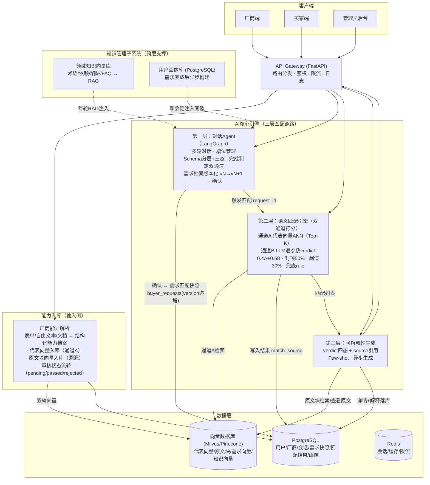

# 核心系统需求

> 版本：v1.0 ｜ 状态：指导系统实现 ｜ 与《产品需求设计》《系统架构设计》保持口径一致

## 目录
1. 概述
2. 架构原则
3. 子系统需求与约束
4. 非功能需求
5. 系统全景图

---

## 1. 概述 
### 1.1 背景与目标 
传统B2B代工供需匹配依赖关键词搜索和竞价排名，无法理解复杂的制造能力和非标需求。需脉枢纽利用大模型的自然语言理解能力，构建一个**纯净、去营销化、基于语义匹配的供需连接基础设施**。

AI核心系统的目标：将代工厂商的隐性制造能力（文本、文档、表单）和采购方的复杂需求（多轮对话）转化为**可计算、可匹配、可解释**的结构化语义表示，并在此基础上实现高精度匹配和持续的知识积累。

### 1.2 系统边界 
本文档仅定义**AI核心系统**，包括：

+ 厂商能力解析子系统（输入侧：资料→能力档案+双轨向量化）
+ 对话Agent子系统（需求理解）
+ 语义匹配引擎子系统（双通道打分）
+ 可解释性生成子系统（匹配理由）
+ 知识管理子系统（领域知识库+用户画像）

**不包含**：前端页面、用户注册登录、管理员后台CRUD、支付交易等非AI业务逻辑（审核的**状态流转**是能力是否进入匹配池的闸门，属能力解析子系统的输入约束，见3.5）。

---

## 2. 架构原则 
### 2.1 分层架构（输入侧 + 三层匹配链路） 
| 层次 | 职责 | 输入 | 输出 |
| --- | --- | --- | --- |
| **输入侧：厂商能力解析** | 将厂商资料（表单/文本/文档）解析为结构化能力档案并双轨向量化 | 表单数据、自由文本、上传文档 | 能力档案（structured_tags+summary_text）、代表向量+原文块向量 |
| **第一层：对话Agent** | 将用户自然语言转化为结构化需求 | 多轮对话历史、用户画像、领域知识 | 符合Schema的需求档案（版本化）→ 需求匹配快照 |
| **第二层：语义匹配引擎** | 双通道打分，输出结构化判定 | 需求匹配快照、厂商能力向量库 | Top-K匹配结果（match_score+verdict判定+match_source） |
| **第三层：可解释性生成** | 将结构化判定转化为人类可读解释 | 匹配结果、需求JSON、厂商能力JSON、原文块 | 三组判定（✅/⚠️/❌）+AI评语+source引用 |

> 说明：能力解析属于AI核心但为**输入侧**（供给端数据源头），与“需求→匹配→解释”三层链路解耦；三层链路是需求端到结果的完整闭环。

### 2.2 为什么必须分离 
+ **稳定性**：对话Agent的"理解"和匹配引擎的"计算"是两种不同性质的任务，混在一起会导致不可控的幻觉和性能浪费。
+ **可维护性**：Schema变更、向量模型替换、Prompt迭代可以独立进行，互不影响。
+ **可演示性**：每层可以独立测试和展示，符合Demo的渐进式演示需求。

---

## 3. 子系统需求与约束 
### 3.1 对话Agent子系统（需求理解） 
#### 3.1.1 功能需求 
+ 支持多轮对话引导，动态弹出选项按钮辅助高效输入
+ 支持自由文本和结构化输入的混合模式；萃取中可随时**完善/变更需求**（补充、纠正、排除，即“需求打磨”），仅更新对应槽位
+ **萃取完成双通道判定**：Agent在品类锚点（`product_type`）确认后主动提示“确认完成？还是继续补充？”；用户也可随时点击“完成需求描述”或输入结束指令
+ 萃取完成后生成“需求档案”卡片（当前版本 vN），未指定字段标注“未指定（可忽略）”，排除字段标注“排除”
+ **已确认档案可版本化修改**：修改任一槽位生成新版本（vN+1）并提示“是否重新匹配”；萃取中变更（需求打磨）不生成新档案、不触发重新匹配

#### 3.1.2 约束与设计决策 
| 约束 | 具体设计 | 为什么需要 |
| --- | --- | --- |
| **Schema分层+三态** | Schema分三层：固定部分（共通维度，参与通道B计分）、品类扩展（预置可选加载）、开放扩展（未预定义维度→附加约束，并入语义通道）；每个字段三态：已指定/未指定（通配）/明确排除 | 保证任意需求可结构化；未指定字段通配不限制；排除项负向过滤 |
| **品类锚点唯一必填** | `product_type`为品类锚点（唯一必填），未指定时匹配无意义，由完成判定引导确认；其余字段全部可选，未指定即通配 | 避免“需求不完整”误判；少参数提交是合法状态 |
| **领域知识注入（RAG）** | 将行业术语、常见陷阱、参数依赖关系存入向量知识库，每轮对话检索Top-3相关知识片段注入System Prompt | 大模型缺乏代工领域的私有知识，会导致引导不专业、选项不合理 |
| **会话+快照上下文** | 对话历史存`conversations`，需求槽位JSON每轮更新；确认档案并提交匹配时生成需求匹配快照（`buyer_requests`，`version`递增） | 支持多轮、修正与需求演化追溯 |
| **禁止自由创造字段** | Schema之外的需求信息，只能作为“开放扩展”附加约束（并入语义通道），不能作为固定结构化标签 | 防止脏数据破坏通道B参数可比性 |
| **完成判定双通道** | Agent判断（品类锚点确认+关键维度覆盖后主动提示）+用户主动（“完成需求描述”） | 不强制打断用户，也不让萃取无限进行 |

#### 3.1.3 设计理由详述 
代工需求涉及大量专业参数（如"三防漆""SMT贴片层数""最小封装尺寸"），如果完全依赖大模型自由发挥，会出现：① 编造不存在的选项；② 同一参数反复询问；③ 忽略行业关键约束（如出口欧盟必须有CE认证）。通过Schema+RAG，系统既能保持自然语言交互的友好性，又能确保采集到的需求是**完整、准确、可计算**的。

---

### 3.2 语义匹配引擎子系统 
#### 3.2.1 功能需求 
+ **双轨向量化**：厂商能力档案生成①厂商级代表向量（`structured_tags`拼装+`summary_text`，1档案=1向量，用于通道A匹配）②原文块向量（原始文本按段落/页切块，携带出处metadata，用于引用溯源）
+ **双通道打分**：通道A语义相似度（代表向量余弦）+ 通道B参数命中率（LLM逐参数verdict判定）→ 综合匹配度=0.4·A+0.6·B
+ 关键参数（product_type/OS/认证）不符时匹配度封顶50%并红色警示；过滤阈值30%
+ 匹配结果长期保留（除非会话被删除）；`match_source`标记计算来源（llm/rule/hybrid）用于兜底与追溯
+ 支持字段级对比（matched/partial/missing/unmatched）

#### 3.2.2 约束与设计决策 
| 约束 | 具体设计 | 为什么需要 |
| --- | --- | --- |
| **双通道打分** | 通道A：厂商级代表向量 vs 需求向量，余弦相似度`semantic_score`； 通道B：LLM对已指定参数逐项判定verdict（matched=1.0/partial=0.5/missing=0.3/unmatched=0.0）， 按权重汇总`param_hit_rate`；综合匹配度=`⌊100×(0.4·A+0.6·B)⌋` | 向量擅长“意思相近”，参数判定保证“精确符合”；两者互补 |
| **通道B分母=已指定** | 通道B仅对“已指定”参数计分，分母=已指定参数权重和；未指定通配不计入；明确排除项按unmatched处理 | 用户少填参数不稀释分数，符合“未指定=不关注”语义 |
| **双轨向量化** | ①厂商级代表向量（1档案=1向量，通道A Top-K检索） ②原文块向量（文档切块+出处metadata，引用溯源，不参与排序） | 检索与溯源职责分离，避免“块级噪音”污染厂商排序 |
| **Embedding模型** | 使用通用高性能Embedding模型（如text-embedding-3-small），不做微调 | 100家厂商的数据量不足以支撑微调，且通用模型已能很好地处理工业术语 |
| **关键参数封顶+阈值** | 任一关键参数unmatched → `critical_fail=true`，匹配度封顶50%；`match_score<30`的厂商不进结果 | 防语义漂移导致的致命误判（如“机顶盒”配“路由器”） |
| **兜底与追溯** | LLM/embedding不可用时按阶段7.8规则兜底，`match_source='rule'/'hybrid'`，结果标注“基于规则匹配” | 演示不翻车，且计算来源可审计 |

#### 3.2.3 设计理由详述 
语义匹配的核心矛盾是：**向量擅长理解"意思相近"，但不擅长判断"精确符合"**。例如"交期30天"和"交期45天"的向量距离可能很近，但对采购方来说是致命差异。双通道打分的意义正在于此——**通道A负责“相关吗”（语义召回），通道B负责“对得上吗”（参数精判）**，两者按0.4/0.6合成，配合关键参数封顶与30%阈值，既保留语义召回能力，又杜绝致命误判。同时通过双轨向量（代表向量+原文块向量）把“排序”与“溯源”解耦，让匹配结果可解释、可追溯。

---

### 3.3 可解释性生成子系统 
#### 3.3.1 功能需求 
+ 对每个匹配结果生成可解释内容：匹配度及其构成（语义/参数子分数）、按verdict三组展示（✅匹配项 / ⚠️需协商·未声明 / ❌不匹配项）、带出处引用source（可“查看原文”）、AI综合评语
+ 关键参数不符（`critical_fail`）时详情顶部显示红色警示条
+ 只对 **Top-5** 结果生成详细解释（数量可配置），其余只显示匹配度百分比；详情展开时若解释未生成则显示骨架屏

#### 3.3.2 约束与设计决策 
| 约束 | 具体设计 | 为什么需要 |
| --- | --- | --- |
| **输入受限** | 仅接收：买家需求JSON + 单个厂商能力JSON（含原文块检索结果），禁止访问对话历史或其他无关上下文 | 防止大模型引入无关信息产生幻觉 |
| **verdict四态输出** | 输出params: [{param, demand_value, supply_value, verdict(matched/partial/missing/unmatched), note, source}]，source=doc_id/page/chunk_text | 支撑三组展示、差异描述与“查看原文” |
| **Few-shot Prompt** | 提供3-5个标准示例，展示四态判定与source的正确格式 | 确保输出格式一致，便于前端渲染 |
| **异步生成** | 匹配列表先返回，详情展开时再加载解释（若未生成则显示骨架屏） | 避免阻塞主结果页，提升Demo体验 |

#### 3.3.3 设计理由详述 
可解释性是投资人信任的关键。如果系统只说"匹配度92%"而不解释为什么，在B2B代工这种高决策成本的场景中是不可接受的。解释必须由结构化数据驱动，而不是让大模型凭空生成——这就是为什么输入被严格限制为需求+厂商两个JSON对象。更进一步，每条判定都要求带出处引用（source），让“能力声明→匹配理由→原始文档定位高亮”的追溯链完整，直接兑现“透明对比=信用背书”。

---

### 3.4 知识管理子系统 
#### 3.4.1 功能需求 
+ **领域知识库**：存储行业术语、参数依赖、常见陷阱、高频问题，支持向量检索
+ **用户画像**：渐进式构建买家偏好（行业焦点、技术倾向、订单模式、交互风格），用于个性化引导

#### 3.4.2 约束与设计决策 
| 约束 | 具体设计 | 为什么需要 |
| --- | --- | --- |
| **知识库可扩展** | 知识以"文档块"形式存入向量库，支持增量添加，无需重新训练模型 | 随着行业扩展（从机顶盒到智能音箱到IoT），领域知识必须能低成本积累 |
| **画像异步更新** | 每次需求完成后，异步调用LLM提取用户特征，更新画像JSON存入PostgreSQL | 不阻塞主流程，且画像构建是离线任务 |
| **画像注入策略** | 新对话开始时，将用户画像摘要注入System Prompt，Agent据此调整引导方式 | 老用户不应被重复询问已知信息，提升体验和效率 |
| **数据隔离** | 不同买家的画像完全隔离，厂商数据不得混入买家画像 | 隐私和商业化基础 |

#### 3.4.3 设计理由详述 
AI系统的长期价值来自**数据飞轮**：每次匹配都在积累知识，知识又让下次匹配更准。但飞轮需要基础设施支撑——知识库解决"行业know-how沉淀"，用户画像解决"个性化服务"。这两者都必须从第一天就设计进去，而不是事后补丁。

---

### 3.5 厂商能力解析子系统（输入侧） 
#### 3.5.1 功能需求 
+ 支持多来源资料解析：模板表单、自由文本、上传文档（PDF/PPT/Word，Unstructured.io+PyPDF2+python-pptx）
+ 输出结构化能力档案：`structured_tags`（工艺/认证/OS/接口/设备/起订量/交期/场景）+ `summary_text`（一句话摘要）
+ **双轨向量化**：①厂商级代表向量（通道A匹配）②原文块向量（`doc_chunks`，携带出处metadata，引用溯源）
+ **能力档案只读**：AI自动生成，无预览、无独立按钮、无人工编辑；材料变更→重新提交→自动重新生成并覆盖（仅保留最新档案）
+ **审核状态流转**：新档案进入 `audit_status=pending`，管理员一键审核通过/驳回（passed/rejected）；预置100家passed厂商直接可用

#### 3.5.2 约束与设计决策 
| 约束 | 具体设计 | 为什么需要 |
| --- | --- | --- |
| **解析Schema与匹配口径一致** | 解析输出字段与通道B参数权重表同源（process_types/certifications/os_support/interfaces/moq/lead_time_days/application_scenarios） | 保证“厂商能力”与“买家需求”可逐参数对齐判定 |
| **无信息置空** | 资料未体现的能力置空数组或null，不做猜测补全 | 避免“未声明”被误判为“具备”，保证verdict=missing语义真实 |
| **档案只读+覆盖更新** | 档案由AI生成，人工不可编辑；重新提交触发重新生成并覆盖（不留历史） | 与“纯净/如实公开”定位一致，避免人工美化 |
| **审核闸门** | `audit_status=passed` 的能力才进入匹配候选池；pending不参与匹配 | 保证入库质量；演示环境预置passed |

#### 3.5.3 设计理由详述 
匹配引擎的“通道B参数判定”依赖厂商能力档案，档案质量直接决定匹配可信度。该子系统是“可计算”的数据源头：没有结构化的能力档案，双通道匹配、可解释性、引用溯源都无从谈起。因此它虽不属于“需求→匹配→解释”三层链路，但必须作为AI核心的输入侧子系统纳入设计与实现。

---

## 4. 非功能需求 
| 维度 | 要求 | 说明 |
| --- | --- | --- |
| **响应时间** | 对话Agent首字延迟<2s，匹配结果<5s，解释生成<3s | Demo中必须流畅，真实环境中是用户体验底线 |
| **可靠性** | 大模型API超时或失败时，有降级方案（规则匹配/缓存结果/友好提示） | 防止Demo现场翻车 |
| **可观测性** | 所有AI调用（输入/输出/耗时/Token消耗）记录日志；**Agent会话与LLM输入输出以事实数据（append-only，只增不删不改、输入全量）保存**，供追溯/评估/优化（见《代理详细设计》3.3）；每次匹配记录`match_source`（llm/rule/hybrid） | 便于调试、评估、向投资人展示系统透明度与计算来源 |
| **数据安全** | 厂商业务信息与联系方式**如实公开**，不做脱敏、不做可见性控制；是否披露客户品牌等细节由厂商自行决定；后台采用真实账号体系+`admin_logs`审计 | 真实透明，与“纯净/透明”定位一致 |
| **成本控制** | Token消耗预算化：需求解析≤1次/轮、通道B判定按Top-K批量、解释按Top-5异步生成；Embedding结果缓存（Redis）；对话使用低成本模型（DeepSeek） | DeepSeek性价比高但非零成本，预算化防止演示/试用超支 |
| **安全与健壮性** | LLM输出强制JSON Schema校验（解析失败重试/降级）；Prompt注入防护（用户输入与指令隔离）；输入长度与调用频率限制 | 大模型输出不确定性与第三方输入是AI系统主要风险源 |
| **扩展性** | 厂商规模从100家→千级的演进路径：向量库分片/托管化（Pinecone）、匹配与解释生成可异步队列化、能力解析并行化 | 保证PoC成功后平滑演进，不推倒重来 |

## 5. 系统全景图（用于指导系统设计） 

**关键数据流**
- **输入侧**：厂商资料（表单/自由文本/文档）→ AI 解析生成能力档案（只读）→ 代表向量 + 原文块向量**双轨入库** → 后台审核（1.6）
- **需求侧**：多轮对话（RAG+画像注入）→ 需求档案版本化 → 用户确认 → 生成**需求匹配快照**（`buyer_requests`，version 递增）→ 触发匹配
- **匹配侧**：双通道打分（0.4·A+0.6·B）→ 结果落库（`match_source` 可追溯）→ 异步生成解释（verdict 三组 + source 引用）→ 前端“查看原文”定位高亮
- **支撑侧**：领域知识 RAG 注入对话；用户画像在需求完成后异步构建、新会话注入

